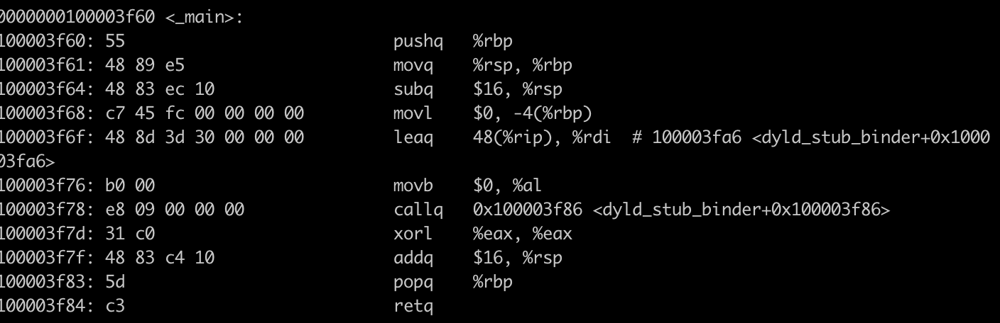
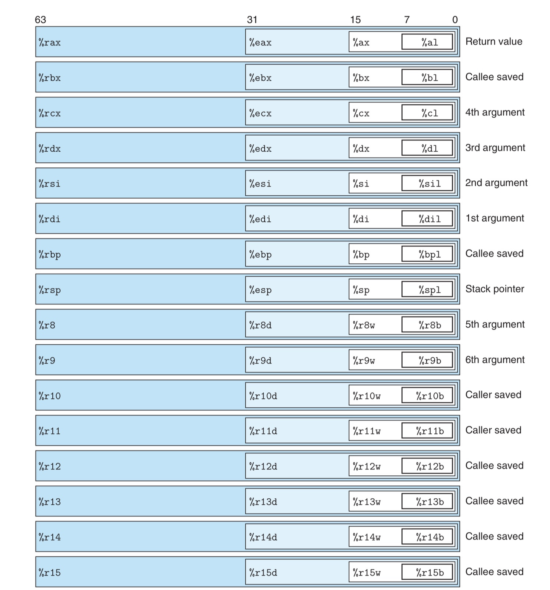
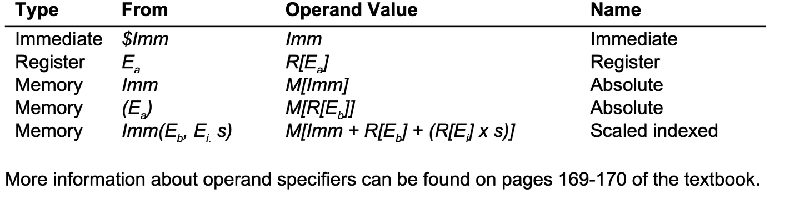

# Assembly Language

- https://www.ruanyifeng.com/blog/2018/01/assembly-language-primer.html
- https://zhuanlan.zhihu.com/p/469950256

- 1 **什么是汇编语言?**
    - 在初学C语言时, 我们都会写一个叫做hello.c的文件, 通过编译(广义)这个文件(及库文件)并执行, 计算机会在屏幕上显示"Hello world!"这一行字符串. 但是, 计算机究竟是怎样理解hello.c中的代码的？

    - 显然, 计算机不可能直接理解这么抽象的语句, 它只认识高电平和低电平, 也就是二进制语言(010010...). 编译器就负责把人类写的源文件“翻译”成计算机认识的二进制文件. 
        - “翻译”的牵涉到一系列工具和复杂的过程, 主要是预由预处理器把源代码中的宏去掉/替换.
        - 由编译器将源代码翻译为汇编程序(汇编语言).
        - 由汇编器将汇编程序翻译为目标文件(.o), 目标文件已经是二进制文件了, 但它还不能执行.
        - 链接器则将多个目标文件合为一个可执行文件(.a, .so).
        - 然后我们执行可执行文件时, 计算机会将可执行文件中的二进制代码搬到内存, 拆解为一系列的指令, CPU按照一定的顺序执行这些指令, 就完成了对可执行文件的执行.
    - 汇编语言是源代码和二进制代码之间的桥梁, 它与二进制代码一一对应, 同时又具备了可读性. 可以说, 它就是文本化的二进制代码. 在发明高级语言之前, 它一直是人类使用的程序语言. 让我们看看hello.c对应的汇编语言是什么样子的. 
    

- 2 **x86和arm上的汇编语言有什么共同点和区别?**
    - 高级语言(c语言), 的编写规则与硬件平台无关. 同样一份C语言文件, 在x86,x86_64, ARM上发挥着相同的功能, 这也正是高级语言的优势之一. 然而, 汇编语言是高度定制化的, 同样的源代码在不同的平台上生成的汇编代码是不同的. 这是因为汇编代码本质上是一条一条的指令, 在不同的机器上的指令集体系结构是不同的. 在x86平台上, 开发者需要用到它提供的它自己的复杂指令集；在arm机器上, 则要用到它自身的精简指令集. 打个不是很恰当的比方, 可以把生成可执行的二进制文件想象成为x86_64和arm分别建造房屋, 然而x86只提供石头, arm只提供砖块. 虽然最终房屋的功能都是相同的, 但是它们的外貌一定是有差别的. 

    x86 和 ARM 是两种不同架构的处理器, 因此它们的汇编语言在指令集、寄存器、寻址模式、指令格式等方面有显著的差异. 下面是一些主要区别: 

    - 1 指令集架构(ISA, Instructions Set Architecture)
        - x86: 由Intel和AMD设计, 使用复杂的指令集(CISC, Complex Instruction Set Computing). 它支持大量复杂的指令, 可以在单一指令中完成多个操作(例如, 算术运算、内存访问等). 
        - ARM 架构: 由ARM Holdings设计, 采用精简指令集(RISC, Reduced Instruction Set Computing). ARM 指令集更加简单, 每条指令的功能通常都比较单一, 强调通过更少的指令完成高效运算. 

    - 2 指令格式
        - x86: x86 指令格式比较复杂, 指令长度是可变的, 可能从 1 个字节到多达 15 个字节. 由于支持许多复杂的寻址模式, 指令长度和格式差异较大. 
            - 例如: `MOV AX, [BX]` 表示将内存地址 `BX` 存储的值加载到寄存器 `AX` 中. 
        - ARM: ARM 使用的是定长指令, 通常每条指令都是 32 位(对于 ARMv7 及更早版本, 后来 ARMv8 也支持 64 位指令). ARM 的指令格式较为简洁, 通常每条指令做一件事. 
            - 例如: `MOV R0, R1` 表示将寄存器 `R1` 的值复制到寄存器 `R0`. 

    - 3 寄存器
        - x86: x86 架构有多个寄存器, 其中包括通用寄存器、段寄存器、控制寄存器、状态寄存器等. 最常用的通用寄存器是 `EAX`、`EBX`、`ECX`、`EDX`, 它们分别有 32 位(在 64 位系统上为 64 位扩展)版本. 
            - x86 的寄存器名称更长, 而且同一组寄存器在不同的模式下(如 32 位和 64 位)有不同的表示. 

        - ARM: ARM 架构有 16 个通用寄存器(R0 到 R15), 其中 R13、R14 和 R15 分别用于栈指针(SP)、链接寄存器(LR)和程序计数器(PC). 此外, ARM 还支持多个特权级别和状态寄存器, 尤其在 ARMv7 和 ARMv8 中, 增加了更多的寄存器用于 64 位和扩展特性. 
            - ARM 的寄存器命名较为简单, 而且使用的寄存器较少. 

    - 4 寻址模式
        - x86: x86 提供了丰富的寻址模式, 支持立即数、寄存器、内存等多种方式. 例如, 支持基址加变址寻址(base+index), 有些指令支持直接对内存进行操作(如 `MOV [EAX+EBX*4], ECX`). 
        
        - ARM: ARM 提供的寻址模式相对简单, 主要支持寄存器寻址和立即数寻址. ARM 也支持偏移量寻址, 但没有像 x86 那样复杂的寻址模式. 

    - 5 指令集的复杂性
        - x86: 由于是 CISC 架构, x86 支持多种复杂的指令, 这些指令可能涉及到内存访问、算术运算、逻辑运算等多个操作. 例如, `MOV`, `ADD`, `SUB`, `MUL`, `DIV` 等指令都有不同的变体, 可以同时处理多种数据类型. 

        - ARM: ARM 是 RISC 架构, 指令相对简单, 每条指令通常完成单一操作. ARM 指令集包括常见的算术运算、逻辑运算、数据传输指令(如 `MOV`, `ADD`, `SUB`, `LDR`, `STR`), 但没有像 x86 那样多的变体. 

    - 6 函数调用约定**
        - x86: x86 通常使用 **栈传递参数** 和 **栈帧** 来进行函数调用. 参数传递方式、返回值存储位置以及栈的管理可能会有所不同, 具体取决于操作系统和编译器的约定. 例如, 在 32 位 Linux 系统中, 函数参数通过栈传递. 

        - ARM: ARM 采用一种较为简单的约定来进行函数调用(称为 ARM 的调用约定, AAPCS), 常用的做法是通过寄存器传递函数参数. 第一个函数参数通常存储在寄存器 `R0`, 第二个参数存储在 `R1`, 依此类推. 返回值通常保存在 `R0` 中. 

    - 7 指令执行效率**
        - x86: 由于其复杂的指令集, x86 指令执行时的效率可能会受到影响, 尤其是在面对更简化的任务时, CISC 指令可能需要较长的周期来执行. 

        - ARM: RISC 架构的 ARM 通常执行每条指令的周期较短, 具有较高的执行效率, 特别是在进行简单的算术和数据传输操作时. ARM 架构的设计目标之一就是提高指令的吞吐量和效率. 

    - 8 扩展指令集**
        - x86: x86 提供了丰富的扩展指令集, 包括 MMX、SSE、AVX 等, 主要用于加速特定类型的运算(如浮点运算、SIMD 运算等). 
        - ARM: ARM 也有自己的扩展指令集, 例如 NEON, 用于加速多媒体处理、向量计算等任务. ARMv8 还引入了 64 位扩展和增强的指令集. 

    - Summary
        - x86 架构支持复杂的指令集和多样的寻址模式, 通常在桌面和服务器级别的处理器中使用, 尤其在支持大型操作系统和应用程序的场景下非常常见. 
        - ARM 架构则通过简化指令集来提高指令执行的效率, 广泛应用于嵌入式系统、移动设备和低功耗设备等场景. 

- 3 **x86_64的寄存器**
    - x86-64 架构中的一些寄存器的不同位(8 位、16 位、32 位、64 位)表示法. 每个寄存器都有一个特定的用途, 比如 `%rsp` 用于指向栈顶,  `%rax` 用于存储函数的返回值. 
        - **64 位寄存器**(如 `%rax`, `%rcx`, `%rdx` 等)可以被切割成较小的部分来处理不同大小的数据类型: 
        - **8 位**: 使用后缀 `l` 表示低 8 位(例如 `%al` 是 `%rax` 的低 8 位). 
        - **16 位**: 使用后缀 `x` 表示低 16 位(例如 `%ax` 是 `%rax` 的低 16 位). 
        - **32 位**: 使用后缀 `e` 表示低 32 位(例如 `%eax` 是 `%rax` 的低 32 位). 

    - 这样做的好处是, 在处理不同大小的数据类型时, 我们可以只操作寄存器的一部分, 而不必浪费整个 64 位寄存器的存储空间. 

    此外, 一些寄存器有特定的功能, 比如: 
        - `%rsp`(栈指针)指向栈的顶部. 
        - `%rax`(或 `%eax`, `%ax`, `%al`)用来存储函数的返回值. 
        - 有些寄存器(如 `%r8` 至 `%r15`)可以用来存储函数的参数值, 尤其在调用约定中定义. 

    这种结构使得程序可以高效地进行不同数据类型的处理, 并充分利用寄存器的不同部分. 
    

- 4 **操作数(Operand)**
    - 操作数可以是立即数、寄存器、内存地址. 下面是表示这三种操作数的方法(来自x64 data sheet): 
    
    - 举例来说, $5是立即数, 它的值5；%rax是寄存器, 它的值是寄存器%rax中的值；0xf7是内存地址, 它的值是内存中地址为0x07的某种类型的值；(%rax)也是内存的地址, 只不过, 该地址保留在寄存器%rax中；0xf7(%rax, %rbp, 4)也是内存的地址, 所有的内存寻址方式都可以写成这种类型. 

- 5 **汇编语言中的操作码**
    - 操作码分为算术逻辑类、数据传输类、控制类等等. 

    - 算术和逻辑指令操作码
            `addq $3, %rdi`
        add代表相加, 第一个操作数是源操作数, 第二个是目的操作数. 这个指令把立即数3加到寄存器%rdi中. 如果之前%rdi中存储的值是8, 则执行该指令之后变为11. 

        那么, add的后缀q代表什么呢？它代表着操作数的大小. 有4种后缀: 
            b-字节(byte, 8比特)、
            w-字(word, 16比特)、
            l-双字(doubleword, 32比特)
            q-四字(quadword, 64比特)

        算术逻辑类除了相加, 还有减、乘、异或、按位或、按位与等等. 如下表: 
        | Instruction | Description |
        |-----|-----|
        | leaq | Load effective address of source into destination |
        | add | Add source to destination |
        | sub | Subtract source from destination |
        | imul | Multiply destination by source |
        | xor | Bitwise XOR destination by source |
        | or | Bitwise OR destination by source |
        | and | Bitwise AND destination by source |

        上面的例子都有两个操作数, 其实还有仅一个操作数的算术逻辑运算: 
        | Instruction | Description |
        |-----|-----|
        | inc | Increment by 1 |
        | dec | Decrement by 1 |
        | neg | Arithmetic negation |
        | not | Bitwise complement |

    - 数据传输指令操作码: 
        `movb $bl, %al`
        表示把%bl寄存器中的值赋值给%al

        `pushq %rbp`
        表示将%rbp的值压入栈中: 即先使栈顶指针寄存器%rsp的值减少8, 再将%rbp的值赋值给%rsp所指的内存单元. (回忆前面讲的压栈)

        `popq %rsi`
        表示将栈顶的8个字节的值弹出, 并赋给寄存器%rsi. 

    - 控制类

    - 比较和测试操作码
        ```
        cmpb %al, %bl
        testq %rax, %rbx
        ```
