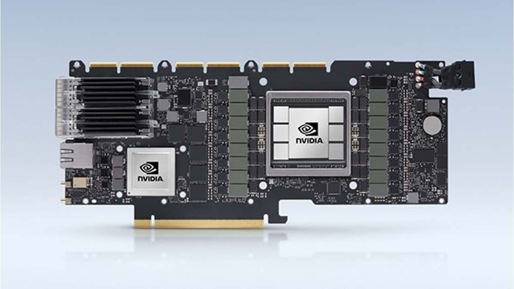
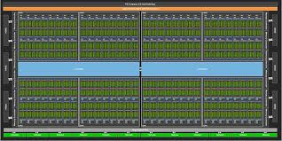
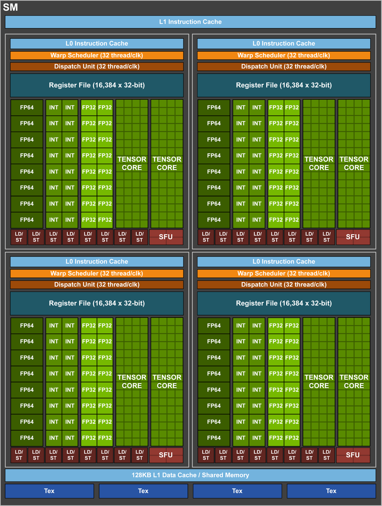
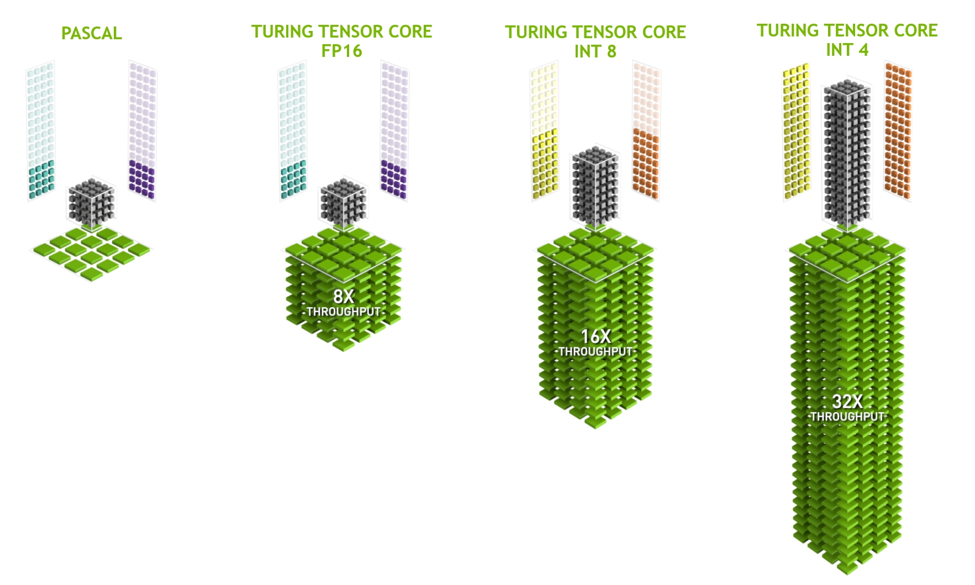
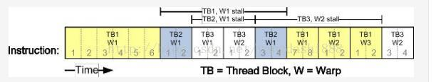
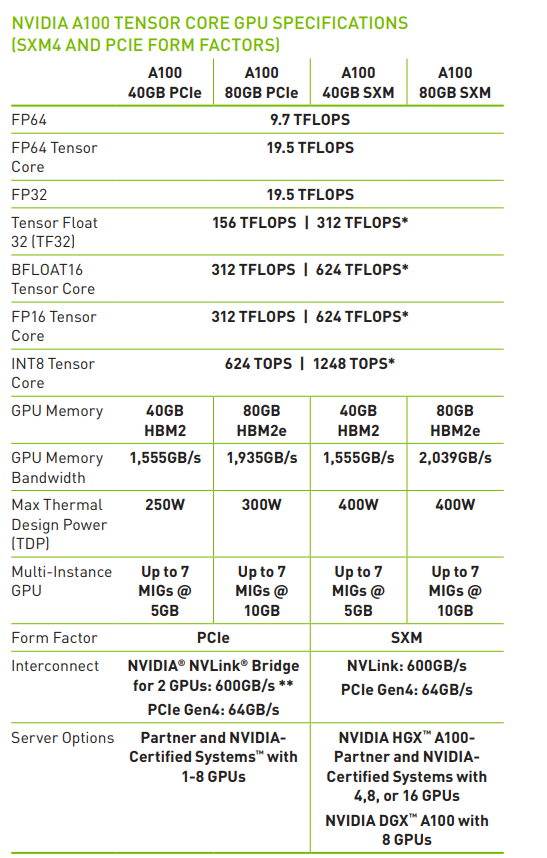
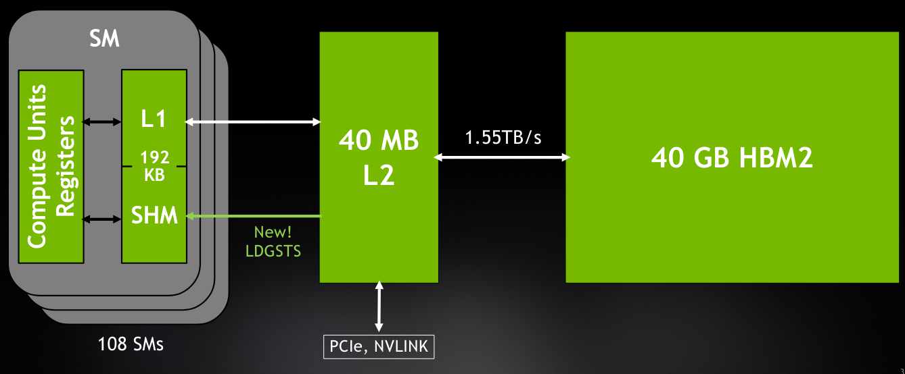

# GPU

## GPU Structure

- 1 **显卡的组成部分**
    1 Graphics Processing Unit (GPU) 图形处理单元
    2 Video Memory (VRAM) 视频内存
    3 Motherboard interface 主板接口
    4 Interconnection interface 互连接口

    5 Network interface 网络接口
    6 Data Processing Unit (DPU) 数据处理单元
    7 Video BIOS (VBIOS) 视频 BIOS
    8 Voltage regulator module (VRM) 稳压模块
    9 Output Interfaces 输出接口
    10 Cooling system 冷却系统
    

- 2 **图形处理单元 (Graphics Processing Unit)**
    - 以 A100 芯片为例, 总共有 8 个 GPC (Graphics Processing Cluster), 每个 GPC 里面包含 8 个 TPC (Texture Processing CLuster), 而每个 TPC 里面又包含了 2 个 SM (Streaming Multi Processor). 因此, A100芯片总共有 128 个 SM, 在实际使用中, 即使有良品率的限制, 也至少会有 108 个SM可用.
    

    - SM 的结构
        
        - 一个 SM 除了上面的 一级指令缓存 (L1 Instruction Cache) 和下面的 一级数据缓存 (L1 Data Cache/Share Memory), 纹理缓存 (Texture cache), 另外有 4 个相同的部分.
        - 每个部分构成:
            - Scheduler 调度 (Warp Scheduler 和 Dispatch Unit)
            - 寄存器 (Register File)
            - 数据加载 存储队列 (LD/ST)
            - 指令缓存 (L0 Instruction Cache)
            - 特殊函数单元SFU (Special Function Unit)
            - Cuda Core (INT32, FP32, FP64, TENSOR CORE)

- 3 **Tensor Core**
    - 通常所说的 GPU 有多少个 core, 一般指的是基本计算单元, 由于衡量 GPU 的性能通常是由浮点数计算衡量的, 因此一般说的 CUDA core, 指的是有多少个 FP32 的计算单元.
    - 在A100里, 一个 SM 有 64 个 FP32 计算单元, A100 有 108 个 SM, 因此 A00 总共有 108*64 个 CUDA core.
    - 早期的 GPU 只有 INT32 和 FP32 的计算单元. 再加上 SFU 计算一些 sin/cos/log/exp 等运算. 例如在游戏中视角旋转, 实际上是整个场景做了旋转矩阵的运算.
    - 对于一些高精度的计算, 例如FP64, 可以拆分成 FP32 的多步计算, 后来 Nvidia 直接加上了 FP64 计算单元. 神经网络时代之后, 矩阵运算量很大, Nvidia 在 Volta 架构上又加了 Tensor Core, 专门对矩阵运算做了很多优化.
    
    - Turing 架构的 Tensor Core 新增了 FP32 FP16 INT8 INT4 类型, 到了 A100 的 Ampere 架构 增加了 TF32 和 FP64, 以及稀疏矩阵运算.

- 4 **Warp Scheduler**
    - Wrap Scheduler 负责 Cuda Core 的调度.
    - 在 GPU 里, 所有的线程都会被分割成 32 个一组的 Warp, 每个 SM 里面有 4 个 Warp Scheduler, 然后会根据每个 Warp 执行的指令和状态, 将对应的线程分配到对应的 Cuda Core 上.
    - 典型任务有: LD/ST 需要进入 SFU 进行计算, Tensor Core 矩阵运算, INT32 或者 FP32 计算.
    - 计算时会采用分时计算, 比如只有 16 个 Cuda Core 可用, 一个 Warp 的指令需要 2 个周期来完成. 如果只有2个 Cuda Core 可用(比如 FP64), 就需要16个周期来完成这个 Warp 的指令.
    
    - 想要发挥 GPU 的最大性能，还得知道工作的原理，比如已经成为标配的 Flash Attention，就是很好的优化了一些默认 GPU 计算的瓶颈，从而达到了好几倍的计算速度提升。

- 5 **全局调度通信**
    - SM 会统一受全局的调度器(GigaThread Engine)的指挥, 同时还有 L2 Cache 进行通信.

- 6 **光线追踪 (RT Core)**
    - 如果一款 GPU 是面向游戏市场的话，那么会牺牲一些计算单元，新加一个 RT Core。

- 7 **显存 Video Memory(VRAM)**
    - 在 A100 中, 有 40G 和 80G 两款显存.
    - 日常PC用的内存都是 DDR 的标准, 显卡的显存大部分都是 GDDR 或者 HBM. 总体来说, HBM 的标准更快, 但是更贵.
    
    - A100 80G 的 GPU 和 显存的通信带宽可以达到 2T/s, 40G 的版本可以达到1.5T. 3090 的显存带宽为 936GB/s.
    

- 8 **主板接口 Motherboard Interface**
    - GPU 最终还是要受到 CPU 的指挥, 也要从 CPU 获取指令和数据, 与 CPU 的通信主要通过 PCIe 接口完成. PCIe4.0 的带宽是 64GB/s, 频率是 16GHz, 通信速度比显卡的通信速度差了很多. Nvidia目前主要采用 Flash Attention 进行通信优化.
    - FlashAttention示意图
    

- 9 ****
