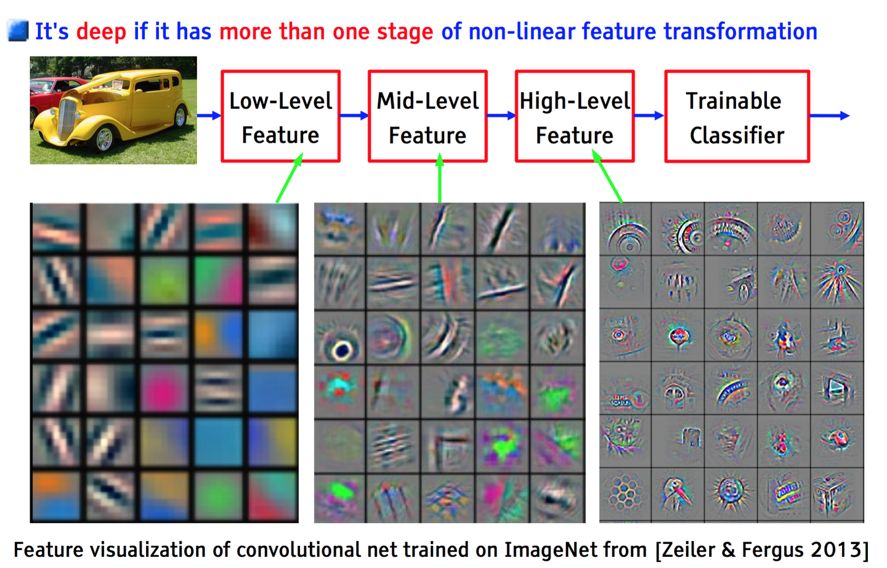

# CNN

- Q1 **CNN和RNN有什么区别?什么时候使用它们?**

    - `CNN`最适用于需要平移不变性的情况. 平移不变性是指, 无论目标出现在图像中的哪个位置, 它都会检测到同样的这些特征, 输出同样的响应.
    
    - `RNN`是可以记住历史输入状态信息的神经网络, 他们记住历史的输入样本, 并使用这些样本来帮助对当前输入样本进行分类. 当数据顺序很重要时, 适合用`RNN`. 因此, 在语音, 视频(帧是有序的)以及文本处理中, 常常用到`RNN`.一般来说, 与时间序列数据(带有时间戳的数据)相关的问题很适合用RNN解决.

Q2 **CNN怎样被用到时间序列预测中?**

- `CNN`从原始输入数据中学习和自动提取特征的能力可以应用于时间序列预测问题. 可以将一系列观察结果视为一维图像, `CNN`模型可以读取该图像并提取其中特征, 创建时间序列的信息表示.
- 常见的将CNN用于时间序列预测的例子包括`TCN`, `wavenet`, 它们是高度抗噪的模型, 并且能够提取信息丰富的深度特征.

Q3 **在`CNN`中, `Max Pooling`与`Average Pooling`的优缺点是什么?**

- 卷积层参数误差造成估计均值的偏移, `max pooling`能减小这种误差, 邻域大小受限造成的估计值方差增大, `average`能减小这种误差. 也就是说, `average`对背景保留更好, `max`对纹理提取更好.对数字识别等任务, 一般使用`max-pooling`.

- 引用: [https://www.zhihu.com/question/34898241](https://www.zhihu.com/question/34898241)

Q4 **比较`CNN`和多层感知机`MLP`**

- `MLP`由全连接层构成, 每个神经元都和上一层中的**所有**节点连接, 存在参数冗余, 相比之下, `CNN`由于权重共享, 参数更少, 方便网络的训练与设计深层网络, 
- `MLP`只接受向量输入, 会丢失像素间的空间信息, `CNN`接受矩阵和向量输入, 能利用像素间的空间关系.
- `MLP`是CNN的一个特例, 当`CNN`卷积核大小与输入大小相同时其计算过程等价于`MLP`.

- 引用: [https://medium.com/data-science-bootcamp/multilayer-perceptron-mlp-vs-convolutional-neural-network-in-deep-learning-c890f487a8f1](https://medium.com/data-science-bootcamp/multilayer-perceptron-mlp-vs-convolutional-neural-network-in-deep-learning-c890f487a8f1)

Q5 **CNN*中的*全连接层*有什么作用?**

- 全连接层在整个网络卷积神经网络中起到“分类器”的作用.如果说卷积层, 池化层和激活函数等操作是将原始数据映射到隐层特征空间的话(特征提取+选择的过程), 全连接层则起到将学到的特征表示映射到样本的标记空间的作用.换句话说, 就是把特征整合到一起(高度提纯特征), 方便交给最后的分类器或者回归.

Q6 **解释RELU激活函数在卷积神经网络中的意义**

- 在每次卷积操作之后, 使用RELU操作.RELU 是一个非线性激活函数.此操作应用于每个像素, 并将特征图中的所有负像素值替换为零.卷积操作本身是线性的, 为了建模非线性变化的图像特征, 需要使用像RELU 这样的非线性函数向模型中引入非线性.

Q7 **对于给定的图像输入尺寸, Filter Size, Stride 和 Padding大小, feature map 的尺寸是多少?**

- 如果我们的输入图像大小为 nxn, 过滤器大小为 fxf, p 是padding size, s 是stride, 则特征图的维度为: **floor[ ((n-f+2p)/s)+1] x floor[ ((n-f+2p)/s)+1]**

Q8 **解释`Valid Paddding`和`Same Padding`**

- `Valid Padding`: 当`filter`全部在`image`里面的时候, 进行卷积运算.
- `Same Padding`: 当`filter`的中心$(K)$与`image`的边角重合时, 开始做卷积运算, 卷积之后输出的`feature map`尺寸保持不变.

Q9 **Pooling有哪些不同类型?说明他们的特点.**

- `max pooling`: 返回卷积核覆盖部分的最大值并抑制噪声.
- `average pooling`: 计算卷积核覆盖的特征图的平均值.
- `sum pooling`: 计算卷积核窗口中所有元素的总和.
- 最广泛使用的池化技术是`max pooling`, 因为它捕获了最重要的特征.

Q12 **解释flatten层在CNN中的角色和作用**

- 在对图像的特征表示进行一系列卷积和池化操作之后, 我们将最终池化层的输出展平为一个长的连续线性数组或向量.将所有生成的二维数组转换为向量的过程称为Flattening.
Flatten 输出作为输入提供给具有不同隐藏层数的完全连接的神经网络, 以学习特征表示中存在的非线性复杂性.

Q13 **列出池化层的超参数**

- 池化层的超参数包括filter size, stride, max/average pooling, 如果池化层的输入维度是$n_{h}*n_{w}*n_{c}$, 那么输出维度将是$((n_{h}-f)/s+1)*((n_{w}-f)/s+1)*n_{c}$

Q14 **解释CNN中“参数共享”和“稀疏连接”的意义**

- 参数共享: 在卷积中, 我们在对输入进行卷积时共享参数.这背后的直觉是, 对图像的一部分有用的特征检测器也可能对图像的另一部分有用.因此, 通过使用单个卷积核, 我们对所有整个输入进行了卷积, 因此参数是共享的.
- 稀疏连接: 对于每一层, 每个输出值都取决于少量输入, 而不是考虑所有输入.

- Q15 **可以使用CNN执行降维操作吗?如果可以, CNN中哪个相关子层执行了降维操作?**

- CNN可以被用于降维操作
- 池化层, Pooling layer 的主要目标是减少 CNN 的空间维度.为了降低空间维度, 它将执行下采样操作, 通过在输入矩阵上滑动卷积核矩阵来创建池化特征图.

- Q16 **什么是感受野?**

    - 感受野(`Receptive Field`)是卷积神经网络（`CNN`）中的一个核心概念, 用于描述网络中某一层的一个神经元在输入图像上的感知范围. 简单来说, 感受野定义了一个神经元可以“看到”的输入区域, 决定了该神经元对输入特征的响应能力.
        - 感受野是指网络中某一层的一个神经元在输入图像上的覆盖范围.
        - 对于某一层的一个神经元, 其感受野是该神经元激活值依赖于输入图像的哪个部分.

        例如:
        - 输入图像大小为$ 32 \times 32$, 第一层卷积核为$3 \times 3 $, 感受野大小是$ 3 \times 3 $.
        - 第二层感受野不仅仅是$3 \times 3$, 还会结合前一层感受的区域, 因此感受野会扩大.

    - 感受野的两种类型
        1 理论感受野:
        - 是从数学计算上推导出的感受野大小.
        - 受卷积核大小, 步幅(`stride`), 池化操作等参数影响.

        2 有效感受野: 
        - 是实际参与激活值计算的输入区域.
        - 实验发现, 神经网络的有效感受野往往小于理论感受野的大小.

    - 感受野的计算
        感受野的大小可以通过层数的卷积和池化参数递归计算. 假设: 
        - 卷积核大小为$k$.
        - 步幅为$s$.
        - 填充(`padding`)为$p$.
        - 当前感受野大小为$r_{\text{current}}$.

        递归公式为: 
            \[
            r_{\text{next}} = r_{\text{current}} + (k - 1) \times \text{step}
            \]

        例如: 
        - 第一层卷积: \( r_{\text{1}} = 3 \)（卷积核 \( 3 \times 3 \)）
        - 第二层卷积: \( r_{\text{2}} = 3 + 2 \)（步幅 \( 1 \)）

    - 感受野的意义
        1 局部特征提取: 
            - 感受野限制了每个神经元只能关注输入的一小部分区域, 有助于提取局部特征.

        2 全局信息整合: 
            - 随着网络层数加深, 感受野逐渐扩大, 使神经元能整合更多全局信息.

        3 任务相关性: 
            - 感受野的大小直接影响模型对不同任务的适应能力. 例如: 
            - 小感受野适合提取细粒度信息, 如边缘检测.
            - 大感受野适合捕捉全局语义信息, 如图像分类.

    - 优化感受野的技巧
        1 增加卷积核大小: 如$5 \times 5$, $7 \times 7$.
        2 增加网络深度: 堆叠更多卷积层.
        3 使用空洞卷积(`Dilated Convolution`): 
            - 增大感受野的同时减少参数量和计算复杂度.

        4 结合池化操作:
            - 池化层可通过缩小特征图尺寸间接扩大感受野.

    - 感受野是卷积神经网络设计中重要的衡量指标, 直接影响神经元对输入数据的理解能力. 在任务中, 合理调整感受野可以平衡局部与全局特征提取能力, 从而提升模型的性能.

- Q32 **`CNN`最成功的应用是在`CV`, 那为什么`NLP`和`ASR`的很多问题也可以用`CNN`解出来? 为什么`AlphaGo`里也用了`CNN`? 这几个不相关的问题的相似性在哪里? `CNN`通过什么手段抓住了这个共性?**

    - Reference: https://zhuanlan.zhihu.com/p/25005808

    - `CNN`(卷积神经网络)虽然在计算机视觉(`CV`)领域最为知名, 但其核心设计思想——局部特征提取, 参数共享, 平移不变性, 层次化建模——使其在自然语言处理(`NLP`), 语音识别(`ASR`)甚至围棋AI(如`AlphaGo`)中也能大放异彩. 这些看似不相关的问题, 本质上共享以下共性, 而`CNN`通过特定手段成功捕捉了这些共性. 
    - 以上几个不相关问题的相关性在于, 都存在局部与整体的关系, 由低层次的特征经过组合, 组成高层次的特征, 并且得到不同特征之间的空间相关性. 如下图所示, 低层次的直线／曲线等特征, 组合成为不同的形状, 最后得到汽车的表示. 

    

    - 1 局部相关性(`Local Patterns`)
        - 在数据(如图像)中, 空间上相邻的元素往往具有较强的关联性, 局部区域的特征比远距离区域的特征更具相关性.
        无论是图像, 文本, 语音还是棋盘, *关键信息往往由局部结构组成*: 
        - `CV`: 图像中的物体由边缘, 角点, 纹理等局部特征构成. 
        - `NLP`: 文本的语义由词或短语(`n-gram`)等局部序列决定(如"not good"与"good"含义相反). 
        - `ASR`: 语音的频谱图(时频域)中, 音素或声学特征表现为局部模式. 
        - `AlphaGo`: 棋盘上的胜负关键常由局部棋型(如"死活", "连接"等)决定.

        通过*卷积核滑动窗口*, 在输入数据上提取局部特征. 例如: 
        - 在图像中, 卷积核检测边缘; 在文本中, 检测短语组合; 在棋盘上, 识别局部棋型. 

    - 2 平移不变性(`Translation Invariance`)
        关键模式可能出现在数据的任何位置, 但无论位置如何变化, 其意义不变: 
        - CV: 一只猫在图像左上角或右下角, 都是猫. 
        - NLP: 关键词"awesome"出现在句首或句末, 情感极性相同. 
        - ASR: 某个音素在时间轴上稍作偏移, 仍表示相同含义. 
        - AlphaGo: 同一棋型出现在棋盘不同区域, 对胜负的影响一致. 

        通过*参数共享*: 同一卷积核在不同位置扫描输入数据, 确保无论模式出现在何处, 都能被同一组权重检测到. 例如: 
        - 无论"猫"出现在图像的哪个位置, 同一个边缘检测卷积核都能激活. 

    - 3 层次化特征组合(`Hierarchical Abstraction`)
        复杂概念由简单特征的组合逐步构成: 
        - CV: 边缘 → 纹理 → 物体部件 → 完整物体. 
        - NLP: 字符 → 词 → 短语 → 句子语义. 
        - ASR: 频谱点 → 音素 → 音节 → 单词. 
        - AlphaGo: 单颗棋子 → 局部棋型 → 全局势力分布 → 胜负判断. 

        通过多层卷积与池化: 
        - 浅层网络提取简单特征(如边缘, 词组合). 
        - 深层网络组合简单特征为复杂特征(如物体, 句子情感, 棋局形势). 

    - 4 高维数据与稀疏性
        图像, 文本, 语音, 棋盘均为高维数据(如百万像素, 千词表, 长时频谱, 19×19棋盘), 但有效信息往往是稀疏且局部化的.   
        - 局部连接: 每个神经元仅连接输入数据的局部区域, 减少参数量. 
        - 池化(Pooling): 降维并保留主要特征(如最大池化保留最显著特征). 

    - 案例解释: 为什么`AlphaGo`用`CNN`? 
        围棋棋盘是典型的*二维网格结构*, 与图像高度相似: 
        - 输入表示: 棋盘状态被编码为多通道"图像"(如黑子, 白子, 气等特征通道). 
        - 局部模式识别: CNN识别关键棋型(如"征子", "眼位"), 这些局部模式直接影响策略(下一步走法)和价值(胜负概率).
        - 层次化抽象: 浅层网络识别棋子连接, 深层网络判断全局势力分布.

    - 总结: CNN的通用性
        CNN的核心优势在于: 
        - 局部特征提取: 通过卷积核捕捉局部模式. 
        - 参数共享与平移不变性: 高效处理位置变化. 
        - 层次化建模: 从简单到复杂逐步抽象. 
        - 高维数据处理: 通过局部连接和池化降低计算成本. 

    - 这些特性使CNN成为处理具有局部相关性, 层次化结构, 平移不变性问题的通用工具, 跨越CV, NLP, ASR甚至博弈领域. 
