# Deep Learning Fundamental

- Q1 **深度学习和机器学习本质的区别在哪里?**

    - 机器学习依赖于人类的因素更多, 人需要手动选择更有效的特征并进行组合, 深度学习使得大部分特征提取的步骤自动化, 消除了人为干预的因素.
    - 机器学习对数据量的依赖程度低, 深度学习需要大量数据才能提供更高精度.
    - 从概念上来说, 机器学习范围更广, 深度学习针对的是利用各种模型解决数据分析的问题.

- Q2 **深度学习的性能为什么会随着数据增多而提高?**

    - 当输入学习算法的数据数量增加时, 模型将考虑更多的边缘情况, 因此算法将学习在这些边缘情况下做出正确的决策, 提供更好的泛化性.

- Q3 **神经网络中的batch size, Iteration和Epoch分别是什么意思?**
    - batch-size
        - Definition
            batch-size: 顾名思义就是批次大小, 也就是一次训练选取的样本个数.
            batch-size的大小对模型的优化和速度都是很有影响的. 尤其是你的GPU的个数不多时, 最好不要把数值设置的很大. batch-size的正确选择是为了在内存效率和内存容量之间寻找最佳平衡.

        - Batch选择方式
            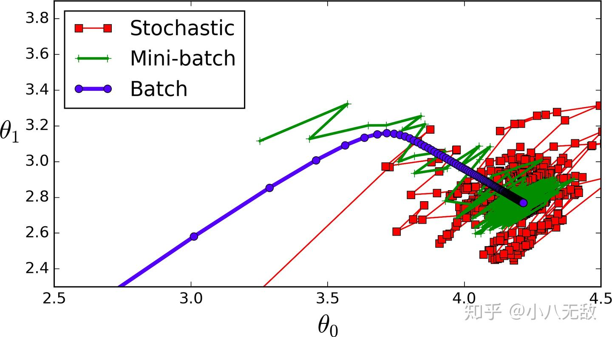

            - 全批次(Batch)(蓝色)是全批次, 也就是当数据集数量少的时候, 我们可以采用全数据集. 全数据集确定的方向能够更好的代表样本总体, 从而更准确的朝向极值所在的方向. 就跟神经网络一样, 能使用全连接最好, 但是对于大的数据集, 全连接会出现很多问题, 消耗内存大 速度慢. 那么我们只能退而求其次.

            - 迷你批次(Mini-batch)(绿色)选择一个适中的 batch_size值. 就是说我们选定一个batch的大小后, 将会以batch的大小将数据输入深度学习的网络中, 然后计算这个batch的所有样本的平均损失, 即代价函数是所有样本的平均. 

            - 随机(Stochastic)(Batch_Size等于1的情况)(红色)每次修正方向以各自样本的梯度方向修正, 横冲直撞各自为政, 难以达到收敛.

        - 增加batch-size的优点: 
            - 1 通过并行化提高内存利用率.
            - 2 单次epoch的迭代次数减少, 提高运行速度. (单次 $epoch = \frac{\frac{全部训练样本}{batch-size}}{iteration} = 1$)
            - 3 适当的增加Batch_Size, 梯度下降方向准确度增加, 训练震动的幅度减小. (看上图便可知晓)

        - Summary
            相对于正常数据集, 如果batch_Size过小, 训练数据就会非常难收敛, 从而导致underfitting. 增大batch_Size,相对处理速度加快. 增大batch_size,所需内存容量增加(epoch的次数需要增加以达到最好的结果). 这里我们发现上面两个矛盾的问题, 因为当epoch增加以后同样也会导致耗时增加从而速度下降. 因此我们需要寻找最好的 batch_size.

    - epoch
        - 定义
            - 1个 epoch 指: 用训练集中的全部样本训练一次.
            - epoch 数是一个超参数, 它定义了学习算法在整个训练数据集中的工作次数. 一个 epoch 意味着训练数据集中的每个样本都有机会更新内部模型参数. epoch 由一个或多个 batch 组成, 具有一批的 epoch 称为批量梯度下降学习算法. 您可以将 for 循环放在每个需要遍历训练数据集的 epoch 上, 在这个 for 循环中是另一个嵌套的 for 循环, 它遍历每批样本, 其中一个批次具有指定的"批量大小"样本数.
            - 当一个完整的数据集通过了神经网络一次并且返回了一次, 这个过程称为一次epoch. 然而, 当一个epoch对于计算机而言太庞大的时候, 就需要把它分成多个小块, 即多个batch. 

        - 多于一个epoch
            - 在神经网络中传递完整的数据集一次是不够的, 而且我们需要将完整的数据集在同样的神经网络中传递多次. 但请记住, 我们使用的是有限的数据集, 并且我们使用一个迭代过程即梯度下降来优化学习过程. 如下图所示. 因此仅仅更新一次或者说使用一个epoch是不够的.
            - 随着epoch数量增加, 神经网络中的权重的更新次数也在增加, 曲线从欠拟合变得过拟合.

        - epoch选取的次数
            - 不幸的是, 这个问题并没有正确的答案. 对于不同的数据集, 答案是不一样的. 但是数据的多样性会影响合适的epoch的数量. 比如, 只有黑色的猫的数据集, 以及有各种颜色的猫的数据集.
            - epochs 数量传统上很大, 通常是数百或数千, 允许学习算法运行直到模型的误差被充分地最小化了. 您可能会看到文献和教程设置为10,100,500,1000和更大的时期数量的示例. 通常创建线图, 其显示沿x轴的时间以及模型在y轴上的误差或技能. 这些图有时被称为学习曲线. 这些图可以帮助诊断模型是否已经过度学习, 学习不足或者是否适合训练数据集.

    - iteration
        - iteration 中文翻译为迭代. 1个iteration即迭代一次, 也就是用batch-size个样本训练一次. 迭代是重复反馈的动作, 神经网络中我们希望通过迭代进行多次的训练以到达所需的目标或结果.

- Q3 **什么是ensemble learning, 在深度学习中有何运用?**

    - ensemble learning表示使用两个以上的模型学习, 并使用某种规则将各个模型的学习结果整合, 用于提高整体模型的*泛化*能力.
    - 深度学习中ensemble learning的运用有dropout, zoneout和drop-connect.

- Q4 **深度学习中, 如何选择激活函数?**

    - 在深度学习中, 选择合适的激活函数对模型的性能和训练效果至关重要.以下是关于选择激活函数的详细说明: 
        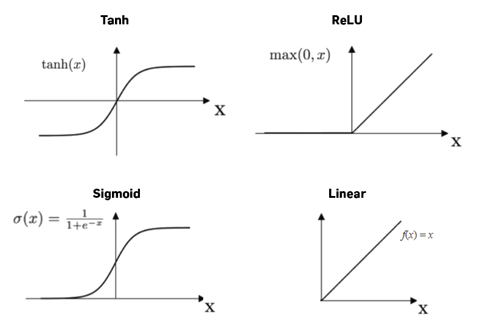

    - 常见激活函数及其适用场景
        - `Sigmoid`
            \[
            f(x) = \frac{1}{1 + e^{-x}}
            \]
            - 输出范围: $(0, 1)$, 适合概率输出(如二分类问题中的输出层).
            - 缺点: 
                - 梯度消失: 输入值很大或很小时, 梯度趋近于零, 影响训练效率.
                - 输出非零中心: 导致梯度更新时收敛较慢.
            - 推荐使用场景: 二分类问题的输出层.

        - `Tanh`
            \[
            f(x) = \tanh(x) = \frac{e^x - e^{-x}}{e^x + e^{-x}}
            \]
            - 输出范围: $(-1, 1)$, 输出零中心, 更有利于梯度更新.
            - 缺点: 同样会出现梯度消失问题.

            - 推荐使用场景: 隐藏层的激活函数(在浅层网络中效果尚可).

        - `ReLU`(`Rectified Linear Unit`)
            \[
            f(x) = \max(0, x)
            \]  
            - 输出范围: \( [0, \infty) \), 计算简单, 效率高.
            - 解决梯度消失问题: 正值区域的梯度始终为`1`.
            - 缺点: 
            - "神经元死亡"问题: 部分节点可能因输出始终为零而失效.

            - 推荐使用场景: 深层网络的隐藏层, 尤其是卷积神经网络(`CNN`).

        - `Leaky ReLU`  
            \[
            f(x) = 
            \begin{cases} 
            x, & \text{if } x > 0 \\ 
            \alpha x, & \text{if } x \leq 0 
            \end{cases}
            \]
            - 通过给负值区域添加一个小斜率$\alpha$, 缓解了`ReLU`的“神经元死亡”问题.
            - 推荐使用场景: 深层网络, 尤其是`ReLU`出现问题时的替代选择.

        - `Softmax`
            \[
            f_i(x) = \frac{e^{x_i}}{\sum_{j} e^{x_j}}
            \]
            - 用于多分类问题, 将输出值归一化为概率分布.
            - 推荐使用场景: 多分类问题的输出层.

        - `Swish`
            \[
            f(x) = x \cdot \text{sigmoid}(\beta x)
            \]
            - 由`Google`提出的激活函数, 平滑非线性, 通常在深层网络中性能优于`ReLU`, 自动学习$\beta$参数.
            - 推荐使用场景: 大型深度学习模型.

    - 激活函数选择的原则
        - 隐藏层
            - `ReLU`系列(`ReLU`, `Leaky ReLU`, `Swish`): 大多数情况下是首选, 因为它们可以缓解梯度消失问题, 尤其适合深层网络.
            - 对于浅层网络, 可以尝试`Tanh` 或`Sigmoid`, 但一般情况下, `ReLU`仍然更高效.

        - 输出层
            - 二分类: `Sigmoid`函数, 输出概率值.
            - 多分类: `Softmax`函数, 输出各类别的概率分布.
            - 回归问题: 
                - 没有约束范围: 直接输出线性值(不使用激活函数).
                - 输出值需在特定范围内: 可选择`Sigmoid`或`Tanh`.

        - 特殊情况
            - 当模型出现梯度消失问题时, 可尝试`Leaky ReLU`或`Swish`.
            - 对高性能深度模型, 可以尝试`Swish`等新的激活函数.

        - 实践建议
            - 从`ReLU`开始: `ReLU`是默认的隐藏层激活函数. 如果`ReLU`出现问题(如梯度消失或神经元死亡), 可以尝试`Leaky ReLU`或其他替代方法.
            - 输出层视任务而定: 
                - 分类: 选择`Sigmoid`或`Softmax`.
                - 回归: 一般不使用激活函数.
            - 小规模测试: 在实验阶段测试不同激活函数的效果, 选择性能最优的.
            - 混合使用: 在不同层使用不同激活函数, 如隐藏层用`ReLU`, 输出层用`Softmax`.

    - Summary
        | 激活函数 | 输出范围 | 适用场景 | 缺点 |
        |--------|--------|---------|--------|
        | `Sigmoid` | \( (0, 1) \) | 二分类输出层 | 梯度消失问题 |
        | `Tanh` | \( (-1, 1) \)| 隐藏层(浅层网络) | 梯度消失问题 |
        | `ReLU` | \( [0, \infty) \)| 隐藏层(深层网络) | 神经元死亡问题 |
        | `Leaky ReLU` | \( (-\infty, \infty) \)| 深层网络替代`ReLU` | 参数需要调优 |
        | `Softmax` | \( (0, 1) \) | 多分类输出层 | 高维类别计算复杂度高 |
        | `Swish` | \( (-\infty, \infty) \)| 深度模型隐藏层 | 计算稍复杂 |

- Q5 **相比机器学习, 深度学习有什么优势?**

    - 深度学习不需要设计模型的人对特征工程有很多理解, 深度学习是端到端的, 有利于快速上手.
    - 深度学习在数据集较大, 建模问题较复杂的情况下, 准确率更高.

- Q6 **什么是指数加权平均和移动平均?**
    - 指数加权平均(`Exponentially Weighted Averages`)是深度学习众多优化算法的理论基础, 包括`Momentum`, `RMSprop`, `Adam`等, 在介绍这些优化算法前, 有必要对指数加权平均(`Exponentially Weighted Averages`)做一个简单的介绍, 以期对后续的优化算法的原理有所知晓.
    - 什么是指数加权平均?
        - 现在想求一段时间内的平均温度, 给定一段时间的温度序列, 加和平均结果为, 每天温度的权重都是相同的. 进一步, 若要根据平均气温预测明天的温度, 显然昨天的温度应该较30天之前的温度权重大一些, 因为越早的日期对于预测明天温度所起到的作用越小, 这符合我们的常规思维, 因此给予每天的温度不同的权重, 这就引出了统计学中常用的一种平均方法-指数加权平均, 平均温度预测的指数加权平均形式如下:
        $${\theta_t} = \beta * {\theta_{t-1}} + (1-\beta) * v_t$$
        其中, ${\theta_t}$代表了第t天的平均温度, \beta代表了可调节的数值数值.
        $${\theta_0} = 0$$
        $${\theta_1} = (1 - \beta) * v_1$$
        $${\theta_t} = \beta^{t-1}*(1-\beta)*v_1 + \beta^{t-2}*(1-\beta)*v_2 + ... + \beta*(1-\beta)*v_{t-1} + (1-\beta)*v_t$$
        随着日期的向后推移, 温度的权重以单位$\beta$进行衰减. 当$\beta = 0$时, 平均气温的计算完全忽略历史信息, 随着$\beta$由0到1不断增大, 历史温度的权重衰减速度不断降低.

- Q7 **什么是梯度消失?**

    - 梯度消失的定义
        - 梯度消失(`Gradient Vanishing`)是指在深度神经网络的反向传播过程中, 梯度值逐层衰减, 最终接近于零的现象. 这会导致网络的参数几乎无法更新, 使训练过程停滞.
        - 梯度消失通常出现在:
            1 深度神经网络: 网络层数较多时, 梯度逐层相乘, 数值会迅速衰减. 
            2 循环神经网络(RNN): 时间步长较长时, 梯度在反向传播中不断缩小, 难以捕获长时间依赖关系.

    - 梯度消失的数学解释

        在反向传播中, 梯度的计算遵循链式法则:

        \[
        \frac{\partial L}{\partial \theta_i} = \frac{\partial L}{\partial \theta_{i+1}} \cdot \frac{\partial \theta_{i+1}}{\partial \theta_i}
        \]

        对于深度网络, 当激活函数的导数值(如`sigmoid`, `tanh`的导数)小于1时, 梯度会逐层相乘, 导致值不断减小, 接近于零.

        以`sigmoid`激活函数为例:

        \[
        \sigma(x) = \frac{1}{1 + e^{-x}}, \quad \sigma'(x) = \sigma(x)(1 - \sigma(x))
        \]

        当$x$取较大或较小值时, $\sigma'(x)$接近于零.
        这种小导数经过多层传播, 会使梯度值快速缩小.

        在循环神经网络中, 梯度的递归形式为:

        \[
        \frac{\partial L}{\partial W} = \prod_{t=1}^{T} \frac{\partial h_t}{\partial h_{t-1}}
        \]

        当时间步长$T$很大且导数值$ \frac{\partial h_t}{\partial h_{t-1}} < 1 $时, 梯度会随$T$的增长而趋近于零.

    - 梯度消失的表现
        1 参数无法更新: 训练过程中模型参数几乎没有变化.
        2 损失函数停止下降: 模型的训练损失在一定水平停滞不前.
        3 底层特征学习不足: 靠近输入的网络层(底层)学到的特征非常有限, 而较高层主导了大部分的学习.

    - 梯度消失的原因
        1 激活函数选择不当: 如 sigmoid, tanh 等激活函数在较大或较小输入值时, 导数非常小. 
        2 网络层数过深: 深层网络中梯度值在反向传播中反复相乘, 导致数值缩小. 
        3 权重初始化不当: 若初始权重值过小, 梯度计算会进一步减小. 

    - 解决梯度消失的方法
        - 1 使用改进的激活函数:
            - 采用梯度更稳定的激活函数, 如`ReLU`, `Leaky ReLU`, `ELU`等.
            - `ReLU`的梯度为`1`(正值部分), 不会引起梯度消失问题.

        - 2 权重初始化方法:
            - 使用`Xavier`初始化或`He`初始化, 确保权重值在合理范围内:
            \[
            \text{Xavier: } W \sim U\left[-\sqrt{\frac{6}{n_{in} + n_{out}}}, \sqrt{\frac{6}{n_{in} + n_{out}}}\right]
            \]
            \[
            \text{He: } W \sim \mathcal{N}\left(0, \sqrt{\frac{2}{n_{in}}}\right)
            \]

        - 3 `Batch Normalization`:
            - 对每一层的输入进行标准化, 使其均值为`0`, 方差为`1`.
            - 能够稳定激活值的分布, 减少梯度消失的发生.

        - 4 残差网络(`Residual Network`, `ResNet`):
            - 引入跳跃连接(`Skip Connection`), 直接将低层输出传递到高层, 缓解梯度消失问题.

        - 5 梯度裁剪(`Gradient Clipping`):
            - 设置梯度的上限, 避免梯度在某些层中变得极小.

        - 6 短序列建模:
            - 对于循环神经网络, 使用短时间序列建模, 并结合长短时记忆网络(`LSTM`)或门控循环单元(`GRU`), 避免长时间依赖问题. 

    - 梯度消失与梯度爆炸的对比

        | **梯度消失**                    | **梯度爆炸**                     |
        |---------------------------------|----------------------------------|
        | 梯度值逐层衰减, 趋近于零         | 梯度值逐层增大, 趋近于无穷大     |
        | 激活函数导数较小或权重值过小导致 | 激活函数导数较大或权重值过大导致 |
        | 导致训练过程停滞                 | 导致训练过程不稳定或数值溢出     |
        | 常见于`sigmoid`, `tanh`激活函数    | 常见于未正则化的`ReLU`或高学习率 |

    - 总结
        梯度消失是深度神经网络训练中的常见问题, 会导致模型学习能力下降甚至无法收敛. 通过优化网络结构(如 `ResNet`), 改进激活函数(如`ReLU`), 调整权重初始化和加入`Batch Normalization`, 可以有效缓解梯度消失现象, 提升深度学习模型的训练效率和性能.

- Q8 **什么是梯度爆炸?**

    - 梯度爆炸是深度学习中常见的优化问题, 发生在反向传播过程中. 它的本质是由于梯度在传播过程中不断累积和放大, 最终导致权重更新幅度过大, 使模型无法有效训练.

    - 梯度爆炸的原理
        - (1) 梯度在反向传播中的累积
        在深度神经网络中, 反向传播通过链式法则计算梯度:   
        \[
         \frac{\partial L}{\partial \theta_i} = \frac{\partial L}{\partial \theta_n} \cdot \frac{\partial \theta_n}{\partial \theta_{n-1}} \cdot \dots \cdot \frac{\partial \theta_{i+1}}{\partial \theta_i}
        \]
        如果每一层的梯度(\(\frac{\partial \theta_{i+1}}{\partial \theta_i}\))的绝对值大于 1, 则在层数较多时, 梯度值会呈指数级增长.

        - (2) 更新权重的影响
            - 梯度过大时, 权重更新幅度过大, 导致: 
            - 参数变得不稳定.
            - 损失函数值变得无意义(如出现$NaN$或过大的数值).

    - 梯度爆炸的表现
        - (1) 训练中断: 训练过程中, 模型的损失函数突然变成$NaN$或无穷大.
        - (2)损失值震荡: 损失函数值在训练过程中剧烈波动.
        - (3)权重异常增大: 权重值迅速变得极大(通常可以通过检查权重或梯度确认).
        - (4)模型性能下降: 即使训练完成, 模型的表现也非常差.

    - 梯度爆炸的常见原因
        - (1)网络过深: 深层神经网络更容易导致梯度在传播过程中累积放大.
        - (2)不适当的权重初始化: 权重值过大可能导致前向传播时激活值变得过大, 从而在反向传播中产生大梯度.
        - (3)学习率过高: 较高的学习率可能导致参数更新过大, 从而放大梯度.
        - (4)激活函数选择不当: 使用某些激活函数(如没有合适归一化的`ReLU`), 可能导致前向传播输出值过大, 进而引发梯度爆炸.

    - 梯度爆炸的解决方法
        - (1)梯度裁剪(`Gradient Clipping`)
            - 将梯度的大小限制在某个范围内, 防止梯度值过大.
            - 常用方法是将梯度向量的范数限制在一个阈值 \(\tau\):
            $g = \frac{g}{\max(1, \frac{\|g\|}{\tau})}$
            - 如果梯度范数超过 \(\tau\), 将其缩小到阈值.

        - (2)权重初始化
            - 使用适当的权重初始化方法: 
                - `Xavier`初始化: 适用于`Sigmoid`和`Tanh`激活函数.
                - `He`初始化: 适用于`ReLU`系列激活函数.
            - 这些方法能让权重的初始值保持在合理范围内.

        - (3)归一化技术
            - 批归一化(`Batch Normalization`): 
                - 在每一层对输入数据进行标准化, 避免数据分布发生过大变化.
                - 梯度归一化: 对梯度进行归一化处理, 确保数值稳定.

        - (4)调整学习率
            - 降低学习率, 避免参数更新过大.
            - 使用自适应优化算法(如`Adam`或`RMSProp`), 动态调整学习率.

        - (5)改进网络结构
            - 引入*残差网络*(`ResNet`)或 *梯度通道*(如`LSTM`中的记忆单元), 让梯度更稳定地传播.

        - (6)激活函数选择
            - 使用平滑且不易引起数值发散的激活函数(如`ReLU`或`Swish`).

    - 梯度爆炸与梯度消失的对比
        | **特性**             | **梯度爆炸**                              | **梯度消失**                              |
        |----------------------|-------------------------------------------|-------------------------------------------|
        | **表现**             | 梯度值过大, 导致训练不稳定                | 梯度值接近 0, 导致训练速度过慢            |
        | **原因**             | 梯度累计放大                              | 梯度逐层衰减                              |
        | **主要影响的激活函数**| 未归一化的 ReLU, 指数增长的函数(Softmax)| Sigmoid 和 Tanh                           |
        | **常见场景**         | 深层网络, 学习率过高                      | 深层网络, 激活函数不当                    |
        | **解决方法**         | 梯度裁剪, 调整学习率, 批归一化等          | 替换激活函数, 批归一化, 残差连接等        |

- Q9 **Embedding Layer的作用是什么?**

    - `Embedding`层的目的是将模型的输入, `one-hot`向量(一种高维, 稀疏的表示)映射到低维稠密的表示, 从而节省模型的计算量.

- Q10 **什么是早停策略?**

    - 早停策略(`Early Stopping`)是一种正则化方法, 用于防止模型在训练过程中出现过拟合问题.它基于训练误差和验证误差的动态变化来决定何时停止训练.在深度学习中, 模型通常通过梯度下降算法更新网络参数.然而, 随着训练的进行, 模型对训练数据的拟合可能会越来越好, 但验证集上的误差(泛化误差)可能会开始上升, 这表明模型正在过拟合.早停策略通过监控验证集误差, 在其开始上升之前的某个点停止训练, 从而避免过拟合.具体实现中, 早停策略会设定一个耐心参数(`patience`), 即允许验证误差在一段时间内不上升, 而如果验证误差持续上升超过耐心次数, 则停止训练.这种方法不仅能提高模型的泛化能力, 还能节省训练时间.

- Q11 **什么是增量学习?**

    - 增量学习是指算法从先前可用的数据集中生成分类器后, 再从新数据中学习的能力.
    - 增量学习算法不断使用输入数据来扩展现有模型的知识, 即使用动态的数据流, 进一步训练模型, 目的是让学习模型在不忘记其现有知识的情况下适应新数据.

- Q12 **解释感知机的原理**

    - 感知机是一种用于二元分类器监督学习的算法.其输入为实例的特征向量, 输出为实例的类别, `+1`代表正类, `-1`代表负类.感知机属于判别模型, 它的目标是要将输入实例通过分离超平面将正负二类分离.
    - 感知机学习的目标就是找到能够将正负样本完全分开的分离超平面, 即要寻找超平面参数`w`, `b`, 感知机通过监督学习学习参数.

    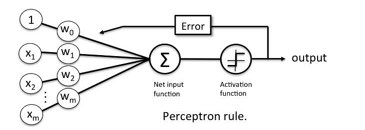

- Q13 **什么是计算图?哪些算法属于计算图模型?**

    - 计算图(`Computational Graph`)是深度学习中的一种数据结构, 用于表示和执行数学计算过程.它将复杂的计算过程分解为一系列简单的操作(如加法, 乘法, 激活函数等), 并以有向无环图(`DAG`)的形式表示.计算图中的每个节点代表一个操作(例如矩阵乘法, 激活函数), 边表示操作之间的数据流.

    - 在深度学习中, 计算图的核心作用是支持前向传播和反向传播: 
        - 前向传播: 计算从输入到输出的过程, 将输入数据通过一系列节点操作, 生成预测值.
        - 反向传播: 从输出节点开始, 通过链式法则(链式求导), 计算各参数的梯度, 用于优化模型参数.

    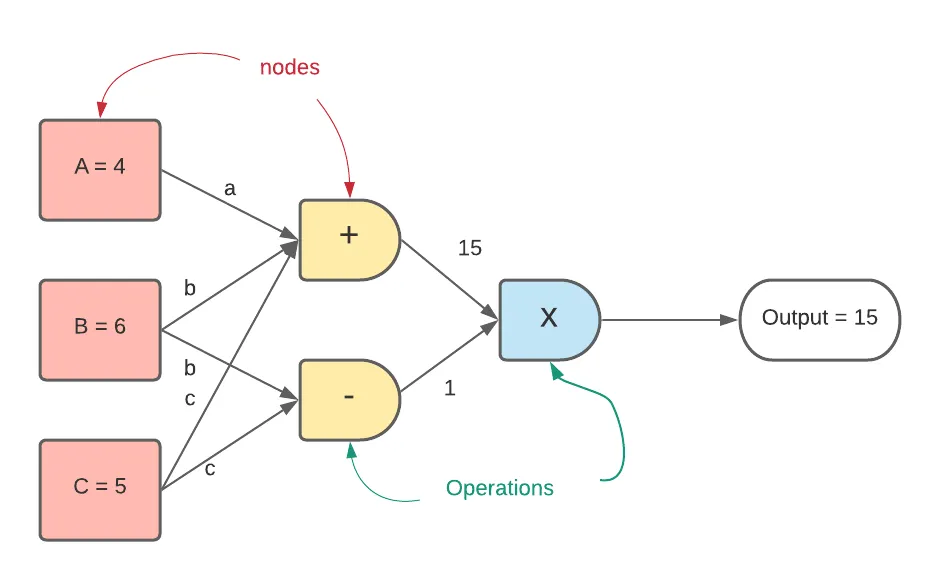

    - 感知机, 深层神经网络, 线性回归均属于计算图模型.

    - 引用: [https://towardsdatascience.com/evolution-of-graph-computation-and-machine-learning-3211e8682c83](https://towardsdatascience.com/evolution-of-graph-computation-and-machine-learning-3211e8682c83)

- Q14 **线性激活函数和非线性激活函数之间有什么区别?**

    - *线性激活函数*的*输出*是*输入*的线性函数, *非线性激活函数*(如`tanh`, `sigmoid`, `relu`)的*输出*是输入的非线性函数, 非线性激活函数可以能够使神经网络学习到更复杂的行为模式.

- Q15 **解释$1 \times 1$卷积操作的意义?**

    - 通道维度的变化: $1\times1$卷积的核心作用是调整输入数据的通道数(深度).假设输入数据的形状为$(c_{\text{in}}, H, W)$, 通过$(c_{\text{out}}, 1, 1)$的卷积核处理后, 输出数据形状变为$(C_{\text{out}}, H, W)$.这样可以在不改变特征图的空间分辨率($H \times W$)的情况下调整通道数量.

    - 特征融合: $1\times1$卷积在每个位置独立地对所有通道进行加权求和, 相当于一个线性变换.这种操作可以实现不同通道之间的信息融合, 从而提升特征表达能力.

    - 降维: 在`Inception`架构中, 使用$1\times1$卷积来降低通道维度, 减少计算复杂度和参数量.例如, 通过将通道数从$256$降到$64$, 可以显著降低后续$3 \times 3$或$5 \times 5$卷积操作的计算开销.

    - 非线性特性: 结合激活函数(如`ReLU`), $1\times1$卷积不仅能调整通道维度, 还能引入非线性特性, 增强模型的表达能力.

- Q16 **在设计神经网络时, 神经网络的广度和深度哪个更重要?**

    - 对于标准的前馈神经网络, 深度比宽度更有价值, 深度可以为网络增加更多的非线性, 增强网络的学习能力, 但同时, 越深的模型越容易过拟合.
    - 相关研究论文: [http://proceedings.mlr.press/v49/eldan16.pdf](http://proceedings.mlr.press/v49/eldan16.pdf).

    - 引用: [https://www.quora.com/What-are-the-tradeoffs-of-increasing-the-depth-of-a-neural-network](https://www.quora.com/What-are-the-tradeoffs-of-increasing-the-depth-of-a-neural-network).

- Q17 **神经网络中的隐藏层计算的内容是什么?**

    - 隐藏层提供非线性变换, 同时能够提取输入中的高维特征.
    - 隐藏层将输入转换为输出可用的特征, 并将输入转换为输出需要的维度.

- Q18 **神经网络中, 可以将非线性激活函数替换为线性激活函数吗?为什么?**

    - 不能替换. 非线性激活函数在神经网络中是不可或缺的, 这种非线性是神经网络和简单线性回归模型的重要区别, 非线性激活函数使得神经网络能够学习到复杂的函数表示.

- Q19 **在深度学习模型中, 如何选择损失函数?**

    - 损失函数的选择必须与特定预测建模问题的框架相匹配, 例如分类或回归问题使用不同的损失函数, 此外, 输出层的配置也必须适合所选的损失函数.
    - 回归损失函数: 使用均方误差损失, 均方对数误差损失, 平均绝对误差损失.
    - 二元分类损失函数: 交叉熵, `Hinge Loss`.
    - 多元分类损失函数: 多类交叉熵损失, `K-L`散度(`Kullback-Leibler Divergence`), `K-L`散度通过计算信息量的丢失衡量`loss`, 当使用学习近似更复杂函数的模型而不是简单的多类分类时, `K-L`散度损失函数更常用, 例如在用于学习密集特征表示的自动编码器的情况, 

    - 引用: [https://machinelearningmastery.com/](https://machinelearningmastery.com/)

- Q20 **介绍`GAN`的原理**

    - 来自论文: [https://arxiv.org/pdf/1406.2661](https://arxiv.org/pdf/1406.2661)

    - 生成对抗网络(`Generative Adversarial Network`, `GAN`)是一种深度学习框架, 由`Ian Goodfellow`等人在`2014`年提出.`GAN`包括两个主要部分: 生成器(`Generator`)和判别器(`Discriminator`), 它们通过相互博弈的方式共同训练, 最终使生成器能够生成逼真的数据.`GAN`的核心思想是利用“对抗”的过程, 使得生成器和判别器共同提升性能.
        - `GAN`的基本原理其实非常简单, 以生成图片为例进行说明.假设我们有两个网络, `G`(`Generator`)和`D`(`Discriminator`).正如它的名字所暗示的那样, 它们的功能分别是: 
        - `G`是一个生成图片的网络, 它接收一个随机的噪声$z$, 通过这个噪声生成图片, 记做$G(z)$.
        - `D`是一个判别网络, 判别一张图片是不是“真实的”.它的输入参数是$x$, $x$代表一张图片, 输出$D(x)$代表$$为真实图片的概率, 如果为`1`, 就代表`100%`是真实的图片, 而输出为`0`, 就代表不可能是真实的图片.
        - 在训练过程中, 生成网络`G`的目标就是尽量生成真实的图片去欺骗判别网络`D`.而`D`的目标就是尽量把`G`生成的图片和真实的图片分别开来.这样, `G`和`D`构成了一个动态的“博弈过程”.最后博弈的结果是什么?在最理想的状态下, `G`可以生成足以“以假乱真”的图片$G(z)$.对于`D`来说, 它难以判定`G`生成的图片究竟是不是真实的, 因此$D(G(z)) = 0.5$.

        - 这样我们的目的就达成了: 我们得到了一个生成式的模型G, 它可以用来生成图片.

        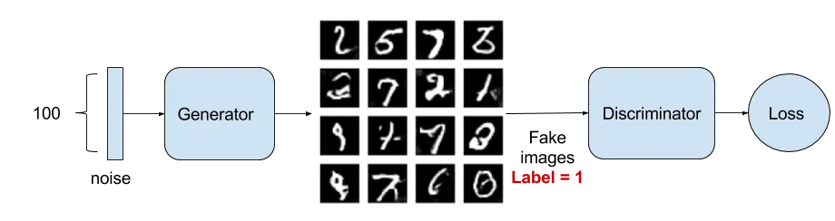

    - 如何用数学语言描述呢?这里直接摘录论文里的公式, 生成对抗网络的目标是解决以下极小极大的优化问题: 
    \[
    \min_G \max_D V(D, G) = \mathbb{E}_{x \sim p_{\text{data}}}[\log D(x)] + \mathbb{E}_{z \sim p_z}[\log(1 - D(G(z)))]
    \]
        - `G`: 生成器, 目标是生成接近真实数据分布的样本.
        - `D`: 判别器, 目标是区分真实数据和生成数据.
        - $p_{\text{data}}$: 真实数据的分布.
        - $p_z$: 随机噪声$z$的分布(通常为标准正态分布).
        - 整个式子由两项构成.$x$表示真实图片, $z$表示输入$G$网络的噪声, 而$G(z)$表示G网络生成的图片.
        - $D(x)$表示$D$网络判断真实图片是否真实的概率(因为$x$就是真实的, 所以对于$D$来说, 这个值越接近`1`越好).而$D(G(z))$是$D$网络判断$G$生成的图片的是否真实的概率.
        - `G`的目的: 上面提到过, $D(G(z))$是`D`网络判断`G`生成的图片是否真实的概率, `G`应该希望自己生成的图片“越接近真实越好”.也就是说, `G`希望$D(G(z))$尽可能得大, 这时$V(D,G)$会变小.因此我们看到公式的最前面的记号是$\underset {G}{min}$.
        - `D`的目的: `D`的能力越强, $D(x)$应该越大, $D(G(x))$应该越小.这时$V(D,G)$会变大.因此式子对于`D`来说是求最大$\underset {D}{max}$.

    - 判别器的损失函数, 判别器的目标是最大化其分类准确性: 
        \[
        L_D = -\mathbb{E}_{x \sim p_{\text{data}}}[\log D(x)] - \mathbb{E}_{z \sim p_z}[\log(1 - D(G(z)))]
        \]

        - 生成器的损失函数, 生成器的目标是“欺骗”判别器, 让判别器将生成样本判断为真实数据: 
        \[ L_G = -\mathbb{E}_{z \sim p_z}[\log D(G(z))] \]

    - 生成器和判别器的优化目标: 
        - 判别器: 
        \[\max_D \; \mathbb{E}_{x \sim p_{\text{data}}}[\log D(x)] + \mathbb{E}_{z \sim p_z}[\log(1 - D(G(z)))]\]

        - 生成器: 
        $\min_G \; \mathbb{E}_{z \sim p_z}[\log(1 - D(G(z)))]$

    - 训练过程中的梯度更新
        - 对判别器的参数进行梯度更新: 
        $\theta_D \leftarrow \theta_D + \eta \nabla_{\theta_D} L_D$
        - 对生成器的参数进行梯度更新: 
        $\theta_G \leftarrow \theta_G - \eta \nabla_{\theta_G} L_G$
        - 在训练的时候, 第一步我们训练$D$, $D$是希望$V(G,D)$越大越好, 所以是加上梯度(`ascending`).第二步训练$G$时, $V(G,D)$越小越好, 所以是减去梯度(`descending`).整个训练过程交替进行.

- Q21 **什么是迁移学习?**

    - 迁移学习(`Transfer learning`)通俗来讲, 就是运用已有的知识来学习新的知识, 核心是找到已有知识和新知识之间的相似性.
    - 迁移学习是机器学习中早有的概念, 按照学习方式可以分为基于样本的迁移, 基于特征的迁移, 基于模型的迁移, 以及基于关系的迁移.
    - 基于样本的迁移通过对源域中有标定样本的加权利用完成知识迁移.基于特征的迁移, 通过将源域和目标域映射到相同的空间(或者将其中之一映射到另一个的空间中), 并最小化源域和目标域的距离来完成知识迁移.基于模型的迁移, 将源域和目标域的模型与样本结合起来调整模型的参数.基于关系的迁移则通过在源域中学习概念之间的关系, 然后将其类比到目标域中, 完成知识的迁移.

    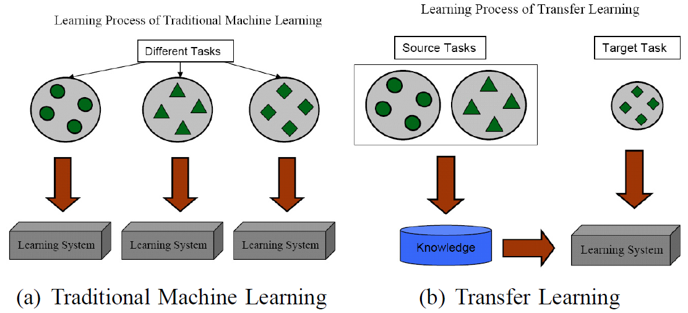

- Q22 **卷积层什么时候与全连接层等价?**

    - 实际上, 全连接层是卷积层的一个子集, 如果把`kernel`大小设置为与输入图像的大小一致, 设置通道数与全连接层层中的输出神经元大小一致, 那么卷积层等价于全连接层.

- Q23 **GAN和自动编码器有什么区别和联系?**

    - 自动编码器(`AutoEncoder`)的工作原理主要是同时学习编码网络和解码网络, 将输入(例如图像)提供给编码器, 编码器试图将输入降维为压缩的编码形式, 然后将其馈送到解码器.自编码器的学习目标是降低`reconstruction los`, 通常用于降维, 异常检测等领域.
    - 生成对抗网络的工作是通过博弈的过程学习生成器和鉴别器, 生成器生成以假乱真的图片, 鉴别器检测图像是否是真实的, `GAN`通常用于图像生成等领域.
    - `GAN`与`AE`同属于生成模型, 但GAN与AE的学习目标不同, 运用领域也不同.

- Q24 **预训练对神经网络有什么好处?**

    - 预训练模型能够从海量未标注的数据上学习语言本身的知识, 而后在少量带标签的数据上微调, 从而使下游任务能够更好地学习到语言本身的特征和特定任务的知识.预训练模型不仅能够充分利用广泛的网络资源, 而且还能完美地解决人工标记数据较为复杂的问题.

- Q25 **在深度神经网络中使用`Batch Normalization`会有什么问题吗?**

    - `Batch Normalization`对一个`batch`的数据进行归一化, 可获得更快的收敛速度和更高的准确性, 但 `Batch Normalization`也有它的劣势: 
        - `Batch Normalization`是内存密集任务, 所有`batch`处理的统计信息需要存储在该层中, 消耗大量计算成本.
        - 训练和推理之间存在差异, 推理结果取决于`batch`大小.
        - 打破了小批量训练示例之间的独立性.
        - 模型性能对`batch`大小敏感, `batch`过小时, `Batch Normalization`性能不佳.
        - `Batch Normalization`不适合序列问题, 在序列模型中, 我们可能拥有长度不同的序列, 以及对应于较长序列的较小批量大小.
    - 针对以上缺点, 目前的改善方案有`layer-norm`, `instance-norm`等.

    - 引用: [https://medium.com/geekculture](https://medium.com/geekculture)

- Q26 **什么是`multitask learning`?什么时候使用它较为合适?**

    - `multitak-learning`训练模型以同时执行多个任务, 在深度学习中, `MTL`是指通过跨任务共享网络的某些层和参数来训练神经网络执行多项任务.`MTL`通过利用跨任务共享的信息来提高模型的泛化性能.通过共享网络的一些参数, 模型可以学习更高效, 更紧凑的数据表示.
    - 当学习任务之间具有一定的相关性时, 使用多任务学习有帮助.或者当任务之间共享基本原则或信息时, 多任务学习可以提高性能.

    - 引用: [https://towardsdatascience.com/](https://towardsdatascience.com/)

- Q27 **`AE`与`VAE`的区别是什么?**

    - 自编码器(`Autoencoder`, `AE`)和变分自编码器(`Variational Autoencoder`, `VAE`)都属于生成模型, 用于学习数据的低维表示(编码)以及从低维表示重建数据(解码).

    - 自编码器(`Autoencoder`, `AE`)由两个部分组成: 编码器(`Encoder`)和解码器(`Decoder`).自编码器将输入数据$x$映射到隐空间表示$z=f(x)$, 解码器将$z$还原为原始输入的近似$\widehat{x}=g(z)$.子编码器主要学习数据的低维特征表示, 训练目的是最小化输入数据与重建数据之间的误差, 通常使用均方误差(`MSE`).
    - 变分自编码器(`Variational Autoencoder`, `VAE`)与自编码器类似, 但编码器输出的是隐空间的分布参数(均值和方差), 而不是固定的隐变量.解码器从隐变量的分布中采样, 用于生成数据.`VAE`将输入数据映射到隐空间的概率分布, 从而生成具有多样性的样本.在生成模型中, `VAE`通过优化似然函数来逼近数据的真实分布.

    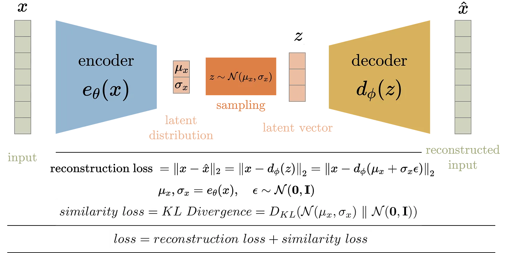

    - 引用: [https://towardsdatascience.com/difference-between-autoencoder-ae-and-variational-autoencoder-vae-ed7be1c038f2](https://towardsdatascience.com/difference-between-autoencoder-ae-and-variational-autoencoder-vae-ed7be1c038f2)

- Q28 **说一些你知道的`CNN`架构**

    - 典型的`CNN`架构堆叠了几个卷积层, 然后是一个池化层, 然后是另外几个卷积层(`+ReLU`), 然后是另一个池化层, 依此类推.
    - 典型的`CNN`架构如: `LetNet`, `AlexNet`, `GoogleNet`, `Inception V2 V3 V4`, `VGG`, `ResNet`, `DenseNet`, `ResNeXt`, `Channel Boosted CNN`, `EfficientNet`.

    - 引用: [https://www.kaggle.com/general/255114](https://www.kaggle.com/general/255114)

- Q29 **什么是玻尔兹曼机?**

    - 玻尔兹曼机是是由对称连接的节点组成的神经网络, 其中节点做出二元决策, 自行决定是否激活.玻尔兹曼机可以串在一起形成更复杂的系统, 例如深度信念网络.
    - 玻尔兹曼机通常用于解决不同的计算问题, 例如, 对于搜索问题, 连接上的权重可以固定, 并用于表示优化问题的成本函数.

    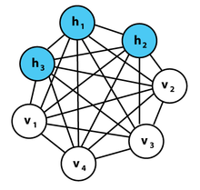

    - 引用: [https://deepai.org/](https://deepai.org/)

- Q30 **你会选择那种神经网络完成视频分类任务?**

    - 视频由有序的帧序列组成.每个帧都包含*空间*信息, 而这些帧的序列包含*时间*信息.为了对这两个方面进行建模, 可以使用由卷积(用于空间处理)和循环层(用于时间处理)组成的混合架构`CRNN`来进行分类.

- Q31 **`Dropout`对神经网络训练有什么影响?**

    - `Dropout`是一种正则化技术, 旨在降低神经网络的过拟合风险, 提高模型的泛化能力.它的核心思想是: 在每次训练过程中, 随机地“丢弃”一定比例的神经元及其连接, 减少网络对某些特定神经元的过度依赖.
    - `Dropout`通过随机使一些神经网络节点失活, 可以使用单个模型来模拟具有大量不同网络架构的模型, 它提供了一种计算成本非常低且非常有效的正则化方法, 以减少过度拟合并改善各种深度神经网络中的泛化误差.

- Q32 **`AE`模型可以用于特征生成吗?如果可以, 怎么做?**

    - `AE`模型可以用于学习原始数据的压缩表示, 该表示可作为特征.
    - 做法: 训练`AE`重建输入数据, 在模型训练完成后, 丢弃`decoder`, 使用模型在`bottle-neck`处的输出作为输入数据的特征, 该特征保留了输入数据中的大部分信息, 并且是固定维度的.

- Q33 **`Batch Normalization`, `Instance Normalization`, `Layer Normalization`, `Group Normalization`之间有什么区别?**

    - 四种归一化方式如下图, 立方体的3个维度为别为$batch \times H \times W$.`Batch Normalization`计算均值和标准差时, 固定`channel`(在一个`channel`内), 对`HW`和`batch`作平均, `LN`计算均值和标准差时, 固定`batch`(在一个`batch`内), 对`HW`和`channel`作平均, `IN`计算均值和标准差时, 同时固定`channel`和`batch`(在一个`batch`内中的一个`channel`内), 对`HW`作平均, `GN`计算均值和标准差时, 固定`batch`且对`channel`作分组(在一个`batch`内对`channel`作分组), 在分组内对`HW`作平均.

    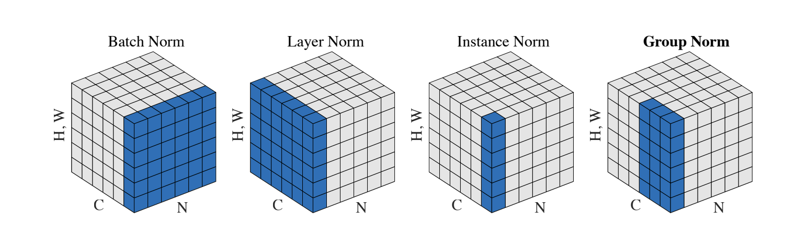

- Q34 **同等参数量情况下, 深层神经网络比浅层神经网络效果好的原理是什么?**

    - 隐藏层的操作, 可以被看作在输入向量的线性组合上施加非线性激活函数, 每个隐藏层都可以看作是一个模块化函数.许多隐藏层的深层网络就像是多个函数的堆叠, 与浅层网络相比, 相同数量的参数可以实现更复杂的功能.换句话说, 深度网络更有效地利用参数.
    - 以具体任务举例, 如语音识别, 初始层学习边缘和曲线等低级特征(发音方式), 后面的层学习高级特征(音素), 具有许多隐藏层的深层网络比浅层网络更容易学习这种高级特征.

- Q35 **比较`SVM`和`Deep Learning`**

    - 直观区别: `Deep Learning`是将许多神经网络层堆叠起来, 以分层的方式学习越来越多的数据的抽象表示, 而`SVM`是在数据点中找到一个分裂边界(线性可分情况下的超平面), 该边界与任一类别的支持向量尽可能远, 
    - `Deep Learning`相对来说不可被解释, 而`SVM`有强有力的数学推导支撑, 
    - 对权重初始化的敏感性: 因为神经网络使用梯度下降, 这使得它们对其权重矩阵的初始随机化敏感.这是因为如果*初始随机化*使*神经网络*接近优化函数的局部最小值, 那么这个神经网络的准确度将永远不会超过某个阈值.相反, `SVM`更可靠, 无论其初始配置如何, 它们都能保证收敛到全局最小值.
    - 在多类别问题上, `Deep Learning`更方便, `SVM`需要使用多个`SVM`分类器来处理多分类问题, 而`Deep Learning`只需要单个神经网络.
    - 在特征数大于样本数时, `SVM`表现不佳, `SVM`需要在特征工程上做更多的工作.

- Q36 **`ReLu`激活函数比`Sigmoid`函数好的地方在哪里?**

    - `ReLu`激活函数计算量更小.
    - `ReLu`能解决`Sigmoid`激活函数容易引起梯度消失的问题, 从两者梯度图可以看出, `Sigmoid`和`Tanh`函数反向传播的过程中, 饱和区域非常平缓, 接近于0, 容易出现梯度消失的问题, 减缓收敛速度.`ReLu`的`gradient`大多数情况下是常数, 有助于解决深层网络的收敛问题.
    - 由于`ReLu`不容易梯度消失, 导致网络训练更快.
    - `ReLU`会使一部分神经元的输出为0, 这样就造成了网络的稀疏性, 并且减少了参数的相互依存关系, 缓解了过拟合问题的发生
        
    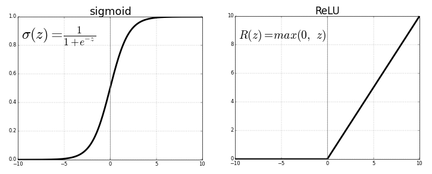

    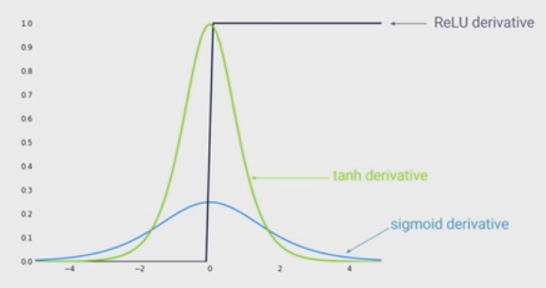

- Q37 **傅里叶变换在深度学习中有什么运用?**

    - 通过使用傅里叶变换, 可以节省卷积层的计算量.`CNN`中输入和滤波器的矩阵可以转换到频域进行乘法, 频域乘法的结果矩阵可以转换到时域.矩阵从时域到频域的转换可以通过傅里叶变换或快速傅里叶变换来完成, 从频域到时域的转换可以通过傅里叶逆变换或快速傅里叶逆变换来完成.

    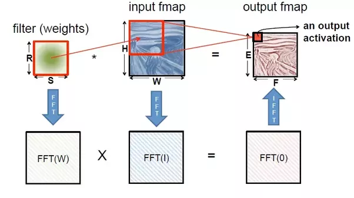

- Q38 **集成学习在深度学习中有什么运用?**

    - 集成学习是指训练多个模型, 并结合这些模型的预测, 减少最终预测的方差, 并提高准确性, 集成学习可以从数据, 模型, 结果组合这三个方面应用于深度学习.
    - 改变训练数据: k 折交叉验证(k 个不同的模型在 k 个不同的训练数据子集上进行训练.将这 k 个模型保存并用作整体的成员), 重采样(对训练数据集进行重采样, 然后使用重采样的数据集训练网络).
    - 模型: dropout, drop-connect.
    - 结果组合: 加权平均集成(对每个模型的预测进行加权来稍微改善, 使用保留验证数据集优化权重), 模型权重平均(对多个网络的权重进行平均, 以希望产生一个整体性能优于任何原始模型的新单一模型).

    - 引用: [https://machinelearningmastery.com/](https://machinelearningmastery.com/)

- Q39 **深度学习怎么减轻/避免维度诅咒?**

    - 维数灾难通常是因为数据中存在相关和太多不相关的(噪声)特征.深度学习架构可以提取高维数据表示的低维特征, 因此深度学习系统在学习过程中减少了不相关特征的影响, 同时增加了相关特征的影响.

    - 引用: [https://www.quora.com/](https://www.quora.com/)

- Q40 **你了解多少种跳转链接(skip-connection)方法?**

    - **ResNet**: 来自初始层的信息通过矩阵加法传递到更深层, 此操作没有任何附加参数.
    - **DenseNets**: `DenseNets`将层的输出特征图与下一层连接起来, 而不是求和.

    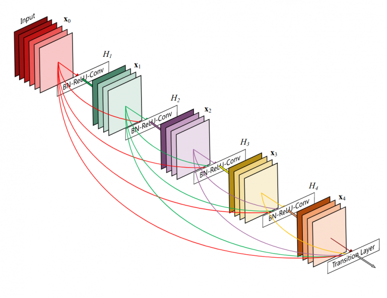

    - **U-Net**: 长跳跃连接

    - 引用: [https://www.analyticsvidhya.com/](https://www.analyticsvidhya.com/)

- Q41 **什么是Deep Recurrent Q-Network?**

    - `DRQN`是将`DQN`中第一个卷积后全连接层替换为`LSTM`的网络, `DRQN`虽然在每个时间步只能看到一个帧, 但成功地整合了时间信息并复制了`DQN`在标准`Atari`游戏和部分观察到的具有闪烁游戏屏幕的等价物上的性能.

    引用: [https://arxiv.org/abs/1507.06527](https://arxiv.org/abs/1507.06527)

- Q42 **基于区域的目标检测神经网络(`R-CNN`), `Fast R-CNN`和`Faster R-CNN`之间有什么区别?**

    - `R-CNN`使用选择性搜索算法从图像中仅提取`2000`个区域作为区域建议, 避免了在图像中选择大量区域引发的计算爆炸, 但即使这样, `RCNN`也不是实时的.
    - `Fast R-CNN`不是将区域建议提供给`CNN`, 而是将输入图像提供给`CNN`以生成卷积特征图.从卷积特征图中, 搜索出建议区域并将它们扭曲成正方形, 然后通过使用`RoI`池化层, 我们将它们重新整形为固定大小, 以便可以将其馈送到全连接层.
    - `Faster R-CNN`不是在特征图上使用选择性搜索算法来识别区域建议, 而是使用一个单独的网络来预测区域建议.然后使用`RoI`池化层对预测的区域建议进行重塑, 然后使用该层对建议区域内的图像进行分类并预测边界框的偏移值.

- Q43 **在处理序列问题上, 比较`HMM`模型和`RNN`模型**

    - `HMM`更简单, 并基于强假设: 状态转换只依赖于当前状态, 而不依赖于过去的任何事情, `HMM`适合小数据集的情况.
    - `RNN`在大数据集上效果更优秀, 不需要额外的假设.
    - `HMM`属于生成模型, RNN属于判别模型.
    - 引用: [https://stats.stackexchange.com/](https://stats.stackexchange.com/)

- Q44 **知道哪些关于目标检测的网络结构?**

    - 常见的目标检测网络结构有`RetinaNet`, `YOLO`, `CenterNet`, `SSD`(单发多框检测器), 区域建议(`R-CNN`, `Fast-RCNN`, `Faster RCNN`, `Cascade R-CNN`).
    - 大致可以分为两类: 单级目标检测与多级目标检测.
    - `YOLO`属于单级检测, 使用经过端到端训练的单个神经网络将照片作为输入并直接预测每个边界框的边界框和类标签.
    - 多级检测将目标检测任务分为两个阶段: 提取`RoI`(感兴趣区域), 然后对`RoI`进行分类和回归.面向`2`阶段的对象检测架构示例包括`R-CNN`, `Fast-RCNN`, `Faster-RCNN`, `Mask-RCNN`等.

    - 引用: [https://www.v7labs.com/](https://www.v7labs.com/blog/object-detection-guide)

    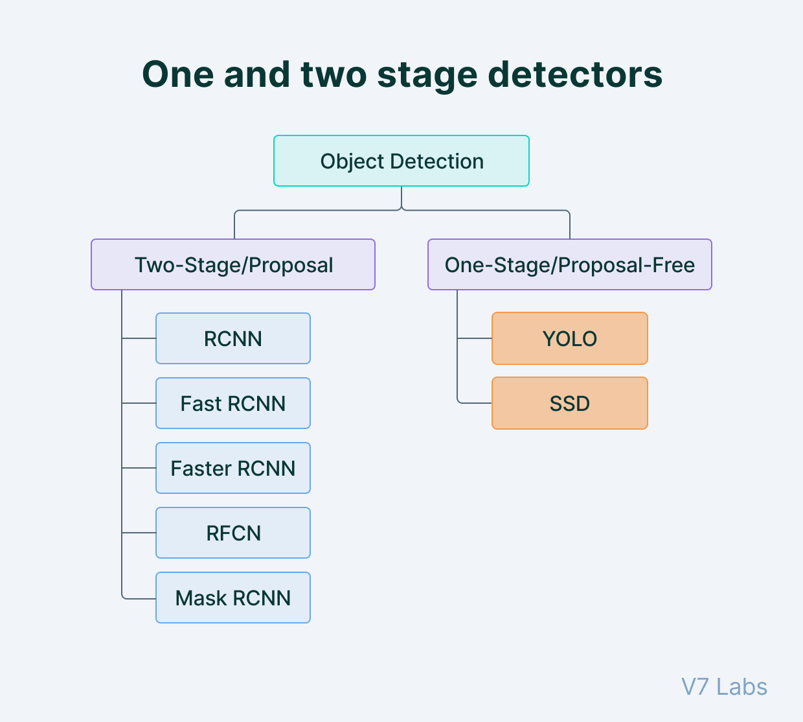

- Q45 **GAN网络在训练时的难点是什么?**

    - `GAN`模型存在以下主要问题: 
        - 不收敛: 模型参数振荡, 不稳定且永不收敛.
        - 模式崩溃: 生成器崩溃, 产生有限种类的样本.
        - 梯度消失: 判别器太成功以至于生成器梯度消失并且什么也学不到.
    - 模式崩溃是`GAN`中最难解决的问题之一. 在理想情况下, 生成模型应该能够生成`10`个数字(对`Minst`数据集), 如果只能生成其中的几个, 而错失其它的模式, 则为模式崩溃(生成的样本大量重复类似).
    - 模式崩溃的原因: 目前的深度神经网络只能够逼近连续映射, 而输入数据到输出数据的*传输映射*是具有间断点的*非连续映射*. 换言之, `GAN`训练过程中, 目标映射不在`NN`的可表示泛函空间之中, 这一矛盾导致了收敛困难. 如果目标概率测度的支集具有多个联通分支, `GAN`训练得到的又是连续映射, 则有可能连续映射的值域*集中在某一个连通分支*上, 即为模式崩溃.
    - 解决方法:
        - 经验方法:
            - `unrolled GAN`(生成器更新参数时不仅考虑当下状态, 而且额外考虑`K`步判别器的反应, 避免了短视行为).
            - `DRAGAN`(避免`GAN`进入坏的局部纳什均衡点).
        - 理论方法: 根据`Brenier`理论, 传输映射在奇异点处间断, 计算`Brenier`势能函数, 判定奇异点集, 可避免模式崩溃
        
        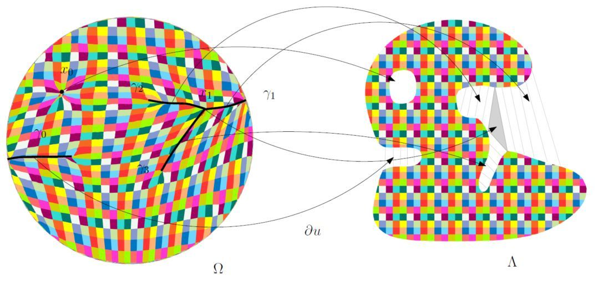

    - 引用: [https://jonathan-hui.medium.com/gan-why-it-is-so-hard-to-train-generative-advisory-networks-819a86b3750b](https://jonathan-hui.medium.com/gan-why-it-is-so-hard-to-train-generative-advisory-networks-819a86b3750b)

    - 《Mode Collapse and Regularity of Optimal Transportation Maps》

- Q46 **假设你想训练一个分类器, 你有大量未标记的训练数据, 但只有几千个标记实例, 你将如何进行?**

    - 使用半监督(`Semi Supervised`)方法, 使用几千个标记示例训练模型`A`, 对未标注的训练数据进行标注, 并按置信度从中挑选可信度高的样本, 作为标记数据`finetune`模型`A`得到结果模型.

- Q47 **怎样使用遗传算法(`Genetic Algorithm`)优化神经网络?**

    - 遗传算法优化`BP`神经网络分为`BP`神经网络结构确定, 遗传算法优化和`BP`神经网络预测3个部分.
    - 其中, `BP`神经网络结构确定部分根据拟合函数输入输出参数个数确定, 进而确定遗传算法个体的长度. 遗传算法优化使用遗传算法来优化`BP`神经网络的权值和阈值, 种群中的每个个体都包含了一个网络所有权值和阈值, 个体通过适应度函数计算个体适应度值, 遗传算法通过选择, 交叉和变异操作找到最优适应度值对应个体. `BP`神经网络预测用遗传算法得到最优个体对网络初试权值和阈值赋值, 网络经训练后预测函数输出.

    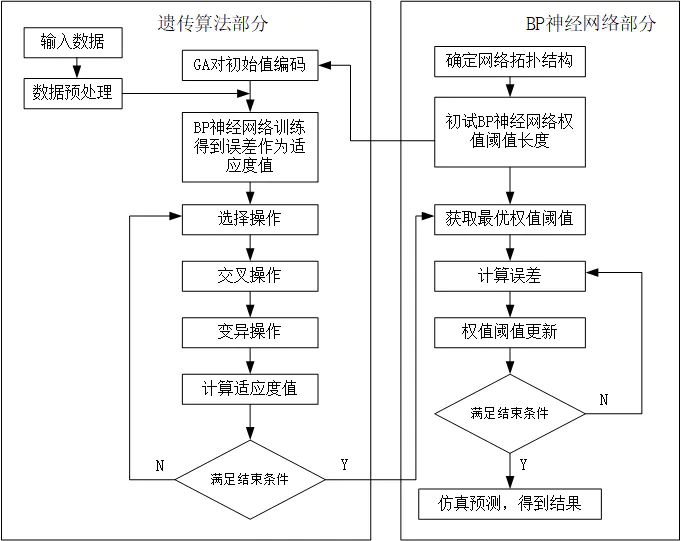

    - 引用: [https://journals.plos.org/plosone/article?id=10.1371/journal.pone.0243030](https://journals.plos.org/plosone/article?id=10.1371/journal.pone.0243030)

- Q48 **列举几种常见的深度学习优化器, 以及各自的优缺点.**

    - 随机梯度下降`SGD`(`Stochastic Gradient Descent`), 在梯度下降算法中, 每一步的更新都需要计算所有超参数的梯度, 迭代速度必然会很慢, 随机梯度下降算法速度和效率都会快很多, 在每次更新的时候使用一个样本进行梯度下降, 所谓的随机二字, 就是说我们可以随机用一个样本来表示所有的样本, 来调整超参数 $\theta$, 公式:
        \[ {\theta_j} = {\theta_j} + {\alpha}({y^{(i)}} - {h_{\theta}}(x^{(i)})){{x_j}^{(i)}}\]

        - 因为这个样本是随机的, 所以每次迭代没有办法得到一个准确的梯度, 这样一来虽然每一次迭代得到的损失函数不一定是朝着全局最优方向, 但是大体的方向还是朝着全局最优解的方向靠近, 直到最后, 得到的结果通常就会在全局最优解的附近. 这种算法相比普通的梯度下降算法, 收敛的速度更快, 所以在一般神经网络模型训练中, 随机梯度下降算法`SGD`是一种非常常见的优化算法.
        \[ \theta_{t+1} = \theta_t - \eta \nabla L(\theta_t) \]
        其中 \(\eta\) 是学习率, \(\nabla L(\theta_t)\) 是当前梯度.
        - 优点: 算法简单、效率高, 对小规模数据或简单目标函数表现好.
        - 缺点: 难以适应复杂的损失曲面, 收敛速度慢, 且容易陷入局部最优.

    - 动量`Momentum`, 动量优化算法是对梯度下降法的一种优化, 它在原理上模拟了物理学中的动量, 在每次更新时累积上一步的梯度信息, 使更新方向更稳定.
        - 公式:
          \[ v_t = \gamma v_{t-1} + \eta \nabla L(\theta_t) \]
          \[ \theta_{t+1} = \theta_t - v_t \]
          其中 \(\gamma\) 是动量因子, \(\eta\) 是学习率.
        - 优点: 能加速收敛, 尤其在深梯度曲面上表现更好. 有助于逃脱局部最优.
        - 缺点: 动量因子需要调优, 可能增加超参数调整的难度.

    - 自适应学习率`Adagrad`(`Adaptive Gradient`)
        - 核心思想: 对每个参数适应性调整学习率, 频繁更新的参数学习率减小, 稀疏更新的参数学习率较大.
        - 更新公式:   
          \[ \theta_{t+1} = \theta_t - \frac{\eta}{\sqrt{G_t + \epsilon}} \nabla L(\theta_t) \]
          其中 \(G_t\) 是每次迭代梯度平方和, \(\epsilon\) 是防止除零的小值.
        - 优点: 适用于稀疏数据, 尤其在NLP任务中表现好. 自动调整学习率, 减少人工调参.
        - 缺点: 累积的梯度平方和可能变得非常大, 导致学习率过小. 对较长时间的训练不适合.

    - 均方根传播`RMSProp`(`Root Mean Squared Propagation`), 在Adagrad中加入梯度平方和的指数衰减, 使学习率保持稳定.
        - 公式:
          \[ G_t = \gamma G_{t-1} + (1 - \gamma) (\nabla L(\theta_t))^2 \]
          \[ \theta_{t+1} = \theta_t - \frac{\eta}{\sqrt{G_t + \epsilon}} \nabla L(\theta_t) \]
          其中 \(\gamma\) 是衰减因子.
        - 优点: 控制梯度平方和增长, 防止学习率过小. 适用于非平稳目标函数.
        - 缺点: 需要调节衰减因子. 对超参数较敏感.

    - Adam(Adaptive Moment Estimation)
        - 结合优点: 同时使用Momentum和RMSProp的思想, 对梯度的一阶矩和二阶矩进行估计.
        - 公式:
            - 一阶矩估计(动量):
              \[
              m_t = \beta_1 m_{t-1} + (1 - \beta_1) \nabla L(\theta_t)
              \]
            - 二阶矩估计(RMSProp):   
              \[
              v_t = \beta_2 v_{t-1} + (1 - \beta_2) (\nabla L(\theta_t))^2
              \]
            - 参数更新:   
              \[
              \theta_{t+1} = \theta_t - \frac{\eta}{\sqrt{\hat{v}_t} + \epsilon} \hat{m}_t
              \]
              其中 \(\hat{m}_t, \hat{v}_t\) 是偏差修正后的值.
        - 优点: 快速收敛, 尤其在深度神经网络中效果优异. 对超参数相对鲁棒, 适应性强.
        - 缺点: 在小批量数据或稀疏梯度场中可能欠拟合. 对复杂优化问题, 可能导致过早收敛.
    
    - Summary
        | **优化器** | **特点** | **优点** | **缺点** |
        |-------|-----|-------|--------|
        | SGD | 随机梯度下降, 更新基于每次迭代的样本梯度.| 简单、易实现；适合小规模数据.| 收敛速度慢；易陷入局部最优；难以处理复杂损失曲面.|
        | Momentum | 在SGD基础上加入动量项, 通过累积梯度的指数衰减平均值加速收敛.| 能有效加速收敛；帮助跳出局部最优解.| 需要调整动量超参数；对不同维度调整学习率的能力较弱.|
        | Adagrad | 自适应梯度算法, 根据参数的历史梯度动态调整学习率, 学习率会随着训练逐渐减少.| 不需要手动调节学习率；对稀疏数据表现优异.| 学习率可能过快减小, 导致训练后期更新几乎停滞.|
        | RMSProp | 在Adagrad基础上加入指数衰减移动平均, 控制梯度平方和的增长.| 适用于非平稳目标；稳定训练过程；对稀疏数据表现好.| 需要调节衰减因子超参数；在非常复杂的任务中性能可能受限.|
        | Adam | 结合Momentum和RMSProp, 使用梯度的一阶矩估计和二阶矩估计动态调整学习率.| 收敛速度快；适应性强；无需大量手动调节超参数.| 参数更新可能导致模型欠拟合；对小批量数据敏感；需要更多的计算资源.|

        - 简单任务或小数据集: SGD, Momentum.
        - 稀疏数据或稀疏梯度场: Adagrad, RMSProp.
        - 大规模复杂任务: Adam是目前应用最广泛的选择.

    - 引用: [https://medium.com/towards-data-science/a-visual-explanation-of-gradient-descent-methods-momentum-adagrad-rmsprop-adam-f898b102325c](https://medium.com/towards-data-science/a-visual-explanation-of-gradient-descent-methods-momentum-adagrad-rmsprop-adam-f898b102325c)

- Q49 **bf16和fp16这两种格式有什么区别?**
    - BF16(BFloat16)和FP16(16-bit Floating Point)是两种常见的16位浮点数格式, 它们在深度学习和高性能计算中得到了广泛的应用. 它们的主要区别在于表示范围、精度和适用场景. 我们可以从以下几个方面来比较它们. 

    - 格式与表示范围
        FP16(半精度浮点数, IEEE 754标准)
            格式: FP16是标准的16位浮点数, 遵循IEEE 754标准. 
                1位符号位, 5位指数位, 10位尾数位(也称为“有效数字”)
            表示范围: 
                指数范围: FP16的指数位有5位, 可以表示的指数范围大约是 [-14, 15]. 因此, FP16的表示范围比FP32小, 适合表示数值较小的范围, 但不适合非常大的或非常小的数值. 
                精度: 由于只有10位尾数, FP16的精度相较于FP32会丢失很多细节, 尤其是对于小数值的表示不如FP32精确. 
        BF16(BFloat16, Brain Floating Point)
            格式: BF16由Google提出, 主要用于深度学习中的加速计算. 
                1位符号位, 8位指数位, 7位尾数位
            表示范围: 
                指数范围: BF16有8位指数位, 表示范围接近FP32, 能够表示的指数范围大约是 [-126, 127]. 这是FP16的两倍, 所以BF16可以表示的数值范围更大, 适合处理非常大的和非常小的数值. 
                精度: 由于BF16只有7位尾数, 精度较低, 尤其是对于数字的低精度尾数计算, 这对于某些深度学习任务可能是可以接受的, 但对于精度要求极高的应用可能存在限制. 
    - 精度与计算稳定性
        FP16: 由于FP16只有10位尾数, 它在表示数值时的精度较低, 尤其在深度学习中的梯度计算过程中可能导致数值下溢(underflow)或溢出(overflow)问题. 因此, 需要使用**损失缩放(Loss Scaling)**等技术来稳定训练. 
        BF16: BF16通过拥有更大的指数位(8位), 能够覆盖更广泛的数值范围. 尽管尾数只有7位, 精度较低, 但对于许多深度学习任务, 尤其是对于梯度计算和参数更新等任务, BF16已经足够使用. 特别是在计算过程中, BF16能更好地避免由于指数溢出导致的数值不稳定问题. 

    - 适用场景
        - FP16的适用场景
            - 计算密集型任务: FP16在计算密集型任务(如训练大规模神经网络)中具有显著的内存优势和加速效果, 尤其是在硬件(如NVIDIA的Tensor Cores)支持FP16计算时, 能够显著提高运算速度. 
            - 适用于不需要高精度的应用: FP16适合应用在一些对精度要求不是特别高的场景, 例如大规模的图像识别任务、语言模型训练等. 
            - 大规模数据处理: FP16可以在内存和带宽上节省大量空间, 适合处理大量数据. 
        - BF16的适用场景
            深度学习(尤其是训练阶段): BF16广泛应用于Google TPU(Tensor Processing Unit)等硬件中, 特别是在深度学习模型的训练阶段. BF16的较大指数范围使其适合处理梯度消失/爆炸问题, 因此在一些深度神经网络中, BF16相比FP16表现更好. 
            云计算和大规模机器学习: BF16适用于需要高吞吐量和较大数值范围的云计算平台, 特别是在Google Cloud和其他基于TPU的环境中. 
            长尾任务: BF16适用于需要处理长尾分布的任务(如NLP中长文本序列的处理), 它能在减少计算负担的同时保持较大的数值范围, 避免训练过程中的精度损失. 
    - 硬件支持
        FP16: FP16在现代GPU(如NVIDIA V100, A100)中得到了广泛支持. 特别是在NVIDIA的Tensor Cores上, FP16能够显著提升训练效率. 
        BF16: BF16主要由Google提出, 并在TPU等硬件中得到了较好的支持. 近年来, Intel的Sapphire Rapids处理器和AMD的某些新架构也开始支持BF16, 以便提供更高效的深度学习推理与训练能力. 

    - Summary
        - FP16适用于需要高效计算和较低内存消耗的场景, 特别是在GPU和大规模数据处理任务中广泛应用. 它的指数范围较小, 因此在需要处理极大或极小的数值时可能会受到限制. 
        - BF16则主要用于深度学习训练, 尤其是在需要较大数值范围但对尾数精度要求不高的场景. 由于BF16具有更大的指数范围, 它在处理大规模神经网络、梯度消失和爆炸问题时, 比FP16更具优势. 
        - 在现代深度学习中, BF16和FP16各有其优势和局限, 选择哪种格式通常取决于具体的硬件平台、训练任务和精度需求. 
  
        | 特性 | FP16 | BF16 |
        |-----|-----|-----|
        | 表示范围 | 较小的指数范围, 适合小范围数值 | 较大的指数范围, 适合广泛数值 |
        | 尾数精度 | 较高, 10位尾数 | 较低, 7位尾数 |
        | 计算效率 | 适合在支持FP16硬件上加速计算 | 适合在TPU和某些现代CPU上加速计算 |
        | 内存需求 | 低内存消耗, 节省带宽 | 低内存消耗, 节省带宽 |
        | 精度要求 | 精度要求较低时适用 | 精度要求不太高时适用 |
        | 适用场景 | 大规模数据处理, 图像识别, 语言处理 | 深度学习训练, 长尾任务, TPU加速 |
