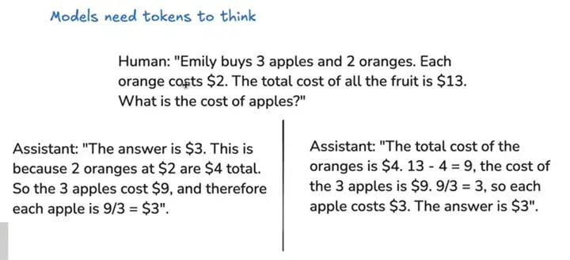

# Interesting articles

- Q1 **符号主义(Symbolism)**
    - 符号主义, 也称为**逻辑主义**或**符号处理主义**, 是人工智能的早期理论之一. 符号主义的核心观点是, 智能是通过对符号(如文字、图像等)的操作来实现的. 在符号主义框架下, 人工智能通过明确的规则和符号结构来表示知识、推理和问题解决. 

    - 特点: 
        - **知识表示**: 符号主义强调使用符号(如逻辑公式、语言等)来表示世界中的事实和概念. 例如, "鸟"、"飞"、"动物"等可以用符号表示, 并通过逻辑规则来描述它们之间的关系. 
        - **规则推理**: 符号主义采用明确的规则(如推理规则、决策树、逻辑推理等)来进行推理和问题求解. 系统通过这些规则对符号进行操作, 从而模拟智能行为. 
        - **可解释性**: 符号主义方法的推理过程通常是可解释的, 因为它基于明确的规则和符号的操作, 可以较容易地追踪和理解推理过程. 

    - 示例: 
        - **专家系统**: 通过一套规则和知识库, 模拟专家在某个领域的决策过程. 例如, 医学诊断专家系统. 
        - **逻辑编程**: 如 Prolog 编程语言, 使用规则和符号进行推理. 

    - 局限性: 
        - 符号主义的系统往往缺乏灵活性, 难以处理模糊、不确定或感知性较强的问题. 它通常依赖于人为编码的知识和规则, 而这些知识在很多情况下并不容易明确化. 
        - 符号主义方法缺乏对复杂模式识别的能力, 尤其是在面对大规模数据时不如其他方法高效. 

    - Summary
        - **符号主义**侧重于规则和显式知识的使用, 强调推理和逻辑过程, 适合处理结构化、明确的问题. 
        - **符号主义**注重规则和知识的表示与推理, 适用于结构化问题, 但对感知和学习的能力较弱. 

- Q2 **连接主义(Connectionism)**
    连接主义(或神经网络模型)是现代人工智能中一种重要的理论, 尤其在深度学习的背景下得到广泛应用. 连接主义的核心观点是, 智能是通过大量简单单元(如人工神经元)之间的连接和相互作用来实现的. 这些简单单元通过加权连接构成一个网络, 网络的结构和训练可以模拟复杂的认知过程. 

    - 特点
        - **神经网络模型**: 连接主义的基础是神经网络, 尤其是人工神经网络(ANN). 每个神经元通过与其他神经元的连接(权重)传递信息, 经过非线性函数处理后输出结果. 
        - **学习能力**: 连接主义方法通过学习过程来自动调整权重, 训练神经网络以从数据中提取特征并进行模式识别. 这种学习通常是通过反向传播算法(如梯度下降)来优化网络的权重. 
        - **并行处理**: 神经网络结构通常是高度并行的, 这使得它们能有效地处理大规模数据. 
        - **适应性**: 连接主义模型能够自动从经验中学习和适应, 不需要明确编码规则. 

    - 示例: 
        - **深度学习**: 卷积神经网络(CNN)、循环神经网络(RNN)、生成对抗网络(GAN)等, 广泛应用于图像处理、自然语言处理、语音识别等领域. 
        - **强化学习**: 基于连接主义的强化学习模型通过与环境的交互, 调整策略以最大化回报. 

    - 局限性: 
        - **黑箱问题**: 连接主义的模型, 尤其是深度神经网络, 常常被称为"黑箱", 因为其内部的工作机制和推理过程难以解释. 尽管能提供高效的预测, 解释模型的决策仍然是一个挑战. 
        - **依赖数据**: 连接主义方法需要大量的训练数据, 且在数据不充分或数据质量不高时, 模型的表现会大打折扣. 

    - Summary
        - **连接主义**侧重于通过数据驱动的学习过程来自动识别模式, 适合处理大规模、复杂和不确定的问题. 
        - **连接主义**依赖神经网络, 通过数据学习来模拟智能, 具有较强的适应性和模式识别能力, 但推理过程不易解释.

- Q3 **An interesting particle about our brains**

    后来生物学家总算领悟到, 人脑之所以强大, 核心原因是算法. 人脑有这样几个"超能力".
    - 1 长期记忆: 人类可以通过睡眠, 把海马体的短期记忆转变为新皮层的长期记忆. 长期记忆对于推理(归纳与演绎)的帮助极大. 如果人类记不住去年的时节气候, 也不可能推演出农耕历法呢. 不过人脑并不是什么信息都转化为长期记忆. 人生中只出现一次的现象, 大脑不会记忆太久, 因为这说明这东西太偶然了, 对生存模型没有帮助, 只有当一个现象反复出现在各个场景中, 大脑才会认为这东西很重要, 值得记忆. 这就是为什么提示词写好了很有用, 因为提示词就是反复出现的信息. 输入越准确, 越详细, 效果就越好. 你直接让大模型写西游记第一章的总结, 和把第一章的文本贴给它, 然后让它总结, 效果是完全不一样的.

    - 2 思维链: 有了长期记忆, 人类的推理能力极大加强, 可以一步步做归因分析, 从而诞生"想象"(即抽象能力与泛化能力). 人类这项能力是从狩猎中学会的, 追踪猎物需要根据猎物留下的各种痕迹, 比如脚印、毛发、血迹、粪便, 打斗的残痕, 折断的树枝, 消失的鸟鸣等信息, 来推测猎物可能的动向与反应. 狩猎需要大脑把各种线索串起来, 不停的根据追踪过程中的每一个发现, 来推断各种可能性, 并决定下一步的行为. DeepSeek的深度思考就是这个原理. 想训练好一个模型, 需要不停的让它思考, 消耗token, 而不是直接给答案. Andrej Karpathy曾经举过一个 SFT 示例
        

    在人类看来左边效果更好, 因为逻辑性强. 但在大模型看来右边效果更好, 因为可以先展开思考, 最后再对比正确答案. 杨立昆之前不看好LLM, 认为自回归模型都是下意识的回答, 没有任何思考, 就好比一个小孩背书再好, 把全人类的知识背的滚瓜烂熟, 那又怎样? 不思考就不可能诞生智能. 不过等DeepSeek出来, 他就不说话了, Meta开始疯狂研究DS, 因为大模型真的会思考.

    - 3 分层思维: 大脑在思考问题时不会调动所有资源, 只是激活少量的相关神经元. OpenAI训练GPT-3的用电量约为1.287吉瓦时, ChatGPT每天消耗超过50万度电力, 相当于1.7万个美国家庭的用电量. 马斯克的Grok3消耗的能源大概还要再乘以10. 大脑大约10-30瓦, 相当于一个灯泡的用电量. 所以你就知道DeepSeek为何如此低成本了, MoE混合专家模式堪比大脑节能的方法. 辛顿在17年的论文就提出了MoE模式(这个思路还可以追溯到更早), 可惜没受重视. 全世界的AI研究者都被OpenAI带歪了.

    - 4 强化学习: 人类天生就会强化学习, 在与环境的交互中通过试错来学习最优策略. 其实人类也是被逼的, 那些不懂得学习的都被自然选择淘汰掉了. 我们教育小孩也用到强化学习. 像机器人那样, 直接给小孩写硬规则, 比如不许打游戏, 九点要上床睡觉, 没用, 谁搭理你啊, 他的基因自发的在反抗. 只有不停的引导孩子, 告诉他什么是对, 什么是错, 并给予相应的奖励或惩罚, 从而改变他的观点(权重), 影响他的行为(输出). 某种意义上, 训练大模型就是教育孩子. 说实话, 我挺奇怪为啥没人早想到强化学习路线. 很多早期投身人工智能的同学, 都有被当年AlphaGo震惊到, AlphaGo就是强化学习的典范, 尤其是AlphaGo Zero, 没有任何棋谱数据或人类先验知识, 仅靠自我对弈就能超越人类顶尖水平. 这说明AI不需要海量数据也可以进化.
  
    - 5 纠错能力: 人脑具备极强的脑补能力, 即使接收到了错误信息, 也能正确处理. 生物学家曾经做过一个实验, 让普通人戴一个上下颠倒的眼镜, 刚开始特别不适应, 各种失误和跌倒, 连最简单的抓取杯子都做不好. 但很快, 大脑就自适应了这个眼镜, 对人来说, 神奇的是世界又恢复正常了, 上下和原来一样, 做动作毫无影响. 只是等摘下眼镜, 又混乱了, 需要再适应一段时间才能恢复. 我们生活中也经常遇到此类问题. 比如一段序顺倒颠的话, 读起来毫无困难. 但是有种特殊的情况, 大脑无法适应, 就是逻辑错误(我们通常称之为认知错误). 逻辑一致性对于生存模型太重要了, 非经剧烈的刺激, 大脑绝不轻易改变. 比如, 我们无法适应与自己认知不一样的世界观, 按某些人的逻辑, 美国就是最强大的灯塔, 怎么可能被中国超越? 一定是哪里出了问题, 我绝不接受. 这说明什么呢? 我想很多 AI 研究者可能还没意识到——数据内容并不重要, 数据结构才是关键. 在思维链中, 数据结构决定了推理的质量, 而不是数据内容. 因为内容错了, 神经网络会自动脑补, 纠错, 但结构错了, 会破坏逻辑一致性, 让大模型的思考"卡壳". Scaling Law 并没有错, 但我们对什么是"高质量的数据", 却需要重新评估. 我不看好Grok3的合成数据, 也是基于这一点. 规模没多大意义, 质量才是王道. 有意思的是, 数据结构其实就是符号主义的思路. 当年皮茨曾预言: "在我们面前有两条通向智能的路径, 一条是模拟人脑的结构, 一条是模拟人类的心智, 但我相信这两条路最终殊途同归". 真是一个伟大的预言. 最后, 罗里吧嗦的说了一堆, 有人可能会问, 干嘛要模拟人脑? 通向AGI又不止这一条路. 说的没错. 不过人脑毕竟是我们接触到的唯一智能, 看得见, 摸得着, 所谓近水楼台先得月, 模拟人脑只是技术问题, 而其他道路则是方向问题, 孰难孰易, 不用说了吧. 总而言之, 我觉得如今的 AI 研究已经到了一个关键节点, 需要研究范式上的转变. OpenAI曾经引领大家探索, 但如今它已经走入了歧途, 是时候重新出发了.