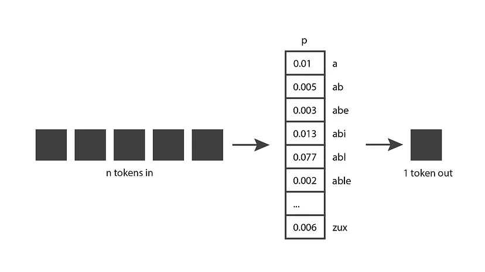
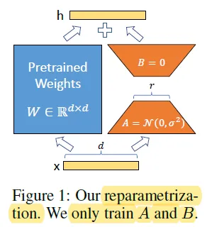

# LLM

- Q1 **语言模型的工作机理是什么?**

    - 生成式语言模型的输出是所有可能标记的概率分布.
        - 生成式语言模型的核心在于预测下一个词语的概率分布. 这个概率分布是一个向量, 每个元素代表一个词语(token)出现的概率. 模型的目标是学习到这个概率分布, 使得在给定输入序列的情况下, 预测下一个词语的概率尽可能高. 
    - 生成式语言模型的输入
        - 生成式语言模型将N个Token作为输入, 并一次生成一个Token作为输出. 然后它将该输出Token合并为下一次迭代的输入的一部分, 产生一个新的Token输出, 依此类推. 此模式不断重复, 直到达到停止条件, 表明它已完成生成您需要的所有文本.
        - 生成式语言模型通过迭代的方式生成文本. 它首先接收一个输入序列(可以是单个词语, 也可以是一段文本), 然后根据这个输入序列预测下一个词语的概率分布. 模型从这个概率分布中采样一个词语作为输出, 并将这个输出词语添加到输入序列中, 作为下一次迭代的输入. 这个过程不断重复, 直到达到停止条件(例如生成了指定长度的文本, 或者遇到了结束标记).  

    

    

    - 这个概率分布来自训练阶段. 在训练期间, 模型会接触大量文本, 并且在给定输入标记序列的情况下, 调整其权重以预测良好的概率分布.

    - GPT生成模型是通过大部分互联网进行训练的, 因此它们的预测反映了它们所看到的信息的混合.

- Q2 **解释LLM中Token, 词表, 语义空间的概念.**

    - Token是指模型在处理语言时, 所使用的最小单元. 它可以是单词, 子词, 字符, 甚至是标点符号或特殊符号. 在大模型中, 输入文本会被切分成多个Token, 这些Token会被转化为数字表示(如向量或索引), 然后输入到模型中进行处理.

        -  Token的定义: 一个Token是文本被分割后的基本单位, 具体分割方式取决于模型使用的分词器(`Tokenizer`).
            不同的Token单位: 
            单词(`Word-level`): 每个单词作为一个Token, 例如 `"I love NLP"` -> `["I", "love", "NLP"]`. 
            子词(`Subword-level`): 将单词分解为更小的单元, 例如 `"unbelievable"` -> `["un", "believ", "able"]`. 
            字符(`Character-level`): 每个字符作为一个Token, 例如 `"chat"` -> `["c", "h", "a", "t"]`. 
            特殊符号: 例如模型常用的`[PAD]`, `[CLS]`, `[SEP]`, 表示特殊功能的Token.
        - Token在大模型中的作用
            - 输入表示. 文本需要转换为Token才能被模型理解和处理. 模型通过分词器将文本切分为Token序列, 并为每个Token分配唯一的索引值. 例如: 输入句子`"I love NLP"`, 分词器将其转换为Token序列`["I", "love", "NLP"]`, 然后映射为索引`[101, 202, 303]`.
                - 大模型的训练和预测. 大模型的核心操作是对Token进行编码和解码: 
                - `Encode`: 将Token转化为向量表示, 捕捉语义信息.
                - `Decode`: 将模型的输出映射回Token, 并最终重构为文本.
            - 生成文本
                - 在生成任务(如机器翻译或文本生成)中, 模型逐步生成Token, 直到完成输出. 例如, 模型可能依次生成Token序列`["The", "cat", "is", "on", "the", "mat"]`.

        - Token的生成方式(分词器)
            分词器(`Tokenizer`)负责将文本切分为Token, 不同模型使用的分词器不同.

            - `Word-levelTokenizer`. 按单词切分. 优点: 简单易用. 缺点: 词表非常大, 稀有词(如专有名词)难以处理. 
            - `Subword-levelTokenizer`. 使用子词单元, 如`BPE`(`Byte Pair Encoding`), `WordPiece`, `SentencePiece`等.
            - `BPE`: 基于频率将常见的字符组合成子词, 如 `"lo" + "ve"` -> `"love"`. 
            - `WordPiece`: 类似`BPE`, 广泛用于BERT. 
            - `SentencePiece`: 基于概率方法切分, 支持多语言处理.
            - 优点: 词表小, 能够处理生僻词. 缺点: 切分会增加Token的数量. 
            - `Character-levelTokenizer`. 按字符切分, 每个字符是一个Token. 优点: 词表最小, 无需担心生僻词. 缺点: 序列长度较长, 训练复杂. 
            - `Byte-levelTokenizer`. 使用字节为单位切分(如 GPT 的分词器). 优点: 无需预定义词表, 适用于所有语言和字符集. 

        - Token的作用举例
            - 机器翻译. 输入句子: `"I love NLP"` -> Token序列: `["I", "love", "NLP"]` -> 索引序列: `[101, 202, 303]`. 模型根据Token序列生成目标语言的翻译结果. 
            - 文本生成. 任务是根据输入生成下一句或下个词. 输入Token序列: `"The cat is"` -> 模型生成下一个Token: `"on"`.
            - 问答系统. 提出问题: `"What is AI?"` -> Token化后输入模型, 模型生成答案Token序列: `"Artificial Intelligence is..."`.

        - Token的挑战
            - Token数量
                长文本会被切分成大量Token, 可能导致模型处理效率下降. 
                解决方法: 引入窗口机制(`Sliding Window`)或限制Token长度. 
            - 分词精度
                分词器可能导致语义误解. 例如, 子词分割可能破坏单词的完整性.
                英文: `"unbelievable"` -> `["un", "believ", "able"]`(保留语义).
                中文: `"机器学习"` -> `["机器", "学习"]` 或 `["机", "器", "学", "习"]`.
            - 多语言处理
                多语言模型需要共享词表, 可能导致一些语言的Token表示不够精确.

            - Token和词表(`Vocabulary`)的关系
                词表: 包含所有Token的集合, 例如: `["I", "love", "NLP", "[PAD]", "[CLS]"]`.
                Token: 词表中的一个元素, 例如Token `"love"`的索引可能是`2`.
                词表的大小(通常是几千到几万个Token)影响模型的参数数量和性能.

            - Token是大模型处理文本的最小单元, 是文本输入与模型之间的桥梁. 通过分词器将文本切分为Token, 并映射到语义空间中, 模型可以高效地理解和生成自然语言. Token的选择和分词方法直接影响模型的性能, 训练效率和生成质量.

    - 词表(Vocabulary)是指模型在处理自然语言时, 所能识别和操作的单词, 子词或符号的集合. 词表是语言模型的基础之一, 直接影响模型的输入与输出格式, 以及其在语言理解和生成任务中的表现. 

        - 词表的定义, 词表可以简单理解为一个列表, 列出所有模型能够处理的基本语言单位. 常见的单位包括: 
            - 单词(`Word-level`): 以完整单词为单位, 如`"apple"`, `"banana"`.
            - 子词(`Subword-level`): 将单词分解为更小的片段, 如`"ap-ple"`或`"ban-ana"`.
            - 字符(`Character-level`): 以单个字符为单位, 如`"a"`, `"b"`.
            - 特殊符号: 包括标点符号(如`.`, `,`), 特殊标记(如`[PAD]`, `[CLS]`)和数字.
       
        - 词表的作用
            - 输入表示. 将自然语言转换为模型可处理的形式(通常是数字化的索引). 例如, 句子`"Hello world"`可能被映射为词表中的索引`[123, 456]`. 
            - 输出生成. 模型生成的预测结果通过词表映射回文本. 例如, 生成索引`[123, 456]`对应词表中的单词`"Hello world"`.

        - 常见的词表构建方法
            - 完整单词词表. 将训练语料中所有独立单词加入词表.
              优点: 简单直观, 单词粒度大, 便于理解.
              缺点: 词表通常非常大, 稀有单词(如人名)难以处理.
            - 子词词表. 通过算法将单词切分为更小的子词单元. 
              常见算法: 
                - `BPE`(`Byte Pair Encoding`): 基于频率合并子词单元, 如将`"ap"`, `"ple"`合并为`"apple"`.
                - `WordPiece`: 类似`BPE`, 广泛用于BERT.
                - `SentencePiece`: 基于概率模型的子词分解方法, 用于GPT, `T5`等.
                    优点: 词表规模更小, 可处理生僻词或新词. 
                    缺点: 增加了分词复杂性. 
            - 字符或字节级词表. 每个字符或字节都是一个词表单元. 
                优点: 无需复杂的分词操作, 能覆盖所有语言. 
                缺点: 粒度过小, 序列长度显著增加, 训练效率低.

            - 词表的设计权衡
                词表大小: 过大增加存储需求, 过小可能影响模型表达能力. 
                语言覆盖: 多语言模型需要设计能够适应多种语言的词表. 
                任务需求: 如代码生成任务可能需要包含编程语言的关键词.

        - 大模型训练中的词表特点
            - 多语言支持. 大模型(如`GPT-4`, BERT)往往需要处理多语言数据, 其词表通常包含多语言的子词单元. 示例: 一个多语言词表可能同时包含`"hello"`和`"你好"`的子词. 
            - 特殊标记. 用于表示模型的特殊功能: `[CLS]`: 分类任务的标记, `[SEP]`: 分隔符, `[MASK]`: 用于掩码语言模型(如BERT).
            - 动态扩展. 一些模型支持动态扩展词表, 以适应未见词汇或领域专用术语. 

        - 词表的挑战
            - 稀有词处理. 生僻词或新词可能被拆分成多个子词, 影响理解或生成.
            - 多语言平衡. 多语言模型中, 不同语言的子词可能竞争有限的词表空间, 导致部分语言表现较弱.
            - 存储与计算. 过大的词表会增加显存需求, 尤其在大规模模型训练中.

        - 词表是大模型训练的重要组成部分, 其设计直接影响模型的训练效率, 泛化能力和生成质量. 随着语言模型规模的不断扩大, 词表构建方法也在持续优化, 以更高效地处理多语言, 多任务场景.

    - 语义空间(Semantic Space)是指通过大规模预训练模型(如GPT, BERT等)对语言进行编码后, 得到的向量化表示空间, 其中每个词语, 句子或段落都可以通过一个高维向量来表示. 这个空间中的向量捕捉了文本的语义信息, 使得模型能够理解和生成自然语言.

        - 语义空间的概念
            语义空间是一个向量空间, 每个文本单元(如单词, 句子, 段落)都被映射到该空间中的一个点. 这个向量是通过预训练模型的嵌入层(Embedding Layer)生成的, 通常是一个多维的数字向量, 表示该文本单元的语义特征. 
            例如, "猫"和"狗"这两个词的向量, 在语义空间中会比较接近, 因为它们代表的是相似的动物概念. 相比之下, "猫"和"汽车"可能在语义空间中较为远离, 因为它们的语义差异较大. 

        - 语义空间的特点
            - 高维空间
                语义空间通常是高维的, 可能有数百到数千个维度. 每个维度捕捉文本中的某种语义特征或语言模式. 高维空间的复杂性允许模型能表示和区分不同的语言特征, 如词性, 上下文含义, 情感倾向等. 
            - 连续性与向量表示
                在语义空间中, 文本单元的表示是连续的, 而不是离散的. 这意味着类似意义的词语或句子在该空间中通常靠得很近, 而意义完全不同的词语则会远离. 这种连续性有助于模型理解和推断语言的上下文. 
            - 向量的相似性
                在语义空间中, 向量之间的距离或相似度反映了语义的相似性. 常用的度量方式包括: 
                - 余弦相似度: 度量两个向量的夹角, 角度越小, 相似度越高. 
                - 欧几里得距离: 度量两个向量之间的距离, 距离越小, 相似度越高. 
            - 语义聚类与类比推理
                语义空间允许模型通过向量之间的关系来进行类比推理. 例如, 如果向量表示"国王" - "男人" <-> "女王" - "女人", 则模型能推断出男女之间的类比关系. 这种能力使得大模型在多种任务中都具有较好的表现, 如词义消歧, 问答和文本生成.

        - 语义空间的构建与学习
            语义空间的构建通常依赖于大规模预训练模型的训练过程, 下面是常见的几种构建方式: 

        - 基于词嵌入(`Word Embedding`)
            经典的词嵌入方法(如`Word2Vec`, `GloVe`, `CBOW`(`Continuous Bag Of Word`))将每个词语映射到一个低维向量空间. 通过分析词与词之间的共现关系, 模型学会了如何在语义空间中表示词语. 
            例如, `Word2Vec`的`Skip-gram`模型尝试通过上下文词来预测目标词, 从而学习到语义上相似的词语具有相近的向量表示. 
        - 基于上下文的表示(`Contextual Embedding`)
            随着大模型(如BERT, GPT)的发展, 语义空间逐渐演变为上下文相关的嵌入. 这些模型不仅考虑词本身, 还考虑词所在的上下文. 
            例如, BERT使用双向Transformer架构来同时考虑一个词的前后文, 从而生成上下文相关的词向量表示. 
        - 多模态语义空间
            对于涉及多种数据类型(如图像, 音频等)的任务, 语义空间不仅限于文本, 还包括多模态信息. 通过联合训练, 模型能学习将图像, 文本和其他数据映射到同一个语义空间, 使得跨模态任务(如图文匹配)成为可能.

        - 语义空间的应用
            - 语义相似度计算. 通过计算文本向量之间的相似度, 模型可以进行信息检索, 推荐系统, 文本匹配等任务. 例如, 在搜索引擎中, 通过计算查询和文档之间的语义相似度, 返回最相关的文档. 
            - 情感分析与意图识别. 通过分析句子或段落的语义表示, 模型可以判断文本的情感(如正面, 负面)或用户的意图(如询问, 请求, 抱怨).
            - 机器翻译. 语义空间能够捕捉不同语言之间的语义对应关系, 使得机器翻译能够跨语言地进行文本生成.
            - 文本生成与对话系统. 通过学习语义空间中的模式, 大模型能够生成语法正确且语义相关的文本. 例如, 在对话系统中, 模型可以基于对话上下文生成合理的回复.

        - 语义空间的挑战
            - 语义歧义. 有些词语在不同上下文中具有多重意义, 如何在语义空间中区分这些歧义依赖于模型的上下文理解能力. 
            - 模型偏差. 训练数据的偏差(如文化, 语言或性别偏见)可能影响语义空间的构建, 导致模型在某些任务中表现不公平或不准确. 
            - 解释性问题. 尽管语义空间能够捕捉复杂的语言模式, 但其黑箱特性使得模型难以解释和理解, 尤其是在面对复杂推理任务时.

        - 大模型的语义空间是通过大量数据训练而形成的一个高维向量空间, 能够捕捉到语言的复杂语义信息. 模型的语义理解能力体现在能够通过向量的距离和关系推断出语言的深层次意义. 随着大模型的不断发展, 语义空间的构建也在不断优化, 推动了语言处理和跨模态任务的进步.

    | **维度** | **Token** | **词表(`Vocabulary`)** | **语义空间(`Semantic Space`)** |
    |---------|-----------|---------|---------|
    | **定义** | 文本被分割后的最小单元, 如单词, 子词, 字符或特殊符号. | 包含所有Token的集合, 用于构建模型输入输出的映射关系. | 一个高维向量空间, 用于表示Token或文本单元的语义信息, 捕捉其上下文含义和关系. |
    | **作用** | 模型的输入和输出单元, 是数据处理的基础单位. | 提供模型训练和推理时的参考索引, 是Token转换为向量的基础. | 通过向量表示语言单元, 支持语义相似度计算, 推理和生成任务. |
    | **表现形式** | 单一单位, 例如 `["The", "cat", "is", "on", "the", "mat"]`. | 例如: `["The", "cat", "is", "on", "the", "mat", "[PAD]", "[UNK]"]`. | 向量表示, 例如 `The -> [0.32, 0.15, 0.87, ...]`, 每个向量维度表示一种语义特征. |
    | **大小** | 动态, 取决于输入文本的长度；长文本会生成更多Token. | 固定大小, 通常几千到几万个Token, 过大会导致计算开销, 过小可能无法表达丰富语义.  | 通常为数百到数千维, 模型训练时隐式学习, 大小与模型设计相关. |
    | **生成方式** | 由分词器(`Tokenizer`)切分文本后生成, 例如`Word-level`, `Subword-level`或`Character-level`. | 通过统计训练语料中的Token, 选择高频Token构建; 可能使用`BPE`, `WordPiece`等技术生成. | 通过模型(如Transformer)的嵌入层学习得到, 通过权重矩阵将Token映射到向量空间. |
    | **与模型的关系** | 模型直接处理Token序列, 通过向量化后输入到模型中. | 词表决定了模型的嵌入层维度和输出层的大小. | 模型的嵌入层和编码器将Token映射到语义空间, 输出层或解码器利用语义空间向量生成结果. |
    | **适用范围** | 文本处理的微观层面, 操作的是具体的单元, 如句子中每个词, 子词或符号. | 文本处理的词级别或符号级别, 提供Token和索引之间的映射, 作用于输入输出的总体范围. | 文本处理的宏观层面, 操作的是语言的语义特征, 用于表示, 推理和生成任务. |
    | **对性能的影响** | Token数量多会增加序列长度, 导致计算复杂度上升; 切分质量影响语义表达和模型表现. | 词表大小决定嵌入层和输出层参数量, 词表太大或太小都会影响模型性能和效率. | 语义空间的质量决定模型对语言理解的深度和生成能力; 较低质量的语义空间可能导致模型推理不准确或生成不连贯文本. |
    | **示例** | 输入句子: `"The cat is on the mat"` -> Token序列: `["The", "cat", "is", "on", "the", "mat"]`. | 示例词表: `{"The": 1, "cat": 2, "is": 3, "on": 4, "the": 5, "mat": 6}`. | 语义空间中, `"cat"` 的向量可能为 `[0.45, 0.68, -0.12, ...]`, 与 `"dog"` 的向量距离较近. |

    - Token是模型的最小操作单位, 决定模型处理的文本细粒度. 
    - 词表是所有Token的集合, 是文本与模型之间的桥梁, 影响嵌入和输出层的设计. 
    - 语义空间 是对Token的向量化表示, 用于捕捉语言的语义特征, 是模型理解和生成能力的核心基础. 
    - Token语义空间的输入单元, 词表决定了Token的映射规则, 而语义空间是模型在语言处理中的最终理解和表达层.

- Q3 **在NLP任务中, 使用Transformer的架构与使用RNN的架构相比, 有什么优势?**

    - 在Transformer出现之前, 通常使用`LSTM`与`encoder-decoder`架构完成序列到序列的任务, `LSTM`模型考虑到了单词之间的相互依赖, 但是该模型有一个局限性: 训练速度相对较慢, 并且输入序列无法并行传递. Transformer的想法是在不使用循环网络的情况下维持序列中单词的相互依赖性, 而仅使用处于其架构中心的注意力机制. 注意力衡量两个序列的两个元素的相关程度.
    - 在基于Transformer的架构中, 使用`self-attention`. 自注意力层确定同一序列中不同单词的相互依赖关系, 以将相关表示与其相关联. 以这句话为例: "狗没有过马路, 因为它太累了". 对于人类来说, 显然"它"指的是"狗"而不是"街道". 因此, 自注意力过程的目标是检测"狗"和"它"之间的联系". 与`RNN`相比, `self-attention`可以并行训练, 使得Transformer的训练速度更快, 并且已被证明对噪声和丢失数据具有更强的鲁棒性.
    - 另外, 在上下文嵌入中, Transformer可以从上下文中提取信息来纠正丢失或嘈杂的数据, 这是其他神经网络无法提供的.

- Q4 **如何评估LLM的性能**

    评估LLM有两种方法: 外在评估和内在评估.

    - **内在评估**  
        捕获模型捕获它应该捕获的内容(例如概率)的程度. 例如困惑度, 交叉熵, 困惑度是模型预测的单词的逆概率的几何平均值. 困惑度越低, 训练效果就越好.

    - **外部评估(基于任务的评估)**
        捕获模型在特定任务中的有用程度.例如给出两个不同LLM的输出, 令人类比较打分.

- Q5 **LLM是如何预训练的?**

    - `MLM`(`Masked Language Models`), 由BERT(`Bidirectional Encoder Representations from Transformers`)等双向模型使用, 其中训练集中一定比例的单词被屏蔽, 模型的任务是预测这些缺失的单词.请注意, 在此任务中, 模型可以看到缺失单词之前和之后的单词, 这就是它被称为双向的原因.

    - 自回归(`Auto Regressive Model`)(例如GPT), 它们是单向的, 预训练时看不到之后的单词, 预测下一个单词. 这是因为这些自回归模型是专门为更好的语言生成而设计的, 这使得模型有必要以单向的方式进行预训练.

- Q6 **什么是NSP预训练任务**

    - (NSP)用于语言建模, 作为BERT模型训练过程的一半(另一半是掩码语言建模(`MLM`)). NSP的目标是预测一个句子是否逻辑上遵循模型呈现的另一个句子.
    - 在训练过程中, 模型会呈现成对的句子, 其中一些在原始文本中是连续的, 而另一些则不是. 然后训练模型来预测给定的句子对是否相邻. 这使得模型能够理解句子之间的长期依赖关系.

- Q7 **LLM中的tokenization技术**

    - tokenization是将原始文本转换为一系列较小单元(称为Token)的过程, 这些单元可以是单词, 子词或字符. LLM中使用的一些tokenization技术包括: 
        - 基于词语的分词(`Word-basedTokenization`): 此方法将文本拆分为单独的单词, 将*每个单词*视为单独的标记. 虽然简单直观, 但基于单词的标记化可能会难以处理词汇表之外的单词, 并且可能无法有效地处理具有复杂形态的语言.
        - 基于子词的分词(`Subword-basedTokenization`): 基于子词的方法, 例如字节对齐编码(`BPE`, `Byte Pair Encoding`)和`WordPiece`, 将文本分割成*更小的单元*, 这些单元可以组合成整个单词. 这种方法使法学硕士能够处理词汇表之外的单词, 并更好地捕捉不同语言的结构. 例如, `BPE`合并最常出现的字符对来创建子字单元, 而`WordPiece`采用*数据驱动的*方法将单词分段为子字标记.
        - 基于字符的分词(`Char-basedTokenization`): 此方法将*单个字符*视为标记.尽管它可以处理任何输入文本, 但基于字符的标记化通常需要更大的模型和更多的计算资源, 因为它需要处理更长的标记序列.

    - Some idea
      - BPE可能会造成大模型幻觉, 因为语义单位的Token越完整, 出现幻觉的概率就越小, 相反语义单位的Token越零碎, 越有可能出现幻觉. tokenization是一个平衡问题, 语义越完整, 幻觉出现的概率越低, 假设Token的单位都是非常长的, 比如句子, 段落等, 那么几乎不会出现幻觉, 但是没有幻觉的同时, 大模型的创造性也消失了. 相反, 如果都是单字的Token, 那么语义表达的空间就会小很多, 幻觉也会变多, 生成质量就会下降.
      - BPE是通过大规模语料学习出来, 在尽量有限的Token词表大小限制下, 学习到最有代表性的Token.
      - 理论上来说, 最好把所有的中英文单词单字都放到词表里, 但是这样做会导致语义空间太大, 实际开发不现实, 学习也会不充分. 类似于人的学习, 人不会把世界上的所有知识都学习了, 但是人能够触类旁通, 会联想, 会基于上下文推测, 这就是大模型的涌现能力.

- Q8 **在开发LLM时, 怎样通过人为方法减少LLM的偏见?**

    - **训练数据管理**: 人类可以参与管理和注释高质量和多样化的训练数据. 这可能包括识别和纠正偏见, 确保观点平衡以及减少有争议或冒犯性内容的影响.
    - **模型微调**: 专家可以通过提供有关模型输出的反馈来指导模型微调过程, 通过RLHF帮助模型更好地避免有偏见或不正确的响应.
    - **评估和反馈**: 人工审核人员可以评估模型的性能并向开发人员提供反馈, 然后开发人员可以迭代改进模型.
    - **定制和控制**: 可以为用户提供定制模型行为的选项, 根据他们的喜好或要求调整输出. 这种方法可以帮助用户通过根据特定上下文或领域定制模型来减轻模型响应中的偏差.

- Q9 **哪些因素会导致LLM中的偏见?**

    - LLM偏见是指存在系统性的误述, 归因错误或事实扭曲, 导致偏向某些群体或想法, 从而使刻板印象永久化, 或根据学习的模式做出错误的假设. 此类模型中的偏差可能由以下几个因素引起: 

    - **训练数据**: 如果用于训练语言模型的数据包含来自源材料或通过选择过程的偏差, 这些偏差可以被模型吸收并随后反映在其行为中.
    - **算法**: 偏差也可以通过用于处理和学习数据的算法引入. 例如, 如果算法更加重视某些特征或数据点, 它可能会无意中引入或放大数据中存在的偏差.

- Q10 **在Transformer中, 同一个单词在不同的句子中可以有不同的注意力权重吗?**

    是的, Transformer架构查看整个句子和句子中单词的位置(位置嵌入), 然后使用注意力权重对它们进行加权, 计算出注意力权重.

    引用: [https://stats.stackexchange.com/questions/575166/in-a-tranformer-the-same-word-can-have-different-attention-weights-in-different](https://stats.stackexchange.com/questions/575166/in-a-tranformer-the-same-word-can-have-different-attention-weights-in-different)

- Q11 **LLM中的因果语言建模CLM与屏蔽语言建模MLM有什么区别?**

    - CLM是一种自回归方法, 其中模型经过训练以在给定先前标记的情况下预测序列中的下一个标记. CLM用于 GPT-2 和 GPT-3 等模型, 非常适合文本生成和摘要等任务.然而, CLM 模型具有单向上下文, 这意味着它们在生成预测时仅考虑过去而不考虑未来上下文.
    - MLM 是一种用于 BERT 等模型的训练方法, 其中输入序列中的一些标记被屏蔽, 模型学习根据周围的上下文来预测被屏蔽的标记.MLM 具有双向上下文的优势, 允许模型在进行预测时考虑过去和未来的token.这种方法对于文本分类, 情感分析和命名实体识别等任务特别有用.

    - 引用: [https://medium.com/@tom_21755/understanding-causal-llms-masked-llm-s-and-seq2seq-a-guide-to-language-model-training-d4457bbd07fa](https://medium.com/@tom_21755/understanding-causal-llms-masked-llm-s-and-seq2seq-a-guide-to-language-model-training-d4457bbd07fa)

- Q12 **RLHF完整训练过程是什么?**

    - RLHF 完整训练过程
        RLHF (Reinforcement Learning from Human Feedback), 即基于人类反馈的强化学习, 是一种用于训练大型语言模型 (LLM) 的方法, 旨在使模型生成的文本更符合人类偏好和价值观.RLHF 的核心思想是利用人类的反馈作为奖励信号, 指导模型学习生成高质量的文本.
        RLHF 完整训练过程主要包括以下几个步骤: 

        - 1 预训练语言模型 (Pre-trained Language Model)
            - 首先, 使用大量的文本数据预训练一个大型语言模型, 例如 GPT-3.
            - 预训练的目标是使模型能够预测给定文本序列的下一个词语, 从而学习到丰富的语言知识和生成文本的能力.

        - 2 监督微调 (Supervised Fine-tuning)
            - 在预训练模型的基础上, 使用人工标注的高质量对话数据进行监督微调.
            - 微调的目标是使模型生成的文本更加符合人类的表达习惯和偏好.

        - 3 构建奖励模型 (Reward Model)
            - 收集人类对模型生成文本的偏好数据, 例如对不同回复进行排序或评分.
            - 使用这些数据训练一个奖励模型, 用于预测给定文本的质量或符合人类偏好的程度.

        - 4 强化学习 (Reinforcement Learning)
            - 使用强化学习算法 (例如 Proximal Policy Optimization, PPO) 对模型进行训练.
            - 训练的目标是使模型生成的文本能够最大化奖励模型的预测得分, 即生成的文本越符合人类偏好, 获得的奖励越高.

        - 5 迭代优化 (Iterative Optimization)
            - 重复步骤 3 和 4, 不断收集人类反馈并更新奖励模型和语言模型.
            - 通过迭代优化, 使模型生成的文本越来越符合人类的期望.

    - RLHF 训练过程中的关键技术
        - 奖励模型设计: 如何设计一个能够准确反映人类偏好的奖励模型是 RLHF 的关键挑战之一.
        - 强化学习算法: 如何选择合适的强化学习算法以及如何调整超参数对训练效果有重要影响.
        - 数据效率: 如何在有限的人工反馈下训练出高质量的模型是一个重要的研究方向.

    - RLHF 的优势
        - 生成文本质量高: 通过人类反馈的指导, 模型生成的文本更加自然, 流畅, 符合人类偏好.
        - 可控性强: 可以通过调整奖励模型来控制模型生成文本的风格和内容.
        - 鲁棒性好: 模型在面对不同的输入时, 能够生成更加稳定和可靠的文本.

    - RLHF 的应用
        - 对话系统: RLHF 可以用于训练对话系统, 使其能够生成更加自然, 流畅, 有逻辑的回复.
        - 文本生成: RLHF 可以用于生成各种类型的文本, 例如新闻报道, 小说, 诗歌等.
        - 机器翻译: RLHF 可以用于改进机器翻译的质量, 使其翻译结果更加符合人类表达习惯.

    总而言之, RLHF 是一种有效的训练大型语言模型的方法, 可以显著提高模型生成文本的质量和符合人类偏好的程度.


- Q13 **GPT和BERT的区别是什么?**

    - GPT和BERT的概念
        - 2018年, Google首次推出BERT(Bidirectional Encoder Representations from Transformers). 该模型是在大量文本语料库上结合无监督和监督学习进行训练的. BERT的目标是创建一个语言模型, 可以理解句子中单词的上下文和含义, 同时考虑到它前后出现的单词. 
        - 2018年, OpenAI首次推出GPT(Generative Pre-trained Transformer). 与BERT一样, GPT也是一种大规模预训练语言模型. 但是, GPT是一种生成模型, 它能够自行生成文本. GPT的目标是创建一种语言模型, 该模型可以生成连贯且适当的上下文文本. 

        - BERT和GPT是两种不同的预训练语言模型, 它们在原理和应用方面存在一些显著的区别.

        - BERT: BERT是一种基于Transformer的预训练模型, 它的目标是通过双向语言模型预训练来学习上下文相关的词表示. 在预训练过程中, BERT通过掩码语言模型(Masked Language Model, MLM)和下一句预测(Next Sentence Prediction, NSP)任务进行训练.

        - 掩码语言模型(`Masked Language Model`, `MLM`)
            - 在输入序列中, BERT随机掩盖一些词语, 然后要求模型预测这些被掩盖的词语. 通过这个任务, BERT可以学习到在给定上下文的情况下, 预测缺失词语的能力. 这使得BERT能够理解词语的语义和上下文信息. 具体来说, 对于每个输入序列, BERT会随机选择一些词语进行掩码. 通常, 选择的词语占总词语数量的15%左右. 对于被选择的词语, 有以下三种方式来处理:

            - 80%的情况下, 将被选择的词语替换为特殊的掩码标记`[MASK]`. 例如, 将句子"I love apples"中的"apples"替换为"`[MASK]` love `[MASK]`", "this movie is great"变为"this movie is `[MASK]`".
            - 10%的情况下, 将被选择的词语随机替换为其他词语. 这样模型不仅需要理解上下文, 还需要具备词语替换和词义推断的能力. 例如, "this movie is great"变为"this movie is drink".
            - 10%的情况下, 保持被选择的词语不变. 这样做是为了让模型学习到如何处理未被掩码的词语, "this movie is great"变为"this movie is great".
            - 接下来, BERT将处理过的输入序列输入到模型中, 然后使用Transformer的编码器结构进行编码. 在编码过程中, 模型会同时考虑到被掩码的词语和其它上下文中的信息. 最终, 模型会生成一组对应被掩码的词语的预测结果.

        - 下一句预测(`Next Sentence Prediction`, NSP)
            - 在一些自然语言处理任务中, 理解句子之间的关系是很重要的. 为了让模型学习句子级别的关系, BERT使用了NSP任务. 该任务要求模型判断两个句子是否是连续的, 即一个句子是否是另一个句子的下一句. 通过这个任务, BERT能够学习到句子级别的语义关系和推理能力. 显式地建模文本对之间的逻辑关系. 具体以下方式来处理:

            - 对于每个训练样本, BERT会随机选择两个句子`A`和`B`. 其中, 50%的情况下, 句子`B`是句子`A`的下一句, 而另外50%的情况下, 句子`B`是从语料库中随机选择的其他句子.
            - 为了进行NSP任务, BERT引入了一种特殊的输入编码方式. 对于每个输入序列, BERT会将句子`A`和句子`B`之间插入一个特殊的分隔标记`[SEP]`, 并在输入的开始处添加一个特殊的句子标记`[CLS]`, 即"`[CLS]` 句子A `[SEP]` 句子B `[SEP]`".
            - 接下来, BERT将这个编码后的序列输入到模型中, 并使用Transformer的编码器结构对其进行编码. 编码器会根据上下文信息对句子A和句子B的表示进行学习. 
            - 在编码过程中, 模型会将整个序列作为输入, 并在特殊的`[CLS]`标记上进行预测. 这个预测任务可以是一个分类任务, 用于判断句子`A`和句子`B`是否是连续的. 通常, 模型会使用一个全连接层将`[CLS]`的隐藏状态映射到一个二分类问题上, 例如使用`sigmoid`激活函数来预测两个句子的连续性.

        - GPT: GPT是一种基于Transformer的生成式预训练模型, 其目标是通过自回归语言模型预训练来学习生成连贯文本的能力. GPT采用了自回归语言模型的预训练方式. 在预训练过程中, GPT使用大规模的文本数据, 并通过自回归的方式逐步生成下一个词语. 模型根据已生成的上文预测下一个词语, 通过最大似然估计来优化模型参数. 这使得GPT能够学习到生成连贯, 有逻辑性的文本的能力. GPT实现过程大致如下:

            - GPT将文本数据分割成词语或子词的过程通常是通过分词(tokenization)来实现的. 在分词过程中, 常用的方法有两种:

            - 基于词语的分词(`Word-basedTokenization`): 这种方法将文本划分为独立的词语单元. 例如, 对于句子"I love natural language processing", 基于词语的分词将它划分为["I", "love", "natural", "language", "processing"].
                - 基于子词的分词(`Subword-basedTokenization`): 这种方法将文本划分为更小的子词单元. 它可以处理词语的内部结构和复杂性, 更适用于处理未登录词(`out-of-vocabulary`)和稀有词(`rare words`). 例如, 对于句子"I love natural language processing", 基于子词的分词可以将它划分为["I", "love", "nat", "ural", "language", "pro", "cess", "ing"]. 
                    - 无论是基于词语还是基于子词的分词, 最终的目标是将文本分割成离散的标记单元, 每个标记单元对应一个词语或子词.

                - 词嵌入(`Embedding`): 将Token编码为向量. 即每个词语或子词都会被转换为对应的嵌入向量表示嵌入向量是一种连续的实数向量, 用于表示词语或子词在语义空间中的位置. 常见的方法是使用预训练的词向量模型, 如`Word2Vec`, `GloVe`或`FastText`, 将词语或子词映射到固定维度的实数向量.

            - Transformer架构: GPT采用了Transformer作为其基础架构. Transformer是一种强大的深度学习模型, 其核心机制是自注意力机制. 它能够在处理序列数据时捕捉全局依赖关系, 同时具有并行计算的能力.

            - 自回归语言模型: 在预训练过程中, GPT使用自回归语言模型进行训练. 具体而言, 模型逐步生成下一个词语, 以此生成连贯的文本. 在生成第$i$个词语时, 模型使用已生成的前$i-1$个词语作为上文来预测下一个词语. 

            - 学习预训练参数: 在自回归语言模型中, GPT的目标是最大化生成真实训练样本的概率. 通过最大似然估计, 模型的参数被优化以最大化真实训练样本的生成概率. 通过大规模的预训练数据和迭代的优化过程, GPT能够学习到语言的统计规律和结构, 从而能够生成连贯, 有逻辑性的文本. 

            - 生成文本: 在预训练完成后, GPT可以生成文本. 给定一个初始文本或种子句子, 模型会逐步生成下一个词语, 将其添加到已生成的文本中, 然后再用生成的文本作为上文来预测下一个词语. 通过重复这个过程, 模型可以生成连贯, 有逻辑性的文本.

    - 训练方式
        - BERT: BERT使用了双向语言模型的训练策略. 在输入序列中, BERT随机掩盖一些词语, 并让模型预测这些被掩盖的词语. 这种方式使BERT能够从上下文中学习词语的语义和语境信息.
        - GPT: GPT使用了自回归语言模型的训练方式. 它通过让模型预测当前位置的词语来学习生成文本的能力. 在预训练过程中, GPT逐步生成下一个词语, 并优化参数以最大化下一个词语的概率.

    - 上下文理解能力
        - 两种基于Transformer架构的预训练模型, 它们在上下文理解能力和应用领域上有所不同. 
        - BERT: 由于BERT采用双向模型, 通过预测被掩盖的词语和判断句子之间的关系. 它可以从上下文中获取更丰富的信息, 并具有较强的上下文理解能力. 这使得BERT在词语级别的任务中表现出色, 如命名实体识别, 问答等. 
        - GPT: GPT是一个单向模型, 它只能依赖已生成的上文来预测下一个词语. 在预训练过程中, GPT使用自回归语言模型进行训练, 通过逐步生成下一个词语来学习生成连贯的文本. 由于单向模型的限制, GPT在生成式任务中表现较好, 如对话生成, 文本生成等. GPT能够生成具有上下文连贯性和逻辑性的文本, 因为它在生成每个词语时都能考虑之前已生成的上文. 

    - 下游任务适用性
        - BERT: 由于BERT具有强大的上下文理解能力和双向模型的特点, 它在各种下游任务中表现优秀, 如文本分类, 命名实体识别, 语义关系判断等. 
        - GPT: GPT主要用于生成式任务, 如对话生成, 文本生成和机器翻译等. 它能够生成自然流畅的文本, 但在一些需要输入输出对齐的任务中效果较弱. 
            - 第一阶段, 在未标记数据上使用语言建模目标来学习神经网络模型的初始参数.
            - 第二阶段, 预训练的GPT模型是生成式的, 而在具体应用中, 可以通过微调(`fine-tuning`)将GPT用于特定的下游任务. 在微调阶段, 可以添加任务特定的层或结构, 并使用有标签的任务数据来进一步调整模型, 使其适应特定任务的要求.

    - 总体而言, BERT和GPT在目标任务, 训练方式, 上下文理解能力和适用性上存在差异. BERT适用于各种下游任务, 而GPT主要用于生成式任务. 选择哪种模型取决于具体的任务需求和应用场景.

- Q14 **Wordpiece与BPE之间有什么区别?**

    - WordPiece与BPE的最大区别在于, 如何选择两个子词进行合并: BPE选择频数最高的相邻子词合并, 而WordPiece选择能够提升语言模型概率最大的相邻子词加入词表.

- Q15 **BERT 中的word embedding, position embedding和positional encoding有什么区别?**

    word embedding是一种可学习的向量表示, 每个词都被赋予一个one-hot编码, 然后该编码充当索引, 与该索引相对应的是一个维度向量, 在训练模型时可以学习其中的系数.

    position embedding类似于word embedding, 只不过它是用句子中的位置作为索引, 而不是一种热编码.

    positional encoding不是可学习的, 而是选择的一种映射数学函数.

- Q16 **Adaptive Softmax在LLM中有何用处?**

    - 在NLP的大部分任务中, 都会用到`softmax`, 但是对于词汇量非常大的任务, 每次进行完全的softmax会有非常大的计算量, 很耗时(每次预测一个token都需要O(|V|)的时间复杂度),
    - adaptive softmax提出利用单词分布不均衡的特点(unbalanced word distribution)来形成clusters, 这样在计算softmax时可以避免对词汇量大小的线性依赖关系, 降低计算时间, 

- Q17 **LLM的幻觉是什么, 如何减轻LLM中的"幻觉"现象?**

    - 大模型的幻觉是指模型在生成内容时, 提供了虚假, 不准确或无根据的信息, 尽管这些内容可能看起来非常可信. 
    - 产生原因: 训练数据集有偏差, 有限, 过时, 矛盾等, 导致LLM在理解和回答用户问题时, 往往依赖于自己学习到的统计规律或模式, 而不是基于事实或逻辑.

    - 减轻LLM幻觉的方法主要有以下几种:
        - 人工审核: 在LLM生成内容后, 由人工进行审核和修改, 以确保内容的正确性和合理性. 这种方法的优点是可以有效地避免或纠正幻觉, 提高内容质量, 缺点是需要耗费大量的人力和时间成本, 而且可能存在人为的错误或偏见.
        - 数据过滤: 在LLM生成内容前, 对输入或源内容进行过滤和清洗, 以去除不相关, 不准确或不一致的信息. 这种方法的优点是可以减少幻觉的可能性, 提高内容的相关性和一致性, 缺点是需要耗费大量的计算资源和算法技巧, 而且可能存在数据丢失或过度简化的风险.
        - 知识图谱: 这种方法是在LLM生成内容时, 利用一个结构化的知识库(知识图谱)来提供事实信息和逻辑推理, 以增强LLM的理解和回答能力. 这种方法的优点是可以提高内容的有意义性和忠实性, 提供更丰富和更深入的信息, 缺点是需要构建和维护一个大规模且高质量的知识图谱, 而且可能存在知识图谱不完备或不更新的问题.

    - 大模型幻觉的评价
        - 幻觉主要是针对事实性或者知识性问题而言的, 只要是有明确答案的, 但大模型回答错了都是幻觉, 不像创意性问题, 怎样回答都ok, 符合国家价值观就行. 评价标准就是和正确答案比对, 机器自动比对(单选, 多选, 判断等题型)或者人工(简答等).

- Q18 **有哪些方法可以降低LLM训练时的显存占用**

    - 混合精度训练, 例如AMP(Automatic Mixed Precision).这种技术旨在在保持收敛性的同时最大化GPU张量核心的吞吐量.
    - 梯度累积: 梯度累积中, 每批计算的量较小, 并在多次迭代中累积梯度(通常求和或求平均), 而不是在每个批次之后立刻更新模型权重. 一旦累积的梯度达到目标「虚拟」批大小, 模型权重就会用累积的梯度更新.
    - QLora: 考虑到LLM的参数的低秩属性(low intrinsic dimension), 在做finetune的时候不做full-finetune, 而是用一个降维矩阵A和一个升维矩阵B去做finetune.

    

- Q19 **LoRA是什么? LoRA微调方法的局限性**

    - 低秩自适应LoRA(`Low Rank Adaptation`), 是一种轻量级的微调方法, 专为大型预训练模型(如GPT, BERT等)的高效微调而设计. 通过引入低秩矩阵调整模型的权重, LoRA在保持基础模型冻结的情况下, 实现了特定任务的快速适配, 同时显著降低了微调成本.

    - LoRA的基本原理与核心思想 
        - 权重分解: 将模型中的权重矩阵分解为两个低秩矩阵($W = W_0 + \Delta W$), 其中: 
            $W_0$ 是原始权重(保持冻结).
            $\Delta W = A \cdot B$ 是低秩矩阵调整部分, $A$和$B$是训练过程中优化的参数. 
        - 参数效率: 只需训练低秩矩阵($A$ 和 $B$), 不改变原始权重, 从而大幅减少所需的参数量和计算量. 

    - 训练过程: 
        - 在特定任务中, LoRA仅调整新增的低秩矩阵, 并利用预训练模型冻结的权重完成推理. 通过减少训练参数, LoRA可以适配多个任务, 并节省存储空间.
        - 新增的低秩矩阵可以按需加载和切换. 
        - 无需对原始模型的权重进行修改, 避免重复训练. 
        - 降低了微调的算力和内存需求.

    - LoRA的应用场景
        自然语言处理(`NLP`): 文本分类, 生成, 翻译等任务. 
        计算机视觉: 图像分类, 目标检测等. 
        跨领域任务: 在资源有限的设备或多任务环境中快速部署模型. 

    - LoRA微调方法的局限性
        尽管LoRA提供了许多优点, 但它在某些场景下仍存在不足: 

        - 基于低秩的微调可能并不始终有效, 比如`finetune`与`pretrain`的差距过大的时候, 比如中英差异, 如`LLama`在LoRA中文语料时效果不佳.

        - 任务复杂性限制. 对于复杂任务(如需要深度语义理解或高精度推理的任务), LoRA的低秩矩阵可能不足以捕获复杂模式. 在数据分布与预训练模型存在显著偏差时, LoRA的微调效果可能不如全模型微调.

        - 参数适配能力有限. LoRA假设基础模型权重的变化可以通过低秩近似来表示, 这对于某些非线性或高复杂度任务可能不够充分. 对于任务特定的架构需求(如改变模型的结构或激活函数), LoRA无法直接适配.

        - 冻结权重的局限性. 冻结原始权重可能导致模型对任务特定的优化不足. 如果预训练模型本身对特定任务不敏感(如过时数据训练的模型), LoRA的效果会大打折扣.

        - 推理阶段的开销. LoRA增加了额外的计算模块(低秩矩阵乘法), 虽然训练阶段高效, 但推理速度可能稍慢, 尤其是部署在低算力设备时.

        - 多任务微调的冲突. 如果多个任务的调整矩阵需要同时加载, 可能导致存储和计算资源压力增加. 多任务矩阵之间的干扰可能降低整体性能.

    - LoRA微调的改进方向
        混合适配: 结合其他参数高效微调方法(如适配层, 提示调控)进一步提升适配能力. 
        动态权重调整: 根据任务复杂性动态调整低秩矩阵的维度. 
        更灵活的架构: 研究改进LoRA结构, 使其适配更广泛的非线性任务需求. 
        压缩优化: 探索在推理阶段进一步优化低秩矩阵的计算成本. 

- Q20 **gguf文件都有哪些量化?**
    
    - gguf文件名("Qwen2-VL-7B-Instruct-03_K_M.gguf")中的"K", "S", "M"这些字母通常代表GGUF量化文件的不同量化类型和级别.

    - Q2, Q3, Q4, Q5: 这些数字代表了量化的比特数(bits). 数字越小, 量化程度越高, 模型文件就越小, 但可能会牺牲一些精度. 
        Q2: 2-bit 量化, 是列表中量化程度最高的, 文件尺寸最小, 但精度损失可能相对较大. 
        Q3: 3-bit 量化. 
        Q4: 4-bit 量化. 
        Q5: 5-bit 量化, 是列表中量化程度最低的, 文件尺寸相对较大, 精度损失可能最小. 
        Q4\_0: $Q4\_0$  通常代表一种标准的 4-bit 量化方法, 在 GGUF 文件中, 它可能指的是一种基础的 4-bit 量化, 相对于 "K-Quants" 量化方法, 精度上可能稍有不同. 

    - K: 字母"K"通常代表K-Quants量化(Kullback-Leibler divergence-based quantization). 这是一种更高级的量化技术, 旨在在保持较高精度的同时, 尽可能减小模型文件的大小. 带有"K"的文件通常在相同比特数下, 比不带"K"的文件具有更好的性能. 

    - S, M, L: 这些字母通常是K-Quants量化类型的细分, 代表不同大小或不同级别的 K-Quants量化, 可能影响模型的平衡点(大小, 速度, 精度). 虽然具体含义可能因模型而异, 但通常可以理解为:
        - S: 可能代表Small或Smallest, 意味着更小的模型尺寸, 可能在精度上有所牺牲, 但速度可能更快. 
        - M: 可能代表Medium, 意味着中等大小的模型, 在尺寸, 速度和精度之间取得平衡. 
        - L: 可能代表Large或Largest, 意味着相对较大的模型尺寸, 可能在精度上更优, 但文件也更大, 速度可能稍慢.

    - 总结来说:
        文件名(Qwen2-VL-7B-Instruct-Qx_Y.gguf)表示的是Qwen2-VL-7B-Instruct模型的 GGUF 格式量化版本, 其中:

        - Qx(例如 Q2, Q3, Q4, Q5)代表量化的比特数, 数字越小, 文件越小, 量化程度越高.
        - Y(例如 K, K\_S, K\_M, K\_L, 0)代表量化类型和级别. "K" 表示使用了 K-Quants 量化,  "K\_S", "K\_M", "K\_L"  是 K-Quants 的不同变体 (Small, Medium, Large), "0" 或没有字母可能表示更基础的量化方法.

        - 如果你追求最小的文件尺寸, 并且对精度要求不高:  可以选择Q2_K.gguf或Q3_K_S.gguf这样的文件. 
        - 如果你希望在文件尺寸和精度之间取得平衡: Q3_K_M.gguf, Q4_K_S.gguf, Q4_0.gguf, Q4_K_M.gguf可能是更好的选择.
        - 如果你最看重模型精度, 并且对文件尺寸不太敏感:  可以选择Q5_0.gguf或Q5_K_M.gguf这样的文件.

- Q21 **半精度训练, 混合精度训练都是什么?**

    - 半精度训练(Half-Precision Training)
        半精度训练是指在模型训练中使用16-bit浮点数(FP16)来表示权重, 梯度等参数, 而不是常用的32-bit浮点数(FP32). 使用半精度可以显著减少内存占用, 从而能够训练更大的模型或使用更大的批量数据.

        - 优点
            - 减少内存使用, 能够在相同的硬件上处理更大的模型.
            - 由于数据存储和传输较少, 计算速度通常会加快.

        - 缺点
            - 16位浮点数的精度较低, 可能导致数值不稳定, 尤其是在梯度计算时.

        - 训练步骤
            - 1 数据准备
                加载训练数据和标签. 在训练前, 通常会对数据进行标准化和预处理. 
            - 2 模型初始化
                使用半精度(FP16)来初始化模型的权重和偏置. 大多数框架(如TensorFlow, PyTorch)会提供相应的功能来将模型转换为FP16格式. 
            - 3 前向传播
                在前向传播过程中, 所有的计算(如矩阵乘法, 激活函数等)都使用半精度计算(FP16). 
                由于FP16的精度较低, 可能会在计算过程中出现数值下溢或溢出, 特别是在激活函数等计算中. 
            - 4 损失计算
                损失函数的计算通常也使用FP16进行, 但需要小心溢出和精度损失. 为了避免精度问题, 一些框架可能会在计算损失时转换为FP32. 
            - 5 反向传播
                计算梯度时, 使用FP16进行梯度计算. 然而, 由于FP16的精度有限, 可能会出现梯度下降的数值问题, 因此一些框架会将梯度转换为FP32进行更新. 
            - 6 权重更新
                梯度和权重更新的过程一般也使用FP16进行, 但有时为了防止梯度消失或爆炸的问题, FP32会用于优化步骤. 
            - 7 精度恢复
                训练过程中, 有时需要使用动态范围(dynamic range)来增强数值的稳定性. 比如, 使用"Loss Scaling"技术, 将损失值和梯度乘以一个缩放因子, 以避免梯度消失. 
            - 8 评估与监控
                使用验证数据集对模型进行评估. 在此过程中, 通常会将计算精度恢复为FP32, 确保精度和稳定性. 
            - 整个模型的权重, 梯度和计算都使用FP16, 可能会遇到数值精度问题, 需要通过损失缩放和动态范围调整来确保稳定性. 


    - 混合精度训练(Mixed-Precision Training)
        混合精度训练是结合了半精度(FP16)和单精度(FP32)的训练方法. 具体而言, 模型的权重和梯度通常以FP16存储, 而某些关键操作(如梯度累积, 优化步骤等)则使用FP32, 这样可以结合两者的优势.

        - 优点
            - 通过合理选择哪些部分使用FP16, 哪些部分使用FP32, 可以避免数值不稳定, 同时提高训练速度和减少内存消耗.
            - 可以利用现代硬件(如NVIDIA的Tensor Cores)对FP16进行加速, 提升计算效率.

        - 缺点
            - 需要额外的实现细节来确保训练过程的稳定性. 

        - 训练步骤
            - 1 数据准备
                与半精度训练相同, 首先加载并预处理训练数据. 
            - 2 模型初始化
                初始化模型时, 权重通常会使用FP32表示, 以确保初始化时的精度. 
            - 3 前向传播
                前向传播中, 非关键计算(如大部分的激活函数, 卷积等)会使用FP16来加速计算. 然而, 对于某些操作(例如某些激活函数, 批归一化等), 仍然使用FP32以保持计算精度. 
            - 4 损失计算
                损失函数计算时, 可能会将计算结果使用FP32, 以保证在极小的损失值时不会出现精度丢失. 
            - 5 反向传播
                梯度计算: 与半精度训练类似, 梯度计算大部分是用FP16进行的, 但为避免梯度在小数值范围内发生不稳定, FP32会用于梯度更新. 
            - 6 梯度缩放(Loss Scaling)
                在混合精度训练中, 通常会使用"Loss Scaling"技术来确保梯度不会因过小而导致数值精度丢失. 具体来说, 损失值会被一个常数缩放因子放大, 然后再反向传播中进行梯度更新时, 这个因子会被还原. 
            - 7 权重更新
                权重更新时, 通常是使用FP32进行. 尽管有些框架支持直接用FP16更新权重, 但为了保证数值稳定, FP32仍然是常用的格式. 
            - 8 精度控制与动态调整
                使用动态精度调整的技术, 如在训练过程中动态改变使用FP16或FP32的比例, 或根据训练的稳定性自动调整精度. 
            - 9 评估与监控
                和半精度训练一样, 评估阶段一般会将模型恢复为FP32格式, 以保证评估结果的准确性. 
            - 结合了FP16和FP32的优势, 通常在前向传播和梯度计算中使用FP16来加速计算, 而在损失计算, 梯度更新等精度要求较高的步骤使用FP32, 从而提高训练速度和内存效率, 同时避免精度丢失. 

        - 混合精度训练是目前深度学习中更为常见且稳定的方式, 尤其是在使用高效硬件(如支持Tensor Cores的NVIDIA GPU)时, 能够有效提升训练速度并减少内存使用. 
    
    - bf16 用8bit 表示指数, 7bit 表示小数, fp16用5bit 表示指数, 10bit 表示小数.也就是说bf16 可表示的整数范围更广泛, 但是精度较低, fp16 表示整数范围较小, 但是精度较高.

    - 尽管BF16的精度较低, 但是它的表示范围较大, 因此在深度学习中通常是更好的选择.此外, 也是由于精度没有那么高, BF16在操作时需要的硬件资源也会较少.

- Q22 **RLHF过程中RM随着训练过程得分越来越高, 效果就一定好吗? 有没有极端情况?**

- Q23 **解释P-tuning 的工作原理, 并说明它与传统的 fine-tuning方法的不同之处.**

- Q24 **大模型涌现是什么?**

    - 涌现指的是随着模型规模的扩大, 模型在某些任务中(一般是`NLP`任务)突然展现出非线性增长的能力, 即在小规模模型中完全不可见的能力或行为在大规模模型中显现出来.

    - 典型表现
        - 语言理解与生成: 对上下文的深度理解能力提升, 生成内容更符合语义逻辑.
        - 跨领域迁移能力: 即便没有明确训练某些任务, 大模型也能表现出较强的泛化能力.
        - 复杂推理与创意生成: 如数学推理, 代码生成, 抽象问题回答等.

    - 产生原因
        - 参数规模的临界点: 参数数量的增加使得模型捕捉到更复杂的模式.
        - 分布表示优化: 模型在更高维度中能够学习到更多信息特征.
        - 任务耦合增强: 大量多样化数据让模型学会如何在不同任务之间共享知识.

    - 实际意义
        - 性能跃迁: 任务的完成度和精度显著提升.
        - 广泛适用性: 适应多种任务的能力使得大模型成为通用人工智能的基础.

    - 挑战与问题: 
        - 资源需求增加: 训练大规模模型需要更高的算力和数据.
        - 解释性不足: 模型为何会在某些任务上表现出涌现性仍是研究热点.
        - 伦理与安全性: 涌现的能力可能导致不可控行为.

- Q25 **`Word2Vec`的原理是什么?**

    - `Word2Vec`是一种用于生成词向量(词嵌入, `word embedding`)的深度学习模型, 其核心思想是通过预测单词及其上下文之间的关系, 学习单词的语义表示, 最终得到语义空间. `Word2Vec`提供两种主要的模型结构: `CBOW`(`Continuous Bag of Words`)和`Skip-Gram`. 

    - `Word2Vec`的核心原理
        - 目标
            - 将每个词映射为一个固定维度的向量, 使语义相似的单词在向量空间中更接近. 
            - 通过预测上下文与目标词的关系, 从大规模语料中学习单词表示. 
        - 基础假设(分布式假设)
            - 单词的意义由它在上下文中的使用定义, 即相似上下文中的单词有相似的语义. 
        - 技术原理
            - 采用神经网络, 优化一个浅层模型的参数, 使得词的向量能够捕捉语义信息. 
            - 使用概率模型(如`softmax`或负采样)来建模单词与上下文之间的关系. 

    - `CBOW`(`Continuous Bag of Words`)
        - 思路
            - 通过上下文单词预测中心目标词. 
            - 目标函数优化: 最大化目标词在给定上下文中的概率. 
        - 模型结构
            - 输入: 上下文单词(一个窗口内的单词). 例如, 句子为`The cat sits on the mat`, 窗口大小为`2`, 要预测目标词`sits`, 上下文为`["The", "cat", "on", "the"]`. 
            - 输出: 目标词(中心词)的概率分布. 
            - 特点: 对输入上下文单词求平均值, 将其映射为一个向量. 
        - 适用场景
            - 更适合小型数据集, 训练速度快.

    - `Skip-Gram`
        - 思路
            - 通过目标词预测上下文单词. 
            - 目标函数优化: 最大化目标词生成上下文的概率. 
        - 模型结构
            - 输入: 目标词(中心词). 例如, 目标词为`sits`, 窗口大小为`2`, 要预测上下文为`["The", "cat", "on", "the"]`. 
            - 输出: 上下文单词的概率分布. 
            - 特点: 输入是一个单词, 输出是多个上下文单词. 
        - 适用场景
            - 更适合大型数据集. 
            - 在稀疏数据中表现更好, 可以更好地捕捉稀有单词的语义. 

    - `CBOW`和`Skip-Gram`的对比

        | **维度** | **CBOW** | **Skip-Gram** |
        |----------|----------|-------------|
        | **思路** | 根据上下文预测目标词. | 根据目标词预测上下文单词. |
        | **输入输出** | 输入: 上下文单词集合；输出: 目标单词. | 输入: 目标单词；输出: 上下文单词集合. |
        | **计算复杂度** | 更低, 因为上下文单词求平均后计算目标词. | 更高, 因为每个目标词预测多个上下文单词. |
        | **适用场景** | 更适合小数据集和高频单词. | 更适合大数据集和稀有单词. |
        | **训练效果** | 能够更快收敛, 但对稀疏单词表现较弱. | 对稀疏单词更敏感, 可以学习到更精确的词向量. |

        - 目标函数
            - `CBOW`
                给定上下文 \(C = \{w_{i-c}, ..., w_{i-1}, w_{i+1}, ..., w_{i+c}\}\), 预测中心词 \(w_i\):   
                \[ P(w_i | C) = \frac{\exp(\mathbf{v}_{w_i} \cdot \mathbf{u}_C)}{\sum_{w \in V} \exp(\mathbf{v}_w \cdot \mathbf{u}_C)} \]
                其中, \(\mathbf{v}_{w_i}\) 是词向量, \(\mathbf{u}_C\) 是上下文词向量的平均值. 

            - `Skip-Gram`
                给定中心词 \(w_i\), 预测上下文 \(C\):   
                \[ P(C | w_i) = \prod_{w_c \in C} P(w_c | w_i) \]
                其中:   
                \[ P(w_c | w_i) = \frac{\exp(\mathbf{v}_{w_c} \cdot \mathbf{u}_{w_i})}{\sum_{w \in V} \exp(\mathbf{v}_w \cdot \mathbf{u}_{w_i})} \]

        - 优化技巧
            - 负采样(`Negative Sampling`):
                - 为减少计算开销, 使用采样策略优化`softmax`. 
                - 从负例中随机采样(例如从词表中选择无关词), 仅更新部分词向量. 

            - 层次`Softmax`(`Hierarchical Softmax`):
                - 将词表组织成树结构, 降低复杂度从 \(O(V)\) 到 \(O(\log(V))\). 
    - Summary
        - `CBOW`: 快速高效, 适合小数据集和频繁出现的单词. 
        - `Skip-Gram`: 更精确, 适合大规模数据集, 能捕捉稀有单词的语义信息. 
        - `Word2Vec`通过这两种模型成功地将离散单词映射到连续向量空间中, 为深度学习和 NLP 应用提供了重要的基础工具.

- Q26 **Scaling Law是什么?**

    Scaling Law是指在大模型(如GPT系列, Transformer模型等)训练过程中, 模型性能(如损失函数, 精度等)如何随着关键因素(如模型参数量, 训练数据量, 计算量)规模的增加而变化的规律. 这一理论为大模型的设计, 训练以及资源分配提供了指导.

    - 模型参数量(Model Size)
        - 规律: 增加模型参数量(如层数, 隐藏单元数, 注意力头数等)通常会提升模型的性能, 但收益递减. 在固定数据量的情况下, 参数过多可能导致过拟合. 
        - 公式: ${performance \space increase} \varpropto {model \space size}^{-\alpha}$
        - 其中, $\alpha$是一个常数,表示性能提升的速度. 

    - 训练数据量(Data Size)
        - 规律: 数据量的增加对模型性能有显著影响, 尤其是在大规模模型下. 数据不足时会限制模型性能, 即"数据瓶颈"现象. 
        - 公式: ${performance \space increase} \varpropto {data \space size}^{-\beta}$
    
    - 其中, $\beta$是一个常数, 通常比$\alpha$更小, 表明数据扩展的收益较为持久.

    - 计算量(Compute Budget)
        - 规律: 增加计算量(训练轮次, 优化步数)在初期能显著提升性能, 但最终收益递减. 过度计算可能会导致资源浪费, 尤其是在模型参数和数据规模不足时. 
        - 公式: ${performance \space increase} \varpropto {compute \space budget}^{-\gamma}$
        - 其中, $\gamma$是一个常数.

    - 模型参数, 数据和计算的平衡
        - 规律: 模型参数量, 训练数据量和计算量之间存在一个最佳平衡点, 称为"优化点". 增加单一维度的规模可能无法充分发挥其他维度的潜力. 例如, 参数量太大但数据不足会导致过拟合, 数据过多但参数不足则无法充分利用数据. 
        - 经验公式: ${Optimal \space Compute} \varpropto {model \space size}^{2} \times {Data Size}$

        - 过实验得出的实践规律, 用于量化模型参数, 训练数据和计算量之间的平衡关系, 具体是: 

        - 公式含义: $C=6DN$
            - 变量解释: 
                $C$: 训练所需的计算量(Compute), 通常以FLOPs(Floating Point Operations Per second, 浮点运算次数)计量. 
                $D$: 数据量(Data Size), 通常是训练语料中Token的总数. 
                $N$: 模型参数量(Model Size), 例如Transformer模型的总参数数目. 
                $6$: 常数, 根据实验调整, 表明参数, 数据和计算之间的经验比例关系. 
            - 背后逻辑: 增加模型参数量$N$必须搭配足够的数据量$D$和计算量$C$, 以充分发挥模型的学习能力. 数据量, 模型大小和计算量存在线性相关性: 参数量越大, 数据和计算量必须同步增长, 否则模型可能过拟合(数据不足)或欠拟合(计算不足). 

    - 大语言模型参数平衡关系
        - 如果$N$(模型参数量)翻倍, 理论上$D$(数据量)也需要翻倍, 同时计算量$C$应增加$2$倍, 以维持训练效率和效果. 如果数据量不足, 模型会陷入数据瓶颈, 无法利用其全部参数能力. 
        - 小规模 vs 大规模: 小规模模型可以用较少的数据量$D$和计算量$C$训练. 大规模模型需要成比例扩展数据量和计算资源, 否则浪费参数能力. 
        - 大模型扩展: 在GPT和Transformer模型的研究中发现, 随着$N$, $D$, $C$按照该比例增长, 模型性能持续提升, 但收益递减. 
    
    - 最优参数比例: 
        - 补充另外一个经验公式, 计算最优参数比例
        - 对于训练计算量C, 最佳数据和参数比例为: $D \varpropto \sqrt{C}$, $N \varpropto \sqrt{C}$, 这表明数据量$D$和参数量$N$应成比例地增长.

        - 训练阶段规则: 早期阶段计算量主要用于参数优化(学习能力开发), 后期阶段计算量更多用于细化模型(捕捉微小语义差异).
        - Scaling Law揭示了大模型训练中的核心规律, 为深度学习模型的开发和资源分配提供了重要理论支持. 在实践中, 合理利用Scaling Law, 可以在计算资源有限的情况下最大化模型性能, 同时为未来更大规模模型的设计提供指导方向.

- Q27 **大模型推理和训练占用的显存怎么计算?**
    - 训练
        - 大模型在训练中, 除了要加载模型本身的参数之外, 还需要储存模型的梯度值和优化器状态. 由于模型训练本质上是梯度方向传播, 在反响传播过程中, 模型的参数会根据梯度值更新.
        - 在训练过程中, 模型的参数会根据梯度值进行更新, 更新后参数值$\theta_{n+1}$, 即原模型参数值减去学习率诚意反向传播值. 在反向传播过程中, 每个参数都对应一个梯度值, 梯度值占用的显存与模型参数占用的显存一致. 优化器如果使用的是梯度下降法SGD(一阶动量)那么优化器所占显存与模型所占显存一致, 如果是Adam优化器(二阶动量)那么优化器所占显存是模型参数的两倍. 仅仅看参数, 梯度值, 优化器这三部分, 训练所占显存就是推理的4倍.
            $\theta_{n+1} = \theta_n - \eta \nabla L(\theta_n)$
        - 此外, 还有激活值, 训练数据, 缓存和驱动等.
            - 激活值: 与层数相关.
            - batch size大小, 模型支持上下文长度.
        - 如果用PPO训练, 除了actor模型之外, 还有reference, reward, critic等
        - 如果使用DPO训练, 除了actor模型之外, 只需要加载reference模型即可, 推理模型的5倍左右.

    - 推理
        - 分析1B模型在推理模型占用的显存大小, 然后推广到7B, 32B等尺寸(都是线性增长的)
        - float32 -> 4 byte
        - 1B model parameter: 10,000,000,000 byte, 1G memory: 1024M = $1024^3$ byte
            $\frac{10^9 \times 4}{1024^3} = 3.725G \equiv 4G$
        - 1B的参数量下, 使用全精度模型需要4G左右的显存

        | Data Type | 1B(10亿)参数需要占用内存 |
        |-----|-----|
        | Float32 (全精度) | 4G |
        | fp16/bf16 (半精度) | 2G |
        | int8 | 1G |
        | int4 | 0.5G |
        - 半精度占用显存会随之下降
            - 7B: 全精度28G, 半精度14G
            - 13B: 全精度52G, 半精度26G
            - 65B: 全精度260G, 半精度130G


- Q28 **大语言模型的训练步骤都有哪些?**
    - 在深度学习模型, 尤其是像GPT, BERT这样的预训练模型的训练过程中, 通常包括几个主要阶段, 分别是: 预训练(Pre-training), 微调(Fine-Tuning, 简称SFT), 奖励建模(Reward Modeling)和强化学习(Reinforcement Learning, 简称RL). 每个阶段都执行不同的任务, 并且它们的输入和输出也各不相同. 以下是这些阶段的详细解释以及每一步的输入和输出. 

    - 1 预训练(Pre-training)
        - 目标
            预训练阶段的主要目标是让模型学习到语言的普遍规律和知识(或其他任务的知识), 使模型能够理解大量的背景信息. 这通常是通过大量无监督学习来进行的. 预训练阶段的产出是基础模型(base model), 基础模型一般不会直接使用, 因为它只能完成读写, 无法完成特定的任务. 比如提问中国的首都是哪里？模型可能会输出一系列的选项, 如: a 上海, b 北京, c 巴黎等, 因为训练语料可能就包括了这样的选择题.

        - 输入
            - **大量的无标签数据**, 通常是文本数据(例如: Wikipedia, BooksCorpus, Common Crawl等). 这些数据并没有手工标注, 仅用于学习词汇, 语法, 上下文等基本语言特征. 

            过程
            - 任务设置: 在预训练中, 模型通常使用自监督学习的方式进行训练, 常见的任务包括: 
                - 语言模型任务(Language Modeling), 自回归语言模型: 通过预测给定上下文下的下一个词(如GPT), 或者遮蔽某些词并预测其值(如BERT)来训练模型. 
                - 掩蔽语言建模(Masked Language Modeling, MLM): 在BERT的训练中, 部分单词被随机掩蔽, 模型需要预测这些掩蔽单词. 
                - 下一句预测(Next Sentence Prediction, NSP): 例如, BERT会接收两句话, 模型需要预测第二句是否与第一句相关联. 

        - 输出
            - 通用的语言表示, 即模型学习到的词向量, 句向量和更高层次的上下文表示. 此时模型尚未专注于特定任务, 只是对输入数据的广泛特征做了建模. 

        - 预训练阶段是最消耗算力的阶段, 基本上99%的算力用在这个阶段, 主要因为这个阶段训练的数据量巨大, 最近发布的大模型训练数据基本都达到了2T~3T的token. 这些语料形式多样, 包括网络内容, 论文, 代码, 再加上多语种, 目前国内开源大模型的训练语料一般是中英双语. 根据MPT公开的资料, 训练一个MPT-7B Base基础模型动用了440张A100共训练了9.5天, 对应的成本达到20w刀. 为了让大模型能具备特定的能力, 如对话, 就必须对大模型进行微调, 那么就进入到下一个阶段: 监督微调或叫指令微调. 

    - 2 微调(SFT, Supervised Fine-Tuning)
        - 目标
            微调是将预训练模型应用到特定任务上(如文本分类, 命名实体识别, 问答等). 通过微调, 模型能在目标任务上优化, 提升其任务特定的表现. 
        - 输入  
            - 带标签的数据集, 每个样本都包含输入和目标输出. 例如, 在情感分析任务中, 输入是文本, 目标是标签(如正面或负面). 常见的输入输出组合包括: 
                - 输入: 一段文本(句子, 段落或文档). 
                - 输出: 标签(如情感分析中的"正面"/"负面"标签, 或问答任务中的正确答案). 
        - 过程
            - 监督学习: 模型会通过优化目标任务的损失函数(如交叉熵损失)来调整模型的参数, 通常是在预训练模型的基础上进行微调. 
            - 训练: 使用标注数据训练模型, 使其能更好地拟合目标任务的特定需求. 
            - 这个阶段的难点不再是对算力的高要求, 转而对微调所需的语料质量有非常高的要求, 对语料的总体要求是少而精, 如上图所示问答对(prompt和答案)的数量一般在10K~100K, 这些语料通常是人工编写的, 也有利用chat-gpt这种超牛大模型输出问答语料, 目前网上也能找到比较丰富的开源的指令微调语料. 对于一个chat模型来说, 它应该能回答用户的提问或根据用户的指令进行输出, 所以语料中包括了各种问答对, 指令集等内容, 例如Alpaca的语料形式如下: 
            ```
            {
                "instruction": "Create a classification task by clustering the given list of items.".
                "input":
                    "Apples, oranges, bananas, strawberries, pineapples".
                "output":
                    "Class 1: Apples, Oranges",
                    "Class 2: Bananas, Strawberries",
                    "Class 3: Pineapples".
                "text":
                    "Below is an instruction that describes a task, paired with an input that provides further context. Write a response that appropriately completes the request.

                Instruction:
                    Create a classification task by clustering the given list of items.
                Input:
                    Apples, oranges, bananas, strawberries, pineapples
                Response:
                    Class 1: Apples, Oranges,
                    Class 2: Bananas, Strawberries,
                    Class 3: Pineapples".
            }
            ```
            - "text"部分是一个prompt模板, 将instruction, input及output进行格式化. 该prompt作为微调语料, 微调后的模型就能接受这样的prompt格式, 完成用户的指令.
            - 这个阶段完成后其实已经能获得一个可以上线的大模型了(SFT模型). 对于那些需要私有化部署并只要求大模型完成特定任务的场景, 指令微调出来的大模型已经完全满足要求. 比如nl2sql的场景.
        - 输出
            - 任务特定的模型, 此时模型不仅具备通用的语言理解能力, 还能在特定任务上进行优化, 输出目标任务的结果.

    - 3 奖励建模(Reward Modeling)
        - 目标
            奖励建模的目标是通过收集人类反馈来构建一个奖励函数, 用于衡量模型输出的质量. 奖励建模是强化学习微调(RLHF)中的一部分.
        - 输入 
            模型的生成输出: 例如模型生成的对话回复, 文本段落等. 
            人类反馈: 人类为生成的输出打分或提供偏好. 反馈通常是数值(评分)或偏好对(哪一个输出更好). 
        - 过程 
            使用监督学习训练一个奖励模型, 奖励模型的任务是根据人类反馈预测一个数字值, 表示模型生成输出的质量. 
        - 输出
            奖励值: 根据模型的输出和人类反馈, 奖励模型为每个生成的输出分配一个奖励值, 通常是一个标量, 表示该输出的质量或符合度.

    - 4 基于强化学习的微调(RLHF, Reinforcement Learning from Human Feedback)
        - 目标
            RLHF旨在通过强化学习的方式进一步微调模型. 例如: 通过构建奖励函数建模, 衡量模型输出的质量. 目的是使模型能够更好地符合人类的价值观, 偏好或道德判断. 这个过程常见于对话系统或生成模型中, 如ChatGPT. 通过人类的反馈, 强化学习帮助模型进行更细致的调整, 提升模型的行为质量. 
        - 输入  
            - 人类反馈数据: 这些反馈数据通常包含模型输出(如对话回复, 文章生成等), 以及人类的评价(如人工标注的好坏, 偏好分数等). 常见的输入和输出组合包括: 
            - 输入: 模型生成的文本(如对话回复, 文章等). 
            - 输出: 人类对生成文本的评分或偏好(如"有帮助"/"不太相关"评分, 或者"这段话很有趣"/"这段话无意义"之类的反馈). 
        - 过程
            - 奖励值: 根据模型的输出和人类反馈, 奖励模型为每个生成的输出分配一个奖励值, 通常是一个标量, 表示该输出的质量或符合度. 
            - 奖励模型(Reward Model): 首先通过收集人类反馈来构建奖励模型. 奖励模型根据人类反馈对模型的输出进行评分. 
            - 强化学习训练(Reinforcement Learning)**: 然后, 使用强化学习(例如PPO, Proximal Policy Optimization)对模型进行进一步训练, 优化其输出, 使模型输出与人类的期望更加一致. 模型通过最大化获得的奖励来学习如何生成更符合人类偏好的输出. 
        - 输出
            - 符合人类偏好的模型, 此时模型不仅能执行特定任务, 还能够根据人类的反馈调整其输出, 使其更符合道德, 伦理, 和人类的长期目标. 

    - Summary
        - 预训练: 模型通过无标签数据学习语言的通用规律. 
        - 微调(SFT):通过带标签的数据优化模型以执行特定任务. 
        - 奖励建模: 通过人类反馈训练奖励模型, 用于衡量生成输出的质量. 
        - 强化学习(RL): 通过奖励模型的反馈, 使用强化学习优化模型输出, 使其更符合人类期望. 

        | **阶段** | **输入** | **输出** | **过程描述** |
        |-----|-----|-----|-----|
        | **预训练** | 大量无标签文本数据 | 通用语言表示(词向量, 上下文表示) | 学习语言的通用规律和知识, 训练自监督任务 |
        | **微调(SFT)** | 带标签的任务特定数据(如分类标签) | 任务特定的模型(如分类器, 问答系统)| 通过监督学习调整模型, 以优化特定任务 |
        | **奖励建模** | 模型生成的输出, 人类反馈 | 奖励值(根据输出预测的质量)| 训练奖励模型, 通过人类反馈构建奖励函数 |
        | **强化学习(RL)** | 模型生成的输出, 奖励模型的奖励 | 优化后的模型 | 通过强化学习根据奖励信号优化模型行为 |


- Q29 **Transformer推理的缓存计算都有哪些?**
    - 在 Transformer 模型推理时, 缓存的计算主要涉及以下几个方面, 尤其是针对自注意力(self-attention)机制和大规模输入数据时的中间缓存. 

    - 1 模型参数的缓存
        - Transformer的主要参数包括: 
            - **权重矩阵**: 每个Transformer层的Q(查询), K(键), V(值)矩阵, 通常是$d_{model}$(特征维度)和$d_{model}$之间的矩阵乘法. 
            - **偏置项**: 通常是每一层都有偏置项. 
        - 如果Transformer的层数为L, d_{model}为每层的特征维度, 则模型的参数缓存可以计算为: 
            - 每一层的Q, K, V 权重矩阵大小为 $d_{model} × d_{model}$, 每层偏置项大小为 d_{model}. 
            - 总的参数量约为$L × 3 × (d_{model} × d_{model} + d_{model})$. 
        例如, 假设模型有 12 层, d_{model} = 768, 则每层的参数量大约是 $3 \times (768 \times 768 + 768)$, 全模型的参数量就是12层的总和. 

    - 2 输入和中间层缓存
        - 对于每个输入, Transformer会依次经过多个注意力机制和前馈网络, 每层都生成中间输出(Activations). 
        - 输入缓存: 
            假设输入序列的长度是T, 每个位置的输入向量维度是$d_{model}$, 那么输入的缓存大小为: 
            $T \times d_{model}$, 即每个位置的向量需要缓存. 

        - 自注意力缓存
            自注意力机制涉及Q, K, V的计算, 每个输入的Q, K, V向量会被计算并缓存. 因为 Transformer 模型通常使用多头注意力(Multi-Head Attention), 所以每个头部都会有独立的Q, K, V矩阵, 但它们共享相同的d_{model}总维度. 

        - 计算每层的自注意力缓存: 
            - Q, K, V向量: 对于每一层, 自注意力机制会生成与输入序列长度一致的Q, K, V向量. 每个Q, K, V向量大小为$T \times d_{model} \times 3$. 
            - 注意力权重矩阵: 每层都会计算一个$T \times T$的注意力权重矩阵, 用于表示不同位置之间的依赖关系. 

        - 因此, 每层自注意力机制的缓存需求为
            - Q, K, V向量缓存: $T \times d_{model} \times 3$(因为 Q, K, V 都有)
            - 注意力权重矩阵缓存: $T \times T$

        - 前馈网络缓存
            前馈网络部分包含两个线性层及激活函数, 其输入和输出的维度通常为d_{model}, 所以它的中间激活值的缓存需求也为$T \times d_{model}$. 

    - 3 渐进缓存与序列推理
        - 对于序列推理(尤其是在生成任务中, 如语言模型生成), Transformer 会将前一时刻的输出作为下一时刻的输入进行推理. 因此, 生成过程中的每个步骤都需要保存某些缓存(例如, 某些中间层的激活值)以便下一个时刻使用. 

        - 对于每个位置的预测, 通常会缓存以下内容
            - 上一时刻的Q, K, V 向量(这与训练时的全序列输入不同, 推理时是逐步生成的)
            - 注意力权重: 需要逐步计算, 但为了加速推理过程, 部分框架(如 GPT 系列)会在缓存中保留之前计算过的 K 和 V 向量, 避免重复计算. 

    - 4 推理过程中的缓存量估算
        - 假设模型有L层, 序列长度T, d_{model}为每个位置的特征维度: 
            - 每层的 Q, K, V 向量的缓存量是 $T \times d_{model} \times 3$. 
            - 每层的注意力权重矩阵缓存是 $T \times T$. 
            - 前馈网络的中间激活缓存是$T \times d_{model}$. 

        推理过程中, 如果是逐步生成的任务, 每一步都可能会缓存新的 Q, K, V 向量以及中间的注意力权重. 

        总的缓存量大约是: 
            - 每层的缓存量: $(T \times d_{model} \times 3 + T \times T + T \times d_{model})$
            - 模型总缓存量: $L \times (T \times d_{model} \times 3 + T \times T + T \times d_{model})$

    - 5 硬件与优化
        现代硬件(尤其是 GPU 和 TPU)会进行优化来减少缓存需求, 例如通过 **分层缓存**, **显存优化** 和 **层间计算合并** 等技术来提高效率. 某些框架也支持 **缓存共享** 和 **渐进推理**, 使得在生成任务中不会保存整个输入序列的中间激活值, 而是逐步计算. 

- Q30 **知识图谱是什么?它与大模型和RAG的关系都是什么?**
    - 知识图谱(Knowledge Graph)是一种通过图结构组织和表示知识的方式, 它将实体(如人、地点、事物等)及其相互之间的关系(如"属于"、"位于"等)构建成一个图, 图中的节点代表实体, 边代表实体之间的关系. 知识图谱可以帮助系统理解世界的结构、语义信息, 并使得不同领域的数据能够有效地连接与推理. 

    - 知识图谱与大模型
        - 1 知识图谱与大模型的结合: 大模型(如大规模的语言模型)通常通过大量的文本数据学习语言模式和语义关系, 但它们可能缺乏结构化的、明确的知识表示. 知识图谱则提供了一种结构化的方式来表示知识, 在一些应用中, 大模型可以结合知识图谱来增强其推理能力和语义理解. 例如, 大模型可以从知识图谱中获取背景知识, 从而更准确地回答问题或完成推理任务. 
        - 2 大模型提升知识图谱的构建与更新: 大模型可以帮助自动化知识图谱的构建和扩展. 例如, 使用大模型的自然语言处理能力来从大量非结构化文本中抽取实体、关系和事实, 进一步构建或更新知识图谱. 
        - 3 推理与知识增强: 知识图谱中的知识可以帮助大模型做推理, 特别是在需要深层次背景知识的任务中, 如问答系统、推荐系统等. 通过结合知识图谱的知识, 大模型能提供更加精确的答案. 
        - 知识图谱和大模型在人工智能领域可以相辅相成, 知识图谱提供了精确的知识和结构化的信息, 而大模型则在理解和生成语言、处理复杂推理时能够利用这些知识进行增强. 

    - RAG(Retrieval-Augmented Generation, 检索增强生成)是一种结合了信息检索与生成模型的框架. RAG通过引入外部知识库(如文档库、知识图谱等), 在生成任务中增强模型的知识基础, 使得生成模型能够更加准确、富有信息地回答问题或进行推理. 
        - 知识图谱作为外部知识库: 在RAG中, 检索部分的任务是从一个大型知识库中提取相关的信息, 这个知识库可以是任何类型的结构化或非结构化数据. 在将RAG与知识图谱结合时, 知识图谱作为一个结构化的知识库, 通过图数据库或知识图谱API来支持检索过程. 系统可以根据输入的查询, 检索与查询相关的实体、关系和事实, 作为上下文信息提供给生成模型. 
        - 检索阶段: 在RAG的检索部分, 模型会首先使用查询信息(例如问题、用户的输入等)进行检索, 寻找与查询相关的节点(实体)及其周围的关系(边)和其他关联信息. 知识图谱通过其结构化的表示, 能够快速地为RAG模型提供丰富的背景知识, 从而使得检索部分能更加精确. 
        - 生成阶段: 在生成部分, 模型会利用检索到的知识图谱信息生成答案. 生成模型可以通过结合知识图谱中提取的实体、关系等信息, 来生成更符合逻辑且富有深度的回答. 对于复杂的推理任务, 知识图谱中的关系信息能帮助生成模型进行多跳推理或填充缺失的信息. 
        - 增强推理能力: 知识图谱不仅为生成模型提供了背景知识, 还可以帮助生成模型做推理. 例如, 在复杂的问答任务中, 模型可以利用知识图谱中的层次结构和多重关系进行逐步推理, 从而生成更准确的答案. 

    - 假设有一个问题: "美国的首都是哪个城市?"在结合了知识图谱的RAG框架中
        - 检索阶段: 检索模型会从知识图谱中查找"美国"实体, 并提取其相关的"首都"关系(例如, "美国 → 首都 → 华盛顿特区"). 
        - 生成阶段: 生成模型根据检索到的关系("美国"与"华盛顿特区"之间的"首都"关系), 生成出完整的回答: "美国的首都是华盛顿特区."
        通过这种方式, RAG结合了知识图谱, 使得模型能够在回答问题时不仅依赖于语言模型的语境理解, 还能够从结构化的知识库中进行高效的检索, 提升了模型的准确性和推理能力.

