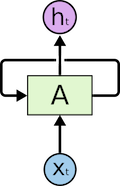
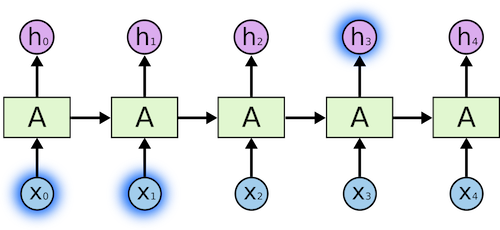
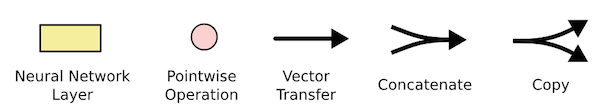

# RNN

- Q1 **`RNN`和`CNN`之间有什么区别?在哪些情况下分别使用彼此?**

    - RNN的全称是循环神经网络, 它的核心特点是处理序列数据, 通过隐藏层的循环连接来捕捉时间或顺序上的依赖关系. 这里的“循环”指的是网络在处理每个时间步的输入时, 会利用前一个时间步的隐藏状态, 从而保留之前的信息.

    - `CNN`对数据执行卷积操作, 提取其中的特征, `CNN`最适用于需要位置不变性的情况(无论目标在输入样本中的什么位置, 您都希望捕获相似的特征).

    - `RNN`是在输入样本之间保持状态的神经网络, `RNN`能利用以前的输入样本信息并使用这些信息来帮助当前输入样本的分类, `RNN`更适合处理时序数据.

- Q2 **`RNN`网络在`NLP`领域有什么运用?**

    - `RNN`在`NLP`领域主要有如下应用: 序列标注, 比如词性标注, 命名实体识别, 常用blstm-crf模型, 分类任务, 比如情感分析, 关系判断, 比如推理, 阅读理解等, 生成式任务, 比如翻译, 对话, 文本摘要等通过一段文字生成另一段文字的任务.

- Q3 **为什么在处理时间序列问题上, RNN会优于MLP?**

    - 1 时间维度建模的本质差异
        `MLP`(多层感知机)的缺陷: 
        - 输入扁平化: 将时间序列数据(如连续10天的股价)强行展开为一维向量, 破坏时间顺序.
            例如: 将序列`[t-2, t-1, t]`转换为 `[x1, x2, x3]`, 模型无法区分 `x1` 是 `t-2` 还是 `t` 时刻的数据.
        - 静态处理: 每个时间步的输入被独立处理, 忽略时间依赖性. 
            例如: 预测 `t+1` 时刻的股价时, 模型无法感知 `t` 时刻的趋势对 `t+1` 的影响.

        RNN的优势:   
        - 动态时间链: 通过隐藏状态(记忆单元)显式传递时间步之间的关联. 
            例如: 预测 `t+1` 时, RNN会参考 `t` 时刻的隐藏状态(已编码 `t-2, t-1, t` 的信息).

    - 2 参数共享与计算效率
        `MLP`的冗余参数:   
        - 若处理长度为 `N` 的时间序列, MLP需要为每个时间步单独分配权重, 参数量随 `N` 线性增长. 
            例如: 处理100天股价序列时, 输入层需要100个节点, 权重矩阵为 `100×隐藏层大小`.

        `RNN`的参数复用:   
        - 所有时间步共享同一组权重(循环核), 参数量与序列长度无关. 
            *例如: 无论处理10天还是100天的股价, RNN的循环核参数保持不变, 仅需 `输入维度×隐藏层大小` 的权重. *

    - 3 时间依赖性的捕捉能力
        MLP的局限性:   
        - 只能通过固定窗口大小的输入捕捉局部时间关系(类似滑动窗口). 
            例如: 若输入窗口为3天(`[t-2, t-1, t]`), 模型无法利用 `t-3` 及更早的数据.

        RNN的记忆传递:   
        - 通过隐藏状态的链式传递, 理论上可以捕捉无限长的时间依赖(实际受梯度问题限制). 
            例如: 预测 `t+1` 时, RNN的隐藏状态可能包含 `t-100` 时刻的关键模式(如周期性规律).

    - 4 处理变长序列的灵活性
        MLP的固定输入:   
        - 要求所有输入序列必须填充(pad)或截断(truncate)到相同长度. 
            例如: 处理句子时, 短句需补零, 长句需截断, 破坏原始信息.

        RNN的动态适应:   
        - 天然支持任意长度的输入序列, 逐时间步处理数据. 
            例如: 输入句子长度可以是10词或100词, RNN均能逐词处理并累积上下文.

    直观类比: MLP vs RNN

    | **场景** | **MLP** | **RNN** |
    |-----|-----|-----|
    | **阅读小说** | 每次只读一页, 合上书后完全忘记内容 | 边读边做笔记, 后续章节参考之前的笔记 |
    | **听音乐** | 把整首歌压缩成一张图片来分析 | 按节拍逐段聆听, 记住前奏影响副歌 |
    | **天气预报** | 仅根据当天数据预测明天天气 | 结合一周的气压变化趋势预测天气 |

    - 实例验证: 股票价格预测
        - **任务**: 根据过去 `N` 天的股价预测次日涨跌. 
        - **MLP的局限**:   
            - 输入为 `N` 天的收盘价向量 `[p1, p2, ..., pN]`. 
            - 模型将 `p1` 和 `pN` 视为同等权重, 无法感知 `p1 -> p2 -> ... -> pN` 的趋势变化. 
        - **RNN的优势**:   
            - 按顺序逐天处理股价: `p1 -> p2 -> ... -> pN`, 隐藏状态累积历史趋势(如连续上涨或下跌). 
            - 预测时, 最终隐藏状态编码了全局时间模式(如周期性波动或突变点). 

    - 数学视角: 时间序列建模
        - **MLP的映射函数**:   
          \[
          y_t = f(x_{t-k}, x_{t-k+1}, ..., x_t) \quad \text{(固定窗口大小k)}
          \]
        - **RNN的映射函数**:   
          \[
          h_t = \sigma(W_h h_{t-1} + W_x x_t + b) \\
          y_t = g(W_y h_t + c)
          \]
          - `h_t` 是隐藏状态, 携带历史信息 `h_{t-1}` 和当前输入 `x_t` 的组合. 

    - 总结: RNN的核心优势
        1 时间动态建模: 显式传递历史状态, 捕捉序列中的因果关系. 
        2 参数高效共享: 循环核复用减少参数量, 提升泛化能力. 
        3 灵活处理变长序列: 无需固定输入长度, 适应实际场景需求. 
        4 长期模式捕捉: 理论上可建模任意长度的时间依赖(需结合`LSTM`, `GRU`缓解梯度问题). 
 
    - `RNN`通过**记忆传递机制**与**时间维度参数共享**, 将时间序列的**动态演化过程**编码到隐藏状态中, 从而在时序任务上显著优于仅依赖静态空间映射的`MLP`. 

- Q4 **RNN的输入有几个维度?每个维度分别代表什么?RNN的输出呢?**

    - RNN的输入有三个维度, 每个维度分别表示batch_size, seq_len, input_dim, batch_size表示batch大小, seq_len表示序列的长度, input_dim表示输入数据的维度
    - 输出层同样拥有三个维度, 含义与输入基本一致, input_dim修改为output_dim

- Q5 **RNN和传统的全连接网络之间有什么差别?**
    - MLP是最简单的DNN, 它的每一层其实就是fc层(fully connected layer)
    - RNN相对于MLP而言, 多了时间先验知识, 即RNN可以学习到数据之间的时间相关性.比如一段文字, 前面的字是“上”, 后面的字是“学”概率更大, 是“狗”的概率很小.RNN神经元的输入会有多个time step, 每个time step的输入进入神经元中时会共享参数, RNN可以视作为编码了时间相关性的DNN

- Q6 **训练RNN时会碰到哪些困难?怎么解决?**

- RNN对于距离当前时刻比较远的隐藏层, 容易出现梯度爆炸或者梯度弥散, 这是由于在反向传播求解梯度过程中, 各个隐藏层的参数会累乘, 当特征值小于1时, 不断相乘导致特征值向0衰减.特征值大于1时, 则向正无穷扩增, 导致无法利用梯度来对距离比较远的时刻进行调节
- 解决方法是LSTM网络, 它通过门控(gates)的方式, 使得不断相乘的梯度的积保持在接近1的数值, 从而使得长序列仍然可以训练

Q7 **在机器翻译领域, 为什么encoder-decoder结构的RNN取代了seq2seq RNN?**

- seq2seq RNN一次只能翻译一个词汇, 而encoder-decoder RNN能处理变长的输入/输出, 一次网络推理能翻译一整句话

引用: [https://quizlet.com/284587332/deep-learning-midterm-2-flash-cards/](https://quizlet.com/284587332/deep-learning-midterm-2-flash-cards/)

Q8 **Stateful RNN与Stateless RNN有什么区别?两种RNN结构有什么利弊?**

- stateless RNN每次接收和处理新批次时, RNN的初始状态都会重置为零, 因此不会利用已经学习的内部激活(状态), 这会导致模型忘记从前几批中学到的知识, 
- Stateful RNN每个批次的 LSTM 单元和隐藏状态都使用前一批次的学习状态进行初始化, 从而使模型学习跨批次的依赖关系
- 如果训练语料是用相互独立的句子组成, 可以使用stateless RNN, 如果语料之间具有联系, 使用stateful RNN, 随着 batch size 的增加, Stateless LSTM 倾向于模拟 Stateful LSTM

引用: [https://towardsai.net/p/l/stateless-vs-stateful-lstms](https://towardsai.net/p/l/stateless-vs-stateful-lstms)

Q9 **分别在什么时候选用MLP, CNN, RNN?**

- MLP 学习从输入到输出的映射关系, 适用于为输入分配类别或标签的分类预测问题, 也适用于回归预测问题
- CNN将图像数据映射为抽象特征, CNN适合处理具有空间关系的数据, 在图像任务和文档分类任务上都取得较好成绩
- RNN的优势是处理序列预测问题, RNN一般用于处理单词和段落序列等时间预测问题上

引用: [https://machinelearningmastery.com/when-to-use-mlp-cnn-and-rnn-neural-networks/](https://machinelearningmastery.com/when-to-use-mlp-cnn-and-rnn-neural-networks/)

Q10 **解释RNN中梯度消失的原因?**

- 在时间维度上RNN等同于一个深层的MLP网络, RNN的梯度需要沿着时间步反传, 在某个时刻对参数的梯度, 需要追溯这个时刻之前所有时刻的信息, 时间序列越长, 那么其反馈的梯度信号越不显著, 最后可能完全没有起作用, 这就意味着RNN对长距离语义的捕捉能力失效

Q11 **讲讲LSTM的基础结构, 相对RNN做了哪些改进?**

- LSTM引入了门控机制, 包括遗忘门, 输入门, 输出门, 输入门决定何时让输入进入细胞单元, 遗忘门决定何时应该记住前一时刻的信息, 输出门决定何时让记忆流入下一时刻, 相比RNN只有一个传递状态, LSTM有两个传输状态$c_{t}$和$h_{t}$, $c_{t}$的梯度会无损地传递到$c_{t-1}$, 缓解长距离梯度消失的问题
- LSTM通过门控机制将短期记忆和长期记忆结合起来, 一定程度上解决了梯度消失的问题.

Q12 **LSTM和GRU结构上的区别有哪些?**

- 相比LSTM, GRU只有两个门(重置门和更新门), 重置门决定了如何将新的输入信息与前面的记忆相结合, 更新门定义了前面记忆保存到当前时间步的量
- GRU不保留内部记忆$c_{t}$, GRU直接将hidden state传给下一单元, LSTM通过记忆单元将hidden state包装起来.

Q13 **还有哪些其它的解决梯度消失或梯度爆炸的方法?**

- 梯度裁剪gradient clipping, 当BP时的梯度小于某个阈值或大于某个阈值时 , 直接裁剪, 防止太小的梯度累乘带来的梯度消失或太大的梯度累乘带来的梯度爆炸.
- 改变激活函数, 例如减少使用sigmoid, tanh这类激活函数, 改成使用Relu, LeakRelu等
- 残差结构, 类似于CEC的模块, 跨层的连接结构能让梯度无损的进行后向传播.
- Batch Normalization, 相当于对每一层的输入做了一个规范化, 强行把这个输入拉回标准正态分布*N~(0,1).*这样使得激活输入值落在非线性函数对输入比较敏感的区域, 这样输入的小变化就会导致损失函数的大变化, 进而梯度变大, 避免产生梯度消失问题.而且梯度变化大 意味着学习收敛速度快, 加快模型的训练速度.

Q14 **LSTM模型中存在sigmoid和tanh函数, 两者分别用于哪里?**

- sigmoid函数被用作各个门上, 产生0~1之间的值, 来判断是对信息进行记住还是遗忘.
- tanh用在了状态和输出上, 可以替换为其他激活函数

Q15 **为什么LSTM具有长时记忆能力?**

- 因为遗忘门控制上一时间步的记忆细胞$C_{t−1}$​是否传递到当前时间步. 如果遗忘门的输出一直接近1且输入门的输出一直接近0, 那么过去的记忆细胞$C_{t−1}$将通过时间保持不变, 从而在当前时间步$C_t$中保留下来. 这种机制允许LSTM捕捉时间序列中跨度较大的依赖关系, 并有效应对RNN中常见的梯度消失问题.

另外, LSTM通过记忆细胞的加性更新(即记忆细胞的值是直接相加而非逐步传递乘积), 避免了因多次相乘导致的梯度爆炸或消失现象. 遗忘门, 输入门和输出门的组合进一步精细化了信息流动的选择, 使得LSTM能够选择性记住或遗忘特定时间步的信息, 从而更好地保留长时依赖关系.

引用: https://www.zhihu.com/question/317594964/answer/641226608

- Q16 **LSTM的原理**

    引用: https://colah.github.io/posts/2015-08-Understanding-LSTMs/
    引用: https://xiaosheng.blog/2017/09/16/what-is-lstm

    - 循环神经网络
        人类不是在每一个时刻重新开始思考的, 当你阅读这篇文章时, 你会根据你对以前的话语的理解来理解每个单词. 你不可能把所有东西都扔掉, 再从头开始思考, 即人类的思想具有持续性.

        但是传统的神经网络就不能做到这一点, 这似乎是一个很大的缺陷. 例如, 假设你想要判断一部电影中每个时间点发生的事件是什么类型. 传统的神经网络是无法根据电影中前面出现的事件来推理后面出现的事件的.

        循环神经网络解决了这个问题. 它们是具有循环的网络, 允许信息的持续存在. 

        

        在上图中, 一组神经网络$A$, 输入一些$x_t$, 并且输出一个值$h_t$. 循环的结构允许信息从网络的一个步骤传递到下一个. 

        这些循环使得循环神经网络看上去有些神秘. 但是, 如果你再深入的思考一下, 就会发现它们并非完全与普通的神经网络不同. 一个循环神经网络可以被看作是很多个同一个网络的副本, 并且每一个副本都会向下一个传递信息. 考虑一下, 如果我们展开循环会发生什么:

        

        这种链状的特征展示了循环神经网络与序列和列表的密切关系. 它们是用于分析此类数据的自然的神经网络结构. 

        这种结构十分奏效, 在过去的几年里, `RNN`在各种问题上取得了巨大的成功: 语音识别, 语言建模, 翻译, 图像字幕等等, 这里不会讨论`Andrej Karpathy`优秀的博客文章`The Unreasonable Effectiveness of Recurrent Neural Networks`中描述的`RNN`可以实现惊人的壮举, 但它们真的很神奇.

        这些成功的基础是使用`LSTM`, 这是一种非常特殊的循环神经网络, 对于许多任务来说, 它比标准的神经网络要有用的多. 几乎所有基于循环神经网络的令人振奋的结果都是通过它们实现的, 这篇文章将探讨这些`LSTM`.

    - 长程依赖的问题(`Long Term Dependency`)
        `RNN`最突出的特点之一, 就是它可以将先前的信息连接到当前的任务. 例如, 使用先前的视频帧可以帮助理解当前视频帧的意义.

        在大部分下游任务中, 我们只需要参考最近的信息去执行当前的任务. 假设有一种语言模型, 其作用是基于前面的单词来预测下一个单词. 现在尝试预测`the clouds are in the sky`中的最后一个词, 模型就不需要任何其他的上下文信息, 很明显下一个词将是`sky`. 在这种情况下, 如果相关信息与需要信息的位置之间的距离很小, `RNN`就可以学习使用过去的信息. 

        

        但是大多数时间, 模型需要更多的上下文信息. 假设现在需要预测文本`I grew up in France, I speak fluent French.`中的最后一个单词, 邻近的信息表明, 下一个词语可能是一种语言, 但是如果我们想确定是哪种语言, 那么还需要往后看一段比较远的距离, 以获得上下文信息“法国”, 所以, 在很多任务中, 相关信息和需要信息的位置之间的距离可能非常大.

        然而, 受限于`RNN`的结构, 随着距离的扩大, `RNN`无法学会去连接这些信息. 

        

        理论上来说, `RNN`有能力处理这样的“长程依赖”. `RNN`可以通过选择参数来解决远距离依赖的问题. 不幸的是, 在实践中, `RNN`很难学习到远距离的先验知识. `Hochreiter(1991)German` 和`Bengio, et al. (1994)`深入探讨了这个问题, 并且发现了一些`RNN`无法解决远距离依赖的原因.

        幸运的是, `LSTM`可以解决这个问题.

    - LSTM 网络
        `LSTM`(长短期记忆网络, `Long Short Term Memory networks`), 是一种特殊的`RNN`, 能够学习长程的依赖. `LSTM`最早由`Hochreiter & Schmidhuber` (`1997`)提出, 并且很多人在接下来的工作中对它们进行了改进和普及. `LSTM`在各种各样的问题上都工作得很好, 现在被广泛使用.

        `LSTM`就是专门为了避免长程依赖问题而设计的. 记住长时间的信息实际上就是`LSTM`的默认行为.

        在所有的`RNN`中, 都具有重复神经网络模块链的形式. 在标准`RNN`中, 该重复模块具有非常简单的结构, 例如单个`tanh`层.

        

        `LSTM`也具有这样的链结构, 但是重复模块具有不同的结构. 它们不是只有一个单一的神经网络层, 而是有四个, 并且层之间以非常特殊的方式进行交互.

        

        不要担心发生了什么的细节. 我们将逐步介绍`LSTM`的图示. 现在, 让我们试着熟悉一下我们将要使用的符号.

        

        在上图中, 每一行都携带了从一个节点的输出到其他节点的输入的整个向量. 粉色圆圈表示点运算, 如向量加法, 而黄色框是学习到的神经网络层. 行合并表示连接(`concatenation`), 而行分叉表示其内容正在复制, 副本将传到不同的位置.

    - `LSTM`背后的核心思想
        `LSTM`的关键是单元状态(`cell state`), 即穿过图顶部的水平线. 单元状态类似于一个输送带. 它直接在整个链上运行, 只有一些小的线性相互作用. 信息能够很容易保持不变地流动下去. 

        `LSTM`确实具有删除或添加信息到单元状态的能力, 由被称为门的结构仔细调节. 门是一种可选择地让信息通过的方式. 它们由一个`sigmoid`神经网络层和点乘运算组成. 

        `sigmoid`层输出零和一之间的数字, 描述每个组件能够通过的程度. 值为零表示"不让任何东西通过", 值为一意味着"让一切通过!"

        LSTM 有三个门, 用于保护和控制单元状态. 

    - LSTM的输入输出
        - 输入
            - 1 输入数据$x_t$: 在时间步t，LSTM接收的当前输入数据，通常是一个向量，表示模型当前时刻的特征或状态。
            - 2 上一个隐藏状态$h_(t-1)$: 来自前一时间步的隐藏层输出，包含了模型之前学习到的信息。
            - 3 上一个单元状态$C_(t-1)$: 前一时间步的单元状态，保存了长期记忆信息。

        - 输出
            - 1 当前隐藏状态(h_t): LSTM当前时间步的输出，这个输出既用于当前的预测，也会作为下一个时间步的隐藏状态输入。它是通过当前时间步的单元状态经过激活函数（如tanh）计算得到的。
            - 2 当前单元状态(C_t): LSTM的内部记忆，它在每个时间步被更新，用于保留长期记忆并控制信息的流动。LSTM通过遗忘门、输入门、输出门来更新该状态。

        - 输入输出过程总结
            - 在每个时间步，LSTM结合当前输入数据（x_t）、上一时间步的隐藏状态（h_(t-1)）和单元状态（C_(t-1)）来决定如何更新当前的单元状态（C_t）和隐藏状态（h_t）。这些更新由三个门（遗忘门、输入门、输出门）共同决定。
            - LSTM的输出不仅取决于当前输入，还受到之前时刻信息的影响，帮助捕捉序列中的长期依赖关系。

    - LSTM的计算过程
        - LSTM的计算过程涉及以下几个步骤，其中通过门控机制控制信息的流动。让我们逐步分析LSTM的计算过程，结合输入、输出和内部状态的更新。

        - 1 遗忘门(Forget Gate)
            遗忘门决定了上一时刻的单元状态（C_(t-1)）中哪些信息应该被遗忘，公式如下：

            \[
            f_t = \sigma(W_f \cdot [h_{t-1}, x_t] + b_f)
            \]

            - \( f_t \) 是遗忘门的输出，表示遗忘的比例。
            - \( W_f \) 是遗忘门的权重矩阵，\( b_f \) 是偏置项。
            - \( \sigma \) 是sigmoid激活函数，输出一个在0到1之间的值。值接近0表示完全忘记，接近1表示完全保留。
            - \( h_{t-1} \) 是前一时刻的隐藏状态。
            - \( x_t \) 是当前时刻的输入数据。

        - 2 输入门(Input Gate)
            输入门决定了当前时刻的输入数据（x_t）以及上一时刻的隐藏状态（h_(t-1)）将有多少信息更新到当前的单元状态中。这个过程通过两部分完成：
            - **更新候选单元状态**（\(\tilde{C_t}\)）：

            \[
            \tilde{C_t} = \tanh(W_C \cdot [h_{t-1}, x_t] + b_C)
            \]

            - **输入门的激活值**（\( i_t \)）：

            \[
            i_t = \sigma(W_i \cdot [h_{t-1}, x_t] + b_i)
            \]

            - \( \tanh \) 是tanh激活函数，用于生成候选单元状态。
            - \( i_t \) 是输入门的输出，控制新信息的更新量。

        - 3 更新单元状态(Cell State)
            LSTM根据遗忘门和输入门的输出，更新当前的单元状态。更新公式为：
            \[ C_t = f_t \cdot C_{t-1} + i_t \cdot \tilde{C_t} \]
            - \( C_t \) 是当前时刻的单元状态。
            - \( C_{t-1} \) 是上一时刻的单元状态。
            - \( f_t \cdot C_{t-1} \) 表示保留上一时刻的记忆，经过遗忘门的控制。
            - \( i_t \cdot \tilde{C_t} \) 表示将输入门控制的信息更新到单元状态中。

        - 4 输出门(Output Gate)
            输出门控制当前单元状态如何影响最终的隐藏状态（\( h_t \)）。首先，计算输出门的激活值：
            \[ o_t = \sigma(W_o \cdot [h_{t-1}, x_t] + b_o) \]
            然后，计算当前的隐藏状态（\( h_t \): \[ h_t = o_t \cdot \tanh(C_t) \]
            - \( o_t \) 是输出门的输出，决定了当前时刻的隐藏状态。
            - \( \tanh(C_t) \) 是当前时刻的单元状态经过tanh激活函数后的值，提供了非线性变换。
            - \( h_t \) 是当前时刻的隐藏状态，既作为当前时刻的输出，也将传递给下一时刻。

        - 5 综合公式
        总结一下整个LSTM的计算过程, 公式如下:
            1 遗忘门
                \[ f_t = \sigma(W_f \cdot [h_{t-1}, x_t] + b_f) \]
            2 输入门
                \[ i_t = \sigma(W_i \cdot [h_{t-1}, x_t] + b_i) \]
                \[ \tilde{C_t} = \tanh(W_C \cdot [h_{t-1}, x_t] + b_C) \]
            3 更新单元状态
                \[ C_t = f_t \cdot C_{t-1} + i_t \cdot \tilde{C_t} \]
            4 输出门
                \[ o_t = \sigma(W_o \cdot [h_{t-1}, x_t] + b_o) \]
            5 隐藏状态输出
                \[ h_t = o_t \cdot \tanh(C_t) \]

- 