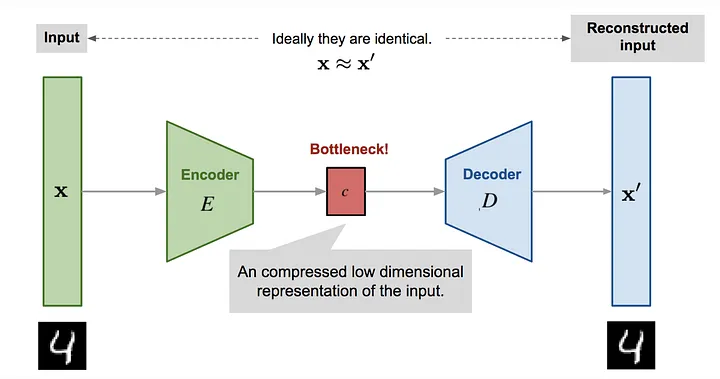
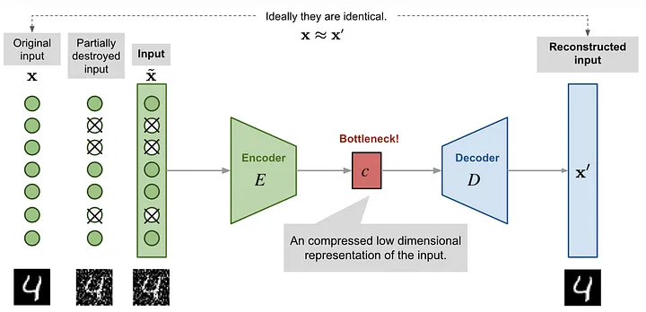

# Unsupervised learning

Q1 **无监督学习可以帮助解决哪些问题?**

- 数据稀缺任务: 对于监督学习, 需要大量的标签数据才能使模型表现良好. 无监督学习可以自动标记未标记的示例, 这将通过聚类所有数据点然后将标记的标签应用于未标记的标签来工作.
- 过度拟合: 机器学习算法有时会通过从数据中的噪声中提取过多信息来过度拟合训练数据.发生这种情况时, 算法正在记忆训练数据, 而不是学习如何概括训练数据的知识.可以引入无监督学习作为正则化器.正则化是一个有助于降低机器学习算法复杂性的过程, 有助于它捕获数据中的信号, 而无需对噪声进行过多调整.
- 异常值: 数据的质量非常重要.如果机器学习算法对异常值(极少数情况)进行训练, 那么它们的泛化误差将低于忽略它们的情况.无监督学习可以使用降维来执行异常值检测, 并专门为异常值创建解决方案, 并单独为正常数据创建解决方案.
- 特征工程: 特征工程是数据科学家执行的一项重要任务, 但特征工程是非常劳动密集型的, 需要人类创造性地设计特征.来自无监督学习的表示学习可用于自动学习正确类型的特征以帮助完成手头的任务.

Q2 **怎样应用无监督学习解决维度灾难问题**

- 使用无监督学习的降维方法(如PCA, SVD), 可以在原始特征集中发现最显着的特征.然后将这个特征集的维度降低到一个可接受的范围, 同时在这个过程中丢失很少的信息.这将有助于算法找到学习数据集的最佳模型.

Q3 **PCA如何应用于降维?**

- PCA主成分分析的想法是, 我们可以选择“最重要”的数据分布方向, 决定数据中最重要的几个特征的维度, 主成分的方向是, 使投影数据的方差最大化的方向, 这种方式可以尽可能多地保留数据中的信息

Q4 **无监督学习和自监督学习的区别**

- 无监督学习 无监督学习不依赖任何标签值, 通过对数据内在特征的挖掘, 找到样本间的关系, 比如聚类相关的任务.
- 自监督学习 和无监督学习不同, 自监督学习主要是利用辅助任务 (pretext)从大规模的无监督数据中挖掘自身的监督信息, 通过这种构造的监督信息对网络进行训练, 从而可以学习到对下游任务有价值的表征.

Q5 **如何用神经网络实现无监督学习?**

- 神经网络用无监督学习以更好地表示输入数据, 比如自动编码器autoencoder, 
- 神经网络可以学习从文档到embedding的映射, 使得embedding能够表达文档的信息, 这可以使用自动编码器来实现, aotoencoder训练的目标是重建原始向量, 并将重建误差作为成本函数, 将bottleneck特征作为提取的数据表示.

Q6 **解释去噪自动编码机(DAE)的算法**

- 在Denoising Autoencoder中, 数据被随机地加入噪声.然后, 训练该模型以预测原始的, 未损坏的数据点作为其输出.与AE相比, DAE学习数据的重建过程, 比普通AE更健壮, 能学到更多不同的特征模式

Q7 **为什么K-means算法会比GMM算法有更高的模型偏差?**

- K-means 比 GMM 有更高的偏差, 因为它其实是 GMM 的一个特例.K-means 假设聚类面是球形的(K-means假设每个维度的权重同等重要), 而GMM的聚类面是椭球形的, 并且聚类问题是一个硬聚类问题(假设每个数据点只能属于一个标签).因此, 从理论上讲, K-means 的性能应该与 GMM 相同(在特定的条件下)或更差

引用 [https://ai.stackexchange.com/questions](https://sakigami-yang.me/2017/10/23/kmeans-is-a-gmm/)

[https://sakigami-yang.me/2017/10/23/kmeans-is-a-gmm/](https://sakigami-yang.me/2017/10/23/kmeans-is-a-gmm/)

Q8** 解释CAE, CAE在什么场景下使用?**

- CAE, 是卷积自动编码器, 在这种情况下, 编码器是一个常规的 CNN 网络, 它通过增加深度来减少输入的空间维度.而解码器必须进行反向操作, 保证输出维度与输入维度一致, 因此解码器一般采用反卷积层, 
- CAE一般在图像任务中使用, 图像任务中, 稠密连接的AE消耗计算量过大, 并且不足以学习图像特征

Q9 **聚类和降维算法有什么区别和联系?**

- 聚类针对的是数据点, 而降维针对的是数据的特征, 
- 聚类和降维都可以作为分类等问题的预处理步骤, 都是无监督学习, 

Q10 **PCA如何用于异常检测?**

- 将数据映射到低维特征空间, 然后在特征空间不同维度上查看每个数据点跟其它数据的偏差
- 另外一种是将数据映射到低维特征空间, 然后由低维特征空间重新映射回原空间, 尝试用低维特征重构原始数据, 看重构误差的大小

Q11 **解释LDA算法**

- LDA是一种有监督的机器学习技术, 可以用来识别大规模文档集或语料库中的潜在隐藏的主题信息, 该方法假设每个词是由背后的一个潜在隐藏的主题中抽取出来.
- 设有20个主题, LDA主题模型的目标是为每一篇文章找到一个20维的向量, 向量中的20个值代表着这篇文章属于某一个主题的概率大小.是一个类似于聚类的操作.
- 对于语料库中的每篇文档, LDA定义了如下生成过程 
    - 对每一篇文档, 从主题分布中抽取一个主题
    - 从上述被抽到的主题所对应的单词分布中抽取一个单词
    - 重复上述过程直至遍历文档中的每一个单词.

引用 [https://cloud.tencent.com/developer/article/1170675](https://cloud.tencent.com/developer/article/1170675)

Q12 **LDA主题模型如何求解参数**

- Gibbs采样或者变分推断EM算法

Q13 **PCA和LDA的关系和不同?**

- 相同 
    - 两者均可以对数据进行降维.
    - 两者在降维时均使用了矩阵特征分解的思想.
    - 两者都假设数据符合高斯分布.
- 不同 
    - LDA是有监督的降维方法, 而PCA是无监督的降维方法
    - LDA降维最多降到类别数k-1的维数, 而PCA没有这个限制.
    - LDA除了可以用于降维, 还可以用于分类. 聚类
    - LDA择分类性能最好的投影方向, 而PCA选择样本点投影具有最大方差的方向.
