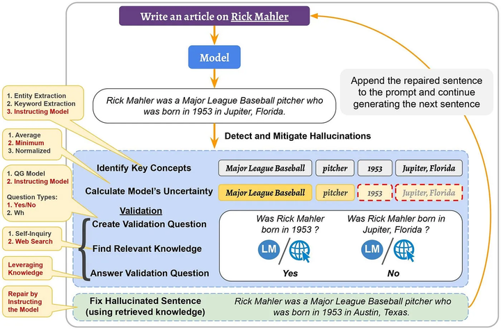

# LLM Evaluation

## Hallucination

- 1 **什么是大模型幻觉?(hallucination)**
    - 在大模型中, 幻觉(hallucination)指的是一本正经的胡说八道, 看似流畅自然的表述, 实则不符合事实错误的信息.
    - 幻觉现象的存在严重影响了大模型应用的可靠性, 会传播错误信息或者侵犯隐私, 影响了模型的可靠性和可信度, 需要解决大模型的幻觉问题.

    - 幻觉不一定是有害的, 特别是在一些需要创造力或灵感的场合, 例如写电影剧情时, 幻觉的存在可能带来一些奇思妙想, 使得生成的文本充满想象力.

- 2 **幻觉都哪些类型?**
    - 大模型幻觉主要分两类
        - 内部幻觉: 生成的内容与源内容相矛盾.
        - 外部幻觉: 生成的内容无法从源内容中得到验证, 既不受源内容支持, 也不受源内容反驳.

- 3 **产生幻觉的原因是什么?**
    - 源与目标的差异: 当我们在存在源与目标差异的数据上训练模型时, 模型产生的文本可能与原始源内容产生偏差. 这种差异, 有时可能是在数据收集过程中不经意间产生的, 有时则是故意为之.
        - 无意识的源-目标差异: 这种差异的产生有多种原因. 例如, 数据可能是基于某种经验法则编制的, 使得目标信息并不总是完全依赖源信息. 举例来说, 如果从两家不同的新闻网站获得相同事件的报道作为源与目标, 目标报道中可能包含源报道没有的信息, 从而导致二者不同. 
        - 有意识的源-目标差异: 某些任务在本质上并不追求源与目标的严格一致, 尤其是在需要多样性输出的情境下. 
    - 训练数据的重复性: 训练过程中使用的数据, 如果存在大量重复, 可能导致模型在生成时过于偏好某些高频短语, 这也可能引发幻觉.
    - 数据噪声的影响: 使用充斥噪声的数据进行训练, 往往是导致幻觉出现的关键因素之一. 
    - 解码过程中的随机性: 某些旨在增加输出多样性的解码策略, 如top-k采样、top-p方法以及温度调节, 有时会增加幻觉的产生. 这往往是因为模型在选择输出词汇时引入了随机性, 而没有始终选择最可能的词汇. 
    - 模型的参数知识偏向: 有研究表明, 模型在处理信息时, 可能更依赖其在预训练阶段所积累的知识, 而忽略了实时提供的上下文信息, 从而偏离了正确的输出路径. 
    - 训练与实际应用中的解码差异: 在常见的训练方法中, 我们鼓励模型基于真实数据预测下一个词汇. 但在实际应用中, 模型则是根据自己先前生成的内容进行预测. 这种方法上的差异, 尤其在处理长文本时, 可能会导致模型的输出出现“幻觉”.
    - GPT之类的生成模型, 其实只是学会了文本中词汇间的统计规律, 所以它们生成内容的准确性仍然是有限的. 

- 4 **度量大模型幻觉**
    - 人工评估: 最可靠, 但是成本最高.
    - 命名实体(Name Entity)误差
        - 命名实体(Name Entities), 是事实描述的组成部分. 可以利用命名实体匹配来计算生成文本与参考资料之间的一致性. 如果一个模型生成了原始知识源中不存在的命名实体, 那么可以视为这个模型产生了幻觉, 或者说这个模型存在事实上的错误.
    - 蕴含率(Textual Entaliment)
        蕴含率(TE), 指的是被参考文本所蕴含的句子数量与生成输出中的总句子数量的比例. 可以采用成熟的蕴含/NLI(Natural Language Inference)模型.
    - 利用问答系统
        - 如果生成的文本在事实上与参考材料一致, 那么对同一个问题, 其答案应该与参考材料相似. 具体而言, 对于给定的生成文本, 问题生成模型会创建一组问答对. 问答模型将使用原始的参考文本来回答这些问题, 并计算所得到答案的相似性.
    - 利用信息提取系统
        使用信息提取模型将知识简化为关系元组, 例如<主体, 关系, 对象>. 这些模型从生成的文本中提取此类元组, 并与从原始材料中提取的元组进行比较.

- 5 **减轻大模型幻觉**
    - 与幻觉有关的数据问题可以通过创建高质量无噪声的数据集来解决, 不过验证和清洗海量文本语料库的难度很大.
    - 利用外部知识验证正确性
        - A Stitch in Time Saves Nine: Detecting and Mitigating Hallucinations of LLMs by Validating Low-Confidence Generation.
        - https://arxiv.org/pdf/2307.03987
        - 幻觉的生成是会传播的, 如果一句话出现幻觉, 那么后面生成的文本也会出现幻觉甚至更严重. 如果能够(在第一句话时)主动检测并减轻幻觉, 那么也可以阻止其在后续生成的句子中传播.
        - 提出了主动检测幻觉和减轻幻觉的方法.
        
        - 在检测阶段, 首先确定潜在幻觉的候选者, 即生成的句子的重要概念(Indentify Key Concepts), 然后利用其logit输出值, 计算出模型对句子的不确定性, 并检索相关知识.
        - 在减轻阶段, 使用检索到的知识作为证据修复幻觉句子, 将修复的句子附加到输入(和之前生成的句子上), 并继续生成下一个句子. 这个过程不仅减轻了检测到的幻觉, 而且还阻止了其在后续生成的句子中的传播.
    - 事实核心采样
        - Factuality Enhanced Language Models for Open-Ended Text Generation.
        - https://arxiv.org/pdf/2206.04624
        - 在大模型的生成中, 采样的"随机性"在生成句子的后半部分时, 对事实性的损害比在句子的开头更大. 因为在生成句子开始时, 没有前文的影响, 所以只要生成的句子在语法和上下文上是正确的, 大模型就可以生成任何内容; 然而随着生成的进行, 前文内容变得更加确定, 只有更少的单词选择可以使句子的幻觉降低. 因此文章引入了事实核心采样算法, 在生成每个句子时动态调整"核心", 在事实核心采样中, 生成每个句子的第t个标记的核心概率$p_t = max\{\omega, p \times {\lambda}^{t-1}\}$, 其中$\lambda$是$top-p$概率的衰减因子, $\omega$是概率的下限衰减.
    - Self Check GPT
        - SELFCHECKGPT: Zero-Resource Black-Box Hallucination Detection for Generative Large Language Models
        - https://arxiv.org/pdf/2303.08896
        - 如果模型真的掌握了某个事实, 那么多次生成的结果应该是相似的并且事实一致; 反之, 如果模型幻觉很严重, 那么随机采样多次的结果会发散甚至会出现矛盾.
        
        - 因此可以从模型中采样多个response (例如通过变化温度参数) 并测量不同的 response 之间的信息一致性, 以确定哪些是事实, 哪些是幻觉. 这种信息一致性可以用 计算语义等价 (BERT Score) 或者使用 IE、QA-Based 方法.

- 6 **大模型什么时候容易产生幻觉**
    - 数值混淆
        - 当大模型处理与数字有关的文本, 例如日期或数值等, 容易产生幻觉.
    - 处理长文本
        - 在需要解读长期依赖关系的任务中, 例如文档摘要或长对话历史, 模型可能会生成自相矛盾的内容.
    - 逻辑推断障碍
        - 如果模型误解了源文本中的信息, 有可能会产生不准确的结论, 因此模型的逻辑推理能力至关重要.
    - 上下文与内置知识的冲突
        - 模型在处理信息时, 可能会过度依赖预训练阶段获取的知识 从而忽略实际上下文导致输出结果不准确.
    - 错误的上下文信息
        - 当给定的上下文包含错误信息或基于错误的假设时 (例如: 为什么高尔夫球比篮球大? 或 氦的原子序数为什么是1?), 模型可能无法识别这些错误, 并在其他回答中产生幻觉.

