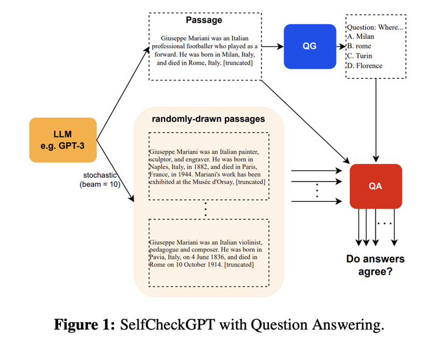

# Evaluation

## Hallucination

- 1 **什么是大模型幻觉?(hallucination)**
    - 在大模型中, 幻觉(hallucination)指的是一本正经的胡说八道, 看似流畅自然的表述, 实则不符合事实错误的信息.
    - 幻觉现象的存在严重影响了大模型应用的可靠性, 会传播错误信息或者侵犯隐私, 影响了模型的可靠性和可信度, 需要解决大模型的幻觉问题.

    - 幻觉不一定是有害的, 特别是在一些需要创造力或灵感的场合, 例如写电影剧情时, 幻觉的存在可能带来一些奇思妙想, 使得生成的文本充满想象力.

- 2 **幻觉都哪些类型?**
    - 大模型幻觉主要分两类
        - 内部幻觉: 生成的内容与源内容相矛盾.
        - 外部幻觉: 生成的内容无法从源内容中得到验证, 既不受源内容支持, 也不受源内容反驳.

- 3 **产生幻觉的原因是什么?**
    - 源与目标的差异: 当我们在存在源与目标差异的数据上训练模型时, 模型产生的文本可能与原始源内容产生偏差. 这种差异, 有时可能是在数据收集过程中不经意间产生的, 有时则是故意为之.
        - 无意识的源-目标差异: 这种差异的产生有多种原因. 例如, 数据可能是基于某种经验法则编制的, 使得目标信息并不总是完全依赖源信息. 举例来说, 如果从两家不同的新闻网站获得相同事件的报道作为源与目标, 目标报道中可能包含源报道没有的信息, 从而导致二者不同. 
        - 有意识的源-目标差异: 某些任务在本质上并不追求源与目标的严格一致, 尤其是在需要多样性输出的情境下. 
    - 训练数据的重复性: 训练过程中使用的数据, 如果存在大量重复, 可能导致模型在生成时过于偏好某些高频短语, 这也可能引发幻觉.
    - 数据噪声的影响: 使用充斥噪声的数据进行训练, 往往是导致幻觉出现的关键因素之一. 
    - 解码过程中的随机性: 某些旨在增加输出多样性的解码策略, 如top-k采样、top-p方法以及温度调节, 有时会增加幻觉的产生. 这往往是因为模型在选择输出词汇时引入了随机性, 而没有始终选择最可能的词汇. 
    - 模型的参数知识偏向: 有研究表明, 模型在处理信息时, 可能更依赖其在预训练阶段所积累的知识, 而忽略了实时提供的上下文信息, 从而偏离了正确的输出路径. 
    - 训练与实际应用中的解码差异: 在常见的训练方法中, 我们鼓励模型基于真实数据预测下一个词汇. 但在实际应用中, 模型则是根据自己先前生成的内容进行预测. 这种方法上的差异, 尤其在处理长文本时, 可能会导致模型的输出出现“幻觉”.
    - GPT之类的生成模型, 其实只是学会了文本中词汇间的统计规律, 所以它们生成内容的准确性仍然是有限的. 

- 4 **度量大模型幻觉**
    - 人工评估: 最可靠, 但是成本最高.
    - 命名实体(Name Entity)误差
        - 命名实体(Name Entities), 是事实描述的组成部分. 可以利用命名实体匹配来计算生成文本与参考资料之间的一致性. 如果一个模型生成了原始知识源中不存在的命名实体, 那么可以视为这个模型产生了幻觉, 或者说这个模型存在事实上的错误.
    - 蕴含率(Textual Entaliment)
        蕴含率(TE), 指的是被参考文本所蕴含的句子数量与生成输出中的总句子数量的比例. 可以采用成熟的蕴含/NLI(Natural Language Inference)模型.
    - 利用问答系统
        - 如果生成的文本在事实上与参考材料一致, 那么对同一个问题, 其答案应该与参考材料相似. 具体而言, 对于给定的生成文本, 问题生成模型会创建一组问答对. 问答模型将使用原始的参考文本来回答这些问题, 并计算所得到答案的相似性.
    - 利用信息提取系统
        - 使用信息提取模型将知识简化为关系元组, 例如<主体, 关系, 对象>. 这些模型从生成的文本中提取此类元组, 并与从原始材料中提取的元组进行比较. 

- 5 **减轻大模型幻觉**
    - 与幻觉有关的数据问题可以通过创建高质量无噪声的数据集来解决, 不过验证和清洗海量文本语料库的难度很大.
    - 利用外部知识验证正确性
        - A Stitch in Time Saves Nine: Detecting and Mitigating Hallucinations of LLMs by Validating Low-Confidence Generation.
        - https://arxiv.org/pdf/2307.03987
        - 幻觉的生成是会传播的, 如果一句话出现幻觉, 那么后面生成的文本也会出现幻觉甚至更严重. 如果能够(在第一句话时)主动检测并减轻幻觉, 那么也可以阻止其在后续生成的句子中传播.
        - 提出了主动检测幻觉和减轻幻觉的方法.
        
        - 在检测阶段, 首先确定潜在幻觉的候选者, 即生成的句子的重要概念(Indentify Key Concepts), 然后利用其logit输出值, 计算出模型对句子的不确定性, 并检索相关知识.
        - 在减轻阶段, 使用检索到的知识作为证据修复幻觉句子, 将修复的句子附加到输入(和之前生成的句子上), 并继续生成下一个句子. 这个过程不仅减轻了检测到的幻觉, 而且还阻止了其在后续生成的句子中的传播.

    - 事实核心采样
        - Factuality Enhanced Language Models for Open-Ended Text Generation.
        - https://arxiv.org/pdf/2206.04624
        - 在大模型的生成中, 采样的"随机性"在生成句子的后半部分时, 对事实性的损害比在句子的开头更大. 因为在生成句子开始时, 没有前文的影响, 所以只要生成的句子在语法和上下文上是正确的, 大模型就可以生成任何内容; 然而随着生成的进行, 前文内容变得更加确定, 只有更少的单词选择可以使句子的幻觉降低. 因此文章引入了事实核心采样算法, 在生成每个句子时动态调整"核心", 在事实核心采样中, 生成每个句子的第t个标记的核心概率$p_t = max\{\omega, p \times {\lambda}^{t-1}\}$, 其中$\lambda$是$top-p$概率的衰减因子, $\omega$是概率的下限衰减.

    - Self Check GPT
        - SELFCHECKGPT: Zero-Resource Black-Box Hallucination Detection for Generative Large Language Models
        - https://arxiv.org/pdf/2303.08896
        - 如果模型真的掌握了某个事实, 那么多次生成的结果应该是相似的并且事实一致; 反之, 如果模型幻觉很严重, 那么随机采样多次的结果会发散甚至会出现矛盾.
        
        - 因此可以从模型中采样多个response (例如通过变化温度参数) 并测量不同的 response 之间的信息一致性, 以确定哪些是事实, 哪些是幻觉. 这种信息一致性可以用 计算语义等价 (BERT Score) 或者使用 IE、QA-Based 方法.

- 6 **大模型什么时候容易产生幻觉**
    - 数值混淆
        - 当大模型处理与数字有关的文本, 例如日期或数值等, 容易产生幻觉.
    - 处理长文本
        - 在需要解读长期依赖关系的任务中, 例如文档摘要或长对话历史, 模型可能会生成自相矛盾的内容.
    - 逻辑推断障碍
        - 如果模型误解了源文本中的信息, 有可能会产生不准确的结论, 因此模型的逻辑推理能力至关重要.
    - 上下文与内置知识的冲突
        - 模型在处理信息时, 可能会过度依赖预训练阶段获取的知识 从而忽略实际上下文导致输出结果不准确.
    - 错误的上下文信息
        - 当给定的上下文包含错误信息或基于错误的假设时 (例如: 为什么高尔夫球比篮球大? 或 氦的原子序数为什么是1?), 模型可能无法识别这些错误, 并在其他回答中产生幻觉.

## Hallucination Solution

- 1 **大模型幻觉的分类**
    - A Survey on Hallucination in Large Language Models: Principles, Taxonomy, Challenges, and Open Questions
    - https://arxiv.org/pdf/2311.05232
    - 事实性问题 (Factuality)
        - 事实性错误: 模型回答与事实不一致.
        - 事实性虚构: 模型回答在真实世界无法验证.
    - 忠诚度问题 (Faithfulness)
        - 违背指令: 模型回答没有遵从指令.
        - 违背上文: 模型回答和上下文内容存在不一致.
    - 自我矛盾 (Self Contradiction)
        - 模型回答内部存在逻辑矛盾, 比如 CoT 多步推理时不同步骤之间存在矛盾.

- 2 **幻觉检测**
    - 事实性检测
        - 外部检索增强
            - 基于外部工具的调用, 例如: 使用搜索引擎检索获得的结果来检查模型回答是否存在幻觉.
        - 模型回答的不确定性
            - 需要获得模型参数: 依赖回答的熵值 (不确定性) 来判断模型对问题是否有可能存在幻觉.
            - 不需要获得模型参数: 使用随机采样多次回答, 或者对模型回答进行二次提问的方案, 判断模型在多次回答之间是否存在不一致性.
    - 忠诚度检测
        - 事实重叠
            - ngram: 判断上文和模型回答之间的ngram重合度 (例如ROUGE), 但考虑到模型生成的多样性, 这个指标可用率较低.
            - 实体: 适用于摘要任务, 计算问答和上文之间实体的重合度.
            - 实体关系: 适用于摘要任务, 抽取实体和关系三元组 (<摘要, 实体, 关系>), 判断三元组在回答和上文之间的重合度.
            - 知识: 依赖知识标注才能计算回答和上文之间知识的重合度.
        - 分类任务
            - NLI (Natural Language Inference): 直接使用 NLI 模型判断模型生成的回答是否可以被上文所 support (entailment).
            - 模型微调: 使用规则或扰动构建弱监督数据直接训练一个忠诚度判别模型用于检测.
        - QA任务
            - 从模型回答中抽取多个事实, 构建针对事实的问题, 并基于同样的上文进行QA问答, 通过对比QA结果和模型回答的重合度来判断模型是否出现幻觉.
        - 不确定性
            - Entropy: 基于上文使用回答的条件熵值来判断模型回答的不确定性.
            - LogProb: 基于回答长度标准化的序列概率来评估模型回答的置信程度.
            - 相似度: 使用模型多次回答之间的相似程度来判断模型的置信度.
        - 大模型prompt
            - 直接使用指令让大模型来评估回答是否遵从上文.

- 3 **大模型幻觉的来源**
    - 数据源缺陷
        - 数据编码是在预训练阶段把训练数据源内化压缩到模型参数中的过程, 而压缩过程中训练数据的问题同样会被模型错误的学习和模仿.
        - 数据错误模仿, 错误训练数据会注入错误知识, 例如网络热梗.
        - 重复偏差, 重复的训练数据会导致模型对部分数据过度训练和记忆, 例如采样拒绝回答的样本, 对于任何问题模型都会回答"对不起".
        - 社会偏见, 训练数据自带社会偏见, 例如人种歧视和性别歧视等.
    - 数据利用缺陷
        - 数据利用, 即知识召回, 可以类比Query-Document检索, 模型把指令映射成任务向量, 去模型参数中召回相应的知识用来回答问题, 召回错误或者召回失败, 模型的回答就会存在幻觉.
        - 长尾知识在预训练中往往学习不充分, 知识压缩效果差.
        - 当指令过于复杂需要模型推理时, 模型召回知识会存在失败.

    - 预训练
        - 训练架构, 缺乏双向编码带来的双向信息, 注意力机制的问题, 例如长程衰减等.
        - 训练策略, 训练时 teacher-force 策略和推理策略的不一致性可能会导致幻觉.
    - 偏好对齐问题
        - 能力对齐, 因为指令微调样本的知识部分超出预训练知识的范畴, 导致在微调过程中, 微调错误的引导模型回答本身压缩知识范围之外的问题, 从而加重了模型幻觉.
        - 置信度对齐, RLHF 的偏好对齐可能会改变莫本身对答案的置信度, 导致模型变得"阿谀奉承", 即使回答是争取的, 如果用户表示质疑, 模型也会自我修正.

    - 推理时随机解码的固有问题
        - 虽然大模型推理时的随机解码可以缓解 greedy 解码整个文本质量较差的问题, 但在同时也引入了不确定性. 多样性越高, 幻觉概率也会相对提高.
    - 解码过程中的信息损失
        - 注意力机制的长程衰减会导致模型随着解码逐渐降低对指令上下文的注意(权重)从而产生幻觉.
        - 输出层的 softmax layer 是 token 在整个吃点的分布, 而仅依赖连续 token 的概率分布序列, 可能无法完全表征自然语言的复杂性导致 softmax bottleneck.
    - 解码过程的错误累计
        如果前面推理的内容存在错误, 模型倾向于在之后的解码中延续错误, 而非修正错误, 导致幻觉(错误)越来越严重.

- 4 **幻觉缓解 (Hallucination Alleviation)**
    - **数据幻觉**
    - 缓解数据错误和偏见
        - 降低错误
            - 高质量 低事实的错误需要对预训练数据集进行构建, 可以通过一定的规则筛选高质量 web 数据源, 或者通过辅助的模型对数据进行过滤.
        - 降低偏见
            - 降低重复偏见, 使用 SimHash SemDeDup 等消重技术对预训练数据集进行消重.
            - 降低社会偏见, 通过检验并筛选, 平衡预训练语料, 使用更全面的数据和采样策略.
    - 缓解知识边界
        - 模型编辑 (Model Edit)
            - 修改内部参数, 直接修改模型参数进行知识修改, 先定位知识在参数中的位置, 然后进行修改, 例如 ROME MEMIT等方法.
            - 增加外部参数, 通过外接模型或外接层, 来进行知识判断和补充知识存储, 不过知识范围的判断准确难度很高, 泛化性较差, 例如 SERAC, T-Patcher, NKB等方法.
        - 检索增强生成 (RAG, Retrieval Augmented Graph)
            - 单次检索, 即传统的 Retrieval Augmented Graph, Retrieve and Read.
            - 链式检索, 适用于多步问答, 例如询问当日成交量最高的板块换手率是多少, 例如 Self-ask, React等方法.
            - 检索后处理, 先让模型回答再进行检索, 然后对回答进行编辑, 在复杂问题检索效果较差的场景有更好的效果, 例如 RARR, PURR, CRITIC, LLM-Augmenter等.
        - 缓解知识召回问题
            - 召回取巧, 可以通过对训练数据中知识共现等导致知识召回有偏差的样本进行过滤, 不过方法泛化性和效果都相对有限.
            - 召回失败, 可以提高知识召回率, 就像 Query-Document 召回里面提高 query 的短文本召回一样, 可以使用 Chain-of-Thought 等方案来提升 Query 上下文.
    - **训练幻觉**
    - 预训练问题
        - 注意力机制, 可以使用双向注意力改良的模型架构 BATGPT.
        - 预训练策略, Attention-Shapening 正则器, 通过把 self-attention 进行稀疏化正则处理, 降低 soft-attention 向前传递的误差, 类似于 L1 正则.
    - 对齐问题
        - 缓解 SFT 和预训练知识差异的方法, 可以对 SFT 样本中模型可能不确定的知识进行样本调整, 允许模型表达怀疑和拒绝, 代表有 R- Tuning, 不过这类方法的泛化性可能不及RLHF.
        - 缓解 RLHF 带来的模型"阿谀奉承", 可以通过优化 RL 的标注数据实现, 要么使用大模型辅助人工达标, 要么使用多人标注来降低标注偏差.
    - **推理幻觉**
    - 事实性增强解码
        - 解码策略
            - factual-nucleus, 随着解码逐渐衰减 top-p 的 p 值, 在保证生成通顺度的前提下, 降低事实性的随机度, 可以认为是 top-p 和 Greedy 解码的折中版本.
            - Inference-time-intervention, 通过干预多头注意力机制中和事实性最相关的 top-k 个 head 的激活函数输出, 引导模型解码结果更加真实.
            - DOLA, 基于 transformer 不同层之间的残差连接, 由于输出层的信息是依赖中间层逐级演化得到的, 通过对比底层和高层, 对下一个 token 的预测概率分布的差异进行解码, 强调高层知识淡化底层知识.
        - 后处理策略
            - Chain-of-Verification, 利用模型的自我修正能力, 先让模型生成答案, 再使用 prompt 让模型对答案进行多个角度的校验提问, 并回答这些提问, 最后基于以上的回答修正初始答案.
            - Self- Reflection, 先让模型生成答案, 再使用 prompt 让模型对答案进行反思, 进行多轮迭代, 直到回答一致.
    - 忠诚度增强解码
        - Context-Aware Decode, 每个 token 的解码概率由基于上文的条件解码概率得到, 和不基于上文的无条件解码概率的边际差异决定, 降低模型内化知识的影响, 从而提高上文的影响, 降低模型的幻觉.
        - KL-guided-sampling, 以上 CAd 的动态优化版本, 基于无条件解码和条件解码的 KL 距离来动态调整 P 值, 这里距离反映上文对模型推理的影响程度, 可以认为是 CAD 和 top-p 的折中版本.
        - Contrastive-Decoding, 一个大模型和一个小模型同步解码, 先用大模型的 top-k 作为候选 token, 再使用小模型生成的 token 概率分布作为"噪声分布", 从大模型分布中diff掉小模型的分布, 从而得到更准确的 token 预测.

