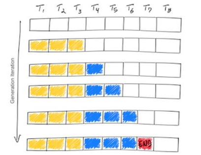
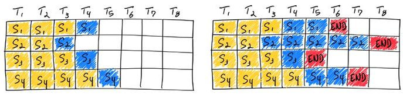
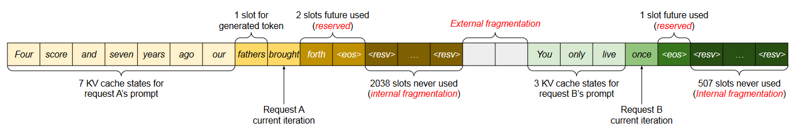
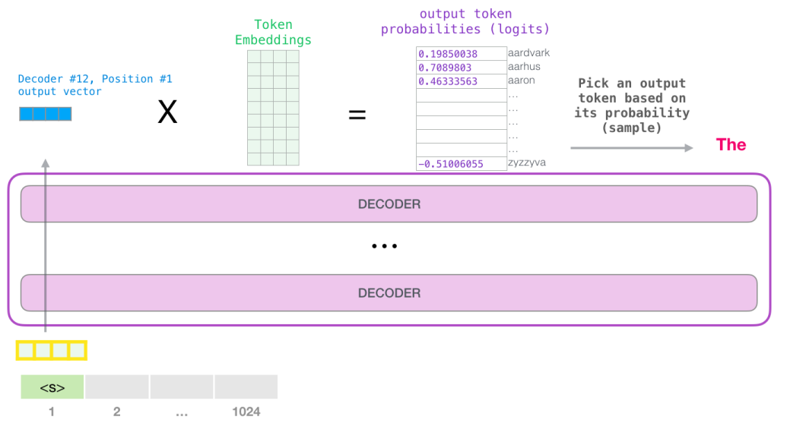

# Inference

## Inference Process
# 1 整体过程

## 一个完整的生成任务为例:
- prompt: 你好世界!
- output: Hello world!
- 模型结构, llama类的标准 transformer 模型, decoder-only.

## 1.2 模型推理的阶段
### Context / Prefill Stage
输入长度为 N 的 prompt (for example 512 tokens)
一次性处理所有的 token
生成初始的 key / value cache, 即 KV cache
输出第一个 logits, 用于预测下一个 token


### Decode Stage

每次只处理一个新的 token, 基于前一个 token 的 hidden state 处理
使用 KV cache 加速 attention 的计算
重复上述计算, 直到达到 max_new_tokens 或遇到 EOS 标志


## vLLM

- 1 **vLLM definition**
    - vLLM是一个大模型推理服务框架, 目前做到: 最牛的 serving 吞吐量, Paged Attention 对 kv cache的有效管理, 传入请求的 continus batching 而不是 static batching, 高性能 CUDA kernel, 流行的 HuggingFace 模型无缝集成, 有各种 decoder 算法的高吞吐量服务, 包括 parallel sampling 和 beam search 等, tensor parallel, 兼容 OpenAI 的 API 服务器.

- 2 **LLM Decoder 推理基础**
    - LLM 解码器的推理主要分为两步, 黄色为 prompt, 蓝色为每个 token generation
        - prompt.
        - LLM 生成一个完整 token 序列, 当遇到 stop token 或最大句子长度就停止.
        
    - LLM decoder 的推理是收到内存/显存限制的 (Memory Bound), 这意味着推理的吞吐能力很大程度取决于用户给到 HBM (高宽带内存, High Bandwidth Memory) 显存多大的 batch size, 而不是 GPU 算力越高, 吞吐越大. HBM 的消耗随着 model size 和句子 seqlen 而变化. 例如, 在 13B 参数的模型中, 对于 sequence 中每个 token 的 state 都要花费 1M 的空间, 对于 A100 显存为 40G 的显卡, 13B 模型的参数占了 26G, 还剩 14G 的空间可以保存 14k token 的 state, 如果我们设置 seqlen 为 512, 那么 batch size 最大是28, 如果 seqlen 为 2048, 那么 batch size 最大为 7. 这是一个理论的上限值, 因为还没算中间 tensor 的内存/显存占用.
    - 由此可见, 量化在大模型的推理中作用很大, 可以加大单卡上的 batch size 和 seqlen, 但是需要修改模型的权重 (flash attention 不用修改模型权重, 使用 continuous batching 也可以提高 memory IO 的效率).

- 3 **LLM Batching**
    - LLM Batching
        - LLM Batching 的推理具有"迭代"的性质, 因为某些客户端的请求可以在 batching 中很早就完成, 但释放资源之后, 并且向可能处于不同完成状态的 batch 中添加新的客户端请求非常麻烦. 因此 GPU 资源没有充分利用, 因为一个 batch 中不同的 seqlen 的生成长度不同于 batch 的最大生成长度, 比如下图中, seq1 生成了 2 个 token, seq3 生成了 1 个, seq4 生成了 2 个, 然而 seq2 生成了 5个, seq1 seq3 seq4结束标记后的白色方块就是 GPU 空闲, 此时 GPU 利用率很低, 传统的 static batching 无法利用 GPU 的空闲时间.
        
        - static batching 在 GPU 上的利用率取决于一个 batch 中这些句子的生成长度. 在分类任务中每个 seq 的输出长度为 1, 在聊天任务中每个 seq 的输出长度不确定, 会降低 GPU 的利用率.

    - Continus Batching
        - 每当一个 batch 中的一个 seq 生成结束, 产生一个 end-of-seq token, 就可以在其位置插入新的 seq 继续生成 token, 从而达到比 static batching 更高的 GPU 利用率.
        

- 4 **Paged Attention**
    - KV cache
        - 在大模型推理过程中, 所有输入到大模型中的 token 会产生注意力 key 和 value 的 tensor, 这些 tensor 保存在 GPU 的显存里, 用来生成下一个 token, 这些缓存下来的 key 和 value 的 tensor 被称为 KV cache.
            - KV cache 内存占用大, 以 Llama-13B 为例, 缓存单个序列最多需要 1.7GB 内存.
            - 动态不可预测: KV cache 的大小取决于序列的长度, 高度可变且不可预测. 由于碎片化和过度保留, 现有系统浪费了 60%-80%的内存/显存空间.
        - Paged Attention 是对 KV cache 所占空间的分页管理, 是一个典型的以内存空间换取计算开销的手段, vllm 和 tensorRT-llm 都应用了这个手段来节约 KV cache 占用的内存/显存. 目前大模型训练的 re-compute 中的 activation 用于 bwd 的以计算开销换内存的手段是相反的.

        - 大模型的核心是自回归 Transformer, 基于输入 prompt 和其之前输出的 token 序列生成词句 (token), 每次生成一个 token. 这种按照序列的生成过程会让工作负载收到内存/显存的限制, 最终限制服务的吞吐量.
        - 通过 batch 可以同时处理多个请求, 提高模型服务的吞吐量. 但是要在单一批次中处理多个请求, 就需要高效管理每个请求所占用的内存/显存空间. 下图展示了一个 (13B)130亿 参数的大模型在一台 40GB 显存的 Nvidia A100 GPU 上的内存分布.
        
        - 其中65%的显存分配给了模型权重, 而模型权重在提供服务期间是不会变化的. 30% 的内存用于存储请求的动态状态, 对 transformer 而言, 这些状态由与注意力机制关联的 key 和 value 的张量组成, 即 KV cache, 表示用于生成序列中新输出的 token 之前 token 上下文.
        - 其余占比较小主要包括激活, 临时张量等数据.

        - 由于模型权重是不变的, 激活等其他数据占比也很小, 因此对于 KV cache 的管理方式就成为推理时 batch size 的关键.
        - 在论文 "Efficient Memory Management for Large Language Model Serving with PagedAttention" 中, 在当前的大模型中, 一般会将球轻到的 KV cache保存在邻接的内存空间中, 因为大多数深度学习框架都需要将张量存储在相邻连续的内存中. 不同于传统深度学习工作负载中的张量, 大模型中的 KV cache 有自己独特的性质, KV cache 会在模型生成新的 token 的过程中随着时间动态地增大或减小, 而且它持续的时间和长度事先无法预估.
        - https://arxiv.org/pdf/2309.06180
        
    
    - vllm 架构
        - vLLM 采用集中式调度器 (scheduler) 来协调分布式 GPU 工作器 (worker) 的执行. KV cache 管理由 Paged Attention 驱动, 能够以分页的方式有效管理 KV cache.
        
    
    - Paged Attention 解决内存瓶颈
        - Paged Attention 为了解决 KV cache, 借鉴了操作系统中虚拟内存和分页经典思想. 与传统的注意力算法不同, Paged Attention 允许在非连续的内存空间中储存连续的 key 和 value, Paged Attention 将每个序列的 KV cache 缓存划分为块, 每个块包含固定数量的 token 的 key 和 value, 在计算注意力期间, Paged Attention内核会识别并获取到这些块. Paged Attention支持将连续的key和value存储在非相邻连续的内存空间中.
        - Paged Attention会将每个序列的KV cache分成KV块, 每个块都包含了固定数量token的key和value的向量; 这个固定数量记为KV块大小(B), 第j个KV块的key是$K
        K_j$, value是$V_j$, 注意力计算可以转换为对以下形式的对块的计算:
            $$
            A_{ij} = \frac{\exp\left(q_i^\top K_j / \sqrt{d}\right)}{\sum_{l=1}^{\lfloor i/B \rfloor} \exp\left(q_l^\top K_1 / \sqrt{d}\right)}, \quad o_i = \sum_{j=1}^{\lfloor i/B \rfloor} V_j A_{ij}^\top
            $$
        其中$A_{i,j}$是在j个KV块三注意力分数的行向量.
        - 在注意力计算期间, Paged Attention核会分开识别并获取不同的KV块.
        
        - 如图, Paged Attention的key和value向量分布在三个块上, 这三个块在物理内存上并不相连. 这个Paged Attention核都会将查询token(forth)的查询向量$q_i$与一个块(比如0块中的 Four score and seven 的键向量)中键向量$K_j$相乘, 以计算注意力分数$A_{i,j}$, 然后再将$A_{i,j}$与块中的值向量$V_j$相乘, 得到最终的注意力输出$o_i$.
    
    - KV cache 管理
        - 使用Paged Attention, 将KV cache重新排列组合成固定大小的 KV 块, 就像虚拟内存中的分页. KV cache被划分成块, 块不需要在内存空间中连续.
        - 对KV cache的请求会被表示成一系列逻辑 KV 块, 在生成新token和它们的KV cache时从左向右填充. 最后一个KV块中未填充的位置留给未来填充.
        - 因为块在内存中不需要连续, 因此可以用一种更加灵活的方式管理key和value. 就像在操作系统的虚拟内存中一样, 可以将块视为页面, 将token视为字节, 将序列视为进程. 序列的连续逻辑块通过块表映射到非连续物理块中, 物理块在生成新token时按需分配.
        - 在Paged Attention中, 内存浪费只会发生在序列的最后一个块中. Paged Attention还有另一个优势, 即高效的内存共享, 在并行采样中多个输出序列是由同一个提示(prompt)生成的. 在这种情况下, 提示的计算和内存可以在输出序列中共享.
    
    - Paged Attention Example
        - vllm在对单个输入序列的解码过程中执行Paged Attention和管理内存.
        
        - 从全局来看, 在每次解码迭代中, vLLM首先会选取一组候选序列来批处理, 并为新请求的逻辑块分配物理块. 然后, vLLM会将当前迭代的所有输入token连接起来, 组成一个序列并将其输入到大模型. 在计算过程中, vLLM使用Paged Attention核来访问以逻辑KV块形式存储的之前的KV cache, 然后将新生成的KV cache保存到物理KV块中.

        - 在一个 KV块中存储多个token(块大小 > 1)可让Paged Attention核并行处理多个位置的KV cache, 由此可以提升硬件使用率并降低延迟.
        


    - vLLM code
        ```python
        from vllm import LLM, SamplingParams

        # Sample prompts.
        prompts = [
            "Hello, my name is",
            "The president of the United States is",
            "The capital of France is",
            "The future of AI is",
        ]
        # Create a sampling params object.
        sampling_params = SamplingParams(temperature=0.8, top_p=0.95)

        # Create an LLM.
        llm = LLM(model="facebook/opt-125m")
        # Generate texts from the prompts. The output is a list of RequestOutput objects
        # that contain the prompt, generated text, and other information.
        outputs = llm.generate(prompts, sampling_params)
        # Print the outputs.
        for output in outputs:
            prompt = output.prompt
            generated_text = output.outputs[0].text
            print(f"Prompt: {prompt!r}, Generated text: {generated_text!r}")
        ```

## Inference

- 1 **大模型推理时的参数设置**
    - Temperature: 用于调整随机从生成模型中抽样的程度, 使得相同的提示可能会产生不同的输出. 温度为0将始终产生相同的输出, 该参数设置越高随机性越大.
    - 波束搜索宽度(Beam Search Width): 波束搜索是许多NLP和语音识别模型中常用的一种算法, 作为在给定可能选项的情况下选择最佳输出的最终决策步骤. 波束搜索宽度是一个参数, 用于确定算法在搜索的每个步骤中应该考虑的候选数量.
    - Top p: 动态设置tokens候选列表的大小. 将可能性之和不超过特定值的top tokens列入候选名单. Top p通常设置为较高的值(如 0.75), 目的是限制可能被采样的低概率token的长度.
    - Top k: 允许其他高分tokens有机会被选中. 这种采样引入的随机性有助于在很多情况下生成的质量. Top k参数设置为3则意味着选择前三个tokens. 若Top k和Top p都启用, 则Top p在Top k之后起作用.

- 2 **大模型推理的过程**
    - 目前常见的大模型只包括了Transformer Decoder, 每个token在输入模型到Transformer Decoder之前, 都会先从Word Embedding层中通过查表获取对应的Embedding向量, 然后将Embedding向量输入到Transformer Decoder中, 并且在最后一层输出的也是相同维度的Embedding. 在预测下一个Token时, 实际上只利用了上一个Token的Embedding.
    - 如图所示, 输入是"a robot must obey the orders given it", 将其转换成对应的Embedding后, 输入到Transformer Decoder中, 每一个token对应的位置相应的也会生成一个新的embedding, 使用最后一个token "it"对应新生成的embeddeding(蓝色)来生成的新的token "Okay", 之后再把刚刚生成的这个token "Okay" 也作为输入, 根据 "Okay" 产生的embedding继续生成的新的token "human", 以此类推.
    
    - 根据新生成的embedding生成下一个token的过程如下图所示, 让新生成的embedding与已经缓存的token embeddings矩阵相乘(也就是, 新生成的token与每个token对应的embedding向量做内积), 得到和词表中每个token的相似性得分(logits), 然后基于这个得分即可以选择生成新的token(常用做法就是直接取得分最高的token).
    
    - 其中, token embeddings的行数即位模型词表中token的个数, 列数即位embedding的维度, 也就是每个token对应一个ebedding维度的向量.
    

- 3 Greedy Search
    - 假设词表中有"a", "given", "human", "it", "must", "obey", "Okay", "orders", "robot", "the", ".", "EOS" 共12个token, 其中"EOS"表示终止token. Greedy Search

