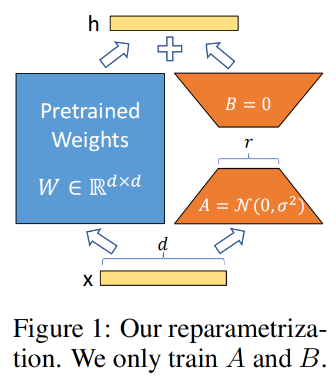

# LoRA

## Concepts

- 1 **LoRA的核心思想**
    - LoRA(Low Rank Adaptation)本质上是对特征矩阵进行低秩分解的一种近似数值分解技术, 可以大幅降低特征矩阵的参数量, 但是会伴随一定的有损压缩. 本质上是用更少的参数来近似大模型全参数微调所得的增量参数, 从而使用更小的显存完成高效的微调.
    - 语言建模的基本符号定义是, 最大化给定提示的条件概率(极大似然估计)
        - 语言模型的条件概率分布建模目标, 调整模型参数$\Phi$, 使得模型在预测每一个训练样本的输出序列时, 每一步都能以尽可能高的概率预测出正确的词或标记.
            $$\max_{\Phi} \sum_{(x,y) \in Z} \sum_{t=1}^{|y|} \log(P_{\Phi}(y_t | x, y_{<t}))$$
            - $\sum_{(x,y) \in Z}$: 表示对数据集 Z 中的所有样本对 (x,y) 进行求和。
            - $\sum_{t=1}^{|y|}$: 表示对输出序列 y 中的每一个时间步 t（从1到序列长度 ∣y∣）进行求和。
            - $\log(P_{\Phi}(y_t | x, y_{<t}))$: 表示在给定输入 x 和先前已生成的序列部分 $y < t$ 的条件下, 模型$\Phi$预测当前时间步$t$的输出为 $y_t$ 的概率的对数。
        - 给定一个参数为$\Phi$的预训练自回归语言模型$p_{\Phi}(y|x)$, $x$是输入, $y$是输出.
        - 在全参数微调(full fine tuning)里, 模型会学习到一个$\Delta \Phi$, $\Delta \Phi$是特定与下游任务的增量参数, 参数量会非常大(与现有参数量一样), 训练成本高.
        - 在LoRA为代表的高效微调中, 令 $\Delta \Phi = \Delta \Phi (\Theta)$, 用参数量更少的$\Theta$来编码, 即用低秩降维表示来近似, $\Theta << \Phi$, 上面的公式可以改写为:
            $$\max_{\Theta} \sum_{(x,y) \in Z} \sum_{t=1}^{|y|} \log(P_{\Phi_0 + \Delta \Phi (\Theta)}(y_t | x, y_{<t}))$$

    - 明确LoRA涉及的参数
        - Transformer层的输入和输出维度大小是$d_model$.
        - $W_q$ $W_k$ $W_v$ 和 $W_o$ 分别代表了自注意力的 query, key, value 和 output 的projection矩阵.
        - $W$ 或 $W_0$ 代表了预训练的权重矩阵.
        - $\Delta W$ 代表了微调后得到的增量参数矩阵, 即训练后优化算法在参数上的累积更新量.
        - $r$ 代表了 LoRA 的地址适应参数的秩.

    - LoRA核心思想
        - 在冻结预训练模型权重之后, 将可训练的低秩分解矩阵注入到Transformer架构的每一层中, 大大减少在下游任务上的可训练参数量.
        
        - 在推理时, 可以直接把原来预训练模型权重与训练好的LoRA权重合并, 因此在推理时不存在额外的开销.

    - LoRA产生的背景
        - 通常, 冻结预训练权重, 再额外插入可训练的权重是常规做法(Adapter), 问题在于, 这样做不仅额外增加了参数, 同时改变了模型结构, 因为它们往往把新的参数加入到模型内部, 会导致模型训练 推理的计算成本和内存占用急剧增加, 尤其是在模型参数需要在多GPU上分布式推理时.
        - 深度网络由大量的dense层组成, 这些参数矩阵通常是满秩的.
        - 在特定任务上, 训练得到的过度参数化的模型实际上存在于一个较低的内在维度上(高维数据实际存在于低维子空间中). LoRA 假设, 大模型在下游任务上微调得到的增量参数矩阵 $\Delta W$ 是低秩的(至少不是满秩), 肯定存在冗余参数或高度相关的参数矩阵, 其中实际有效参数是更低维度的. 因此设想, 可以对全参数微调的增量参数矩阵 $\Delta W$ 进行低秩分解近似表示, 对其参数做降维.
        - 这样训练 $\Delta W$ 的低秩分解近似参数矩阵, 效果上相比其他的 PEFT 方法相近, 而且还能在推理时不增加额外的开销.

- 2 **LoRA的原理公式**
    - LoRA 做的其实是低秩矩阵自适应, 在冻结原有的大模型参数时, 用参数量更小的矩阵进行低秩近似训练.
    - 对于预训练权重矩阵 $W_0 \in R^{d \times d}$, LoRA 限制了其更新的方式, 也就是把全参数微调的增量参数矩阵 $\Delta W$ 表示为两个参数量更小的矩阵 $A$ 和 $B$ 的低秩近似:
        $W_0 + \Delta W = W_0 + B \times A$
        - 其中, $B \in R^{d \times r}$ 和 $A \in R^{r \times d}$ 是 LoRA 的低秩适应权重矩阵, 秩 $r << d$.
        - 此时, 微调的参数量从原来的 $\Delta W$ 的 $d \times d$, 变成了 $B$ 和 $A$ 的 $2 \times r \times d$, 远小于原来的参数量.
        - 给定输入 $x \in R^d$, 添加 LoRA 之后的输出 $h \in R^d$:
            $\Delta h = (W_0 + \Delta W)x = W_0 X + B \times A x$
            因为 $h$ 只与 $B \times A$ 相关, 因此可以认为 $ h = B \times A x$.
        - 在训练时, 原始参数 $W_0$ 被冻结, 意味着 $W_0$ 虽然会参与前向传播和反向传播, 但是不会计算其对应梯度 $\frac{\partial L}{\partial W_0}$, 也不会更新这部分的参数.
        - 在推理时, 直接按照上面的公式将 $B \times A$ 合并到 $W_0$ 中, 因此相比原始的大模型理论上不存在推理延时.

- 3 **LoRA训练时参数的变化**
    - 初始化阶段
        - 在开始训练时, 矩阵 $B$ 通过高斯函数初始化, 分布为 $b_i ~ N(0, \sigma_b^2)$. 矩阵 $A$ 为全零初始化, $a_{i,j} = 0$.
        - 在使得训练开始前, LoRA 的旁路 $B \times A = 0$, 那么微调就能够从预训练权重 $W_0$ 开始, 在训练时可以跟全参数微调一样, 有相同的开始. 这个策略要求 $B$ 和 $A$ 中至少有一个被初始化成全零, 如果 $B$ 和 $A$ 都被初始化成全零, 全部的梯度也是0, 因此设置 $A$ 为全零.

    - 合并参数阶段
        - 在实现中, $\Delta W = B \times A$会乘以系数 $\frac{\alpha}{r}$ 与原始预测值权重 $W_0$ 合并:
            $$
            h = \left(W_0 + \frac{\alpha}{r} \Delta W\right)x
            $$

        - 系数 $\frac{\alpha}{r}$ 决定了在下游任务上微调得到的 LoRA 低秩适应的权重矩阵 $B \times A$ 占最终模型参数的比例.
        - 给定一个或多个下游任务数据, 进行 LoRA 微调:
            - 系数 $\frac{\alpha}{r}$ 越大，LoRA微调权重的影响就越大，在下游任务上越容易过拟合  
            - 系数 $\frac{\alpha}{r}$ 越小，LoRA微调权重的影响就越小（微调的效果不明显，原始模型参数受到的影响也较少）

一般来说，在给定任务上LoRA微调，让 $\alpha$ 为 $r$ 的2倍数。（太大学过头了，太小学不动。）

根据经验，LoRA训练大概很难进入新的知识，更多是修改LLM的指令等随的能力，例如输出风格和格式。原始的LLM能力，是在预测结果获得的（取决于参数量、数据规模 × 数据质量）。

LoRA的秩 $r$ 决定LoRA的低秩近似矩阵的拟合能力，实际任务需要调整挑选合适的秩 $r$ 维度。系数 $\frac{\alpha}{r}$ 中 $\alpha$ 决定新老权重的占比。

    

        
    

