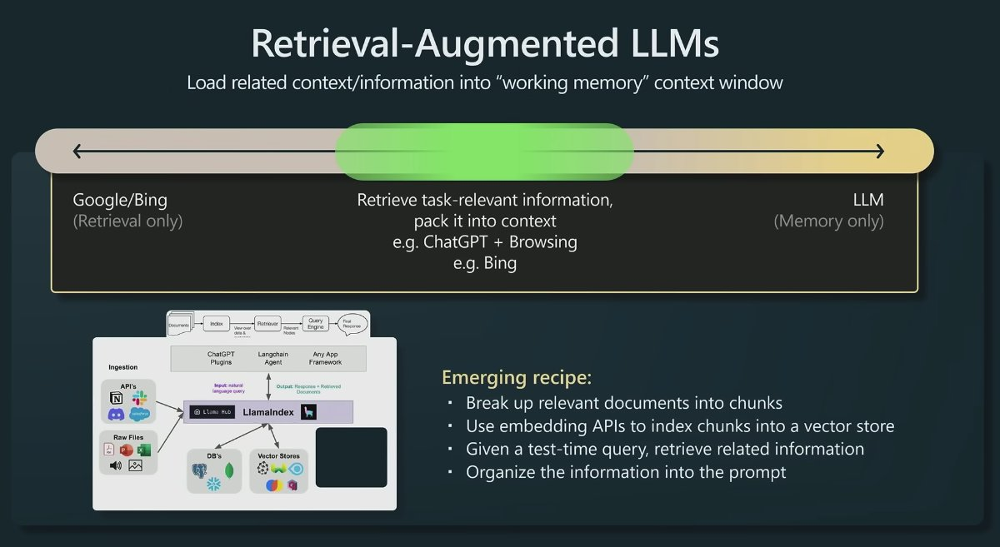
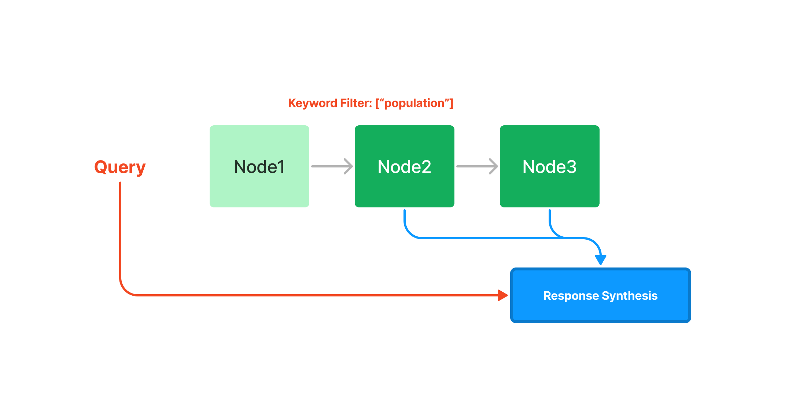
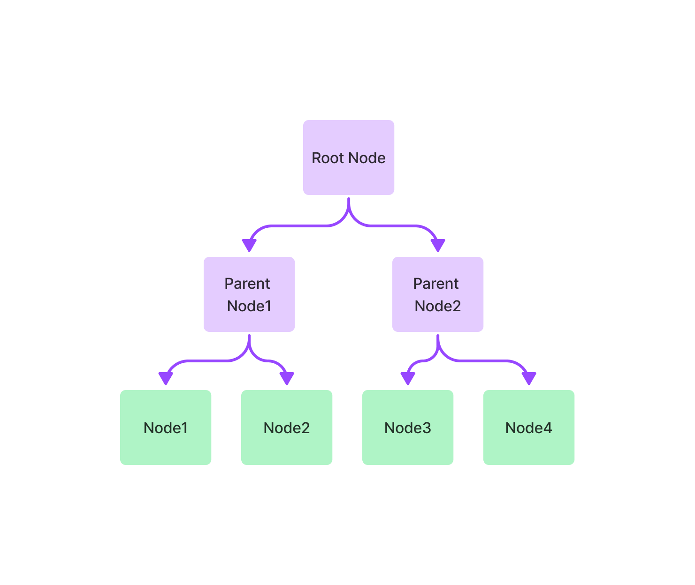
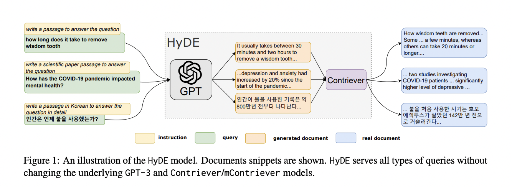

# RAG

## Retrieval Augmented LLM

- 1 **Definition**
    - 大语言模型自问世以来, 在实际使用上面临两个问题. 一是大模型的幻觉(Hallucination), 二是数据新鲜度(Data Freshness)的问题. 幻觉问题主要是指生成内容不正确, 荒谬或与事实不符的结果. 数据新鲜度指的是大语言模型对于时效性比较强的问题给出不正确或过时的答案. 为了解决上述问题, 一般采用检索增强LLM(Retrieval Augmented LLM)或检索增强生成(RAG, Retrieval Augmented Generation)方法对大模型的答案进行优化.
    - 检索增强大模型(Retrieval Augmented LLM), 为大模型提供了一个外部数据库, 对于用户问题(Query), 通过一些信息检索(Information Retrieval)等技术, 先从外部数据库中和用户问题相关的信息, 然后让大模型结合这些相关信息来生成结果.
    - 下图是一个检索增强LLM的示意图. Source: https://www.youtube.com/watch?v=bZQun8Y4L2A, State of GPT.
    
    - 传统的信息检索工具, 比如 Google/Bing 这样的搜索引擎, 只有检索能力(Retrieval Only), 现在大模型通过预训练过程, 将海量的数据和知识嵌入到巨大的模型参数中, 经过预训练的大模型即具有记忆能力(Memory Only). 检索增强大模型将大模型与传统的信息检索相结合, 通过一些信息检索技术将相关信息加载到大模型的工作内存(Working Memory)中, 即大模型的上下文窗口(Context Window), 也是大模型单次生成时能接受的最大文本输入.
    - Source: ACL 2023 Tutorial: Retrieval-based Language Models and Applications, https://acl2023-retrieval-lm.github.io/.

- 2 **长尾知识(Long Tail Knowledge)**
    - 长尾问题(Long Tail Problem)是指在某些数据分布中, 少数类别出现的频率非常高, 而多数类别出现的频率非常低. 头部(高频部分)占据了大部分的资源, 尾部(低频部分)包含了大量的类别, 虽然单独出现的频率低, 但是总量却非常大. 长尾数据即为长尾问题中低频次多类别的数据.
    - 当前大模型的训练数据量已经非常庞大, 一般都是几百GB的数据量, 以及万亿级别的token数, GPT3的预训练数据就使用了3000亿(300B)token, llama使用了1.4万亿(1400B)token. 训练数据的来源也十分丰富, 例如维基百科 书籍 论坛 代码等, 大模型的参数量也十分巨大, 最大能到万亿量级. 但是让大模型在有限的参数中记住所有的知识或信息是不现实的, 训练数据的涵盖范围也是有限的, 总会有一些长尾知识(Long Tail Knowledge)在训练数据中无法覆盖到.
    - 对于一些相对通用和大众知识, 大模型通常能生成较为准确的结果, 而对于一些长尾知识大模型生成的结果幻觉较为严重. 论文Large Language Models Struggle to Learn Long-Tail Knowledge(https://arxiv.org/pdf/2211.08411)研究了大模型对基于事实的回答的准确性, 发现准确性与预训练数据中相关领域文档数量具有很强的相关性, 即 预训练数据中相关文档数量越多, LLM对事实性回答的回复准确性也越高. 因此可以得出结果, 大模型对于长尾知识的学习能力较弱.
    
    - 为了提升大模型对于长尾知识的学习能力, 容易想到的是在训练数据里加入更多相关长尾知识, 或增大模型参数量. 这两种方法性价比较低, 需要一个很大的训练数据量级和模型参数才能提供大幅度提升大模型对长尾知识回答的准确性. 采用通过检索的方法, 把相关信息在大模型推理时作为上下文(Context)给出, 可以兼顾准确性和性价比.

- 3 **数据来源及可解释性**
    - 通常大模型生成的结果不会给出来源, 也很难解释为什么会生成这样的内容. 而通过大模型提供的外部数据源, 基于检索出的相关信息进行生成, 在生成的结果和信息来源之间建立了关联, 因此生成的结果就可以追溯参考来源, 可解释性和可控性会大大增强. Bing Chat就利用了检索增强进行生成, 生成的回复中会给出相关信息的链接.
    
    - 利用检索来增强大模型的输出, 其中很重要的一步是通过一些检索相关的技术从外部数据中找出相关信息片段, 然后把相关信息片段作为上下文供大模型在生成回复时参考. 尽管LLM的上下文窗口(Context Window)越来越长, 但检索相关信息的步骤仍然很重要. 大模型的网络架构决定了其上下文窗口的长度是有限的, 不会无限增长, 看似很大的上下文窗口, 能容纳的信息对于下游任务还是不足, 例如32k的上下文长度仅相当于一篇论文的长度. 另一方面, 有研究表明, 提供更少量的信息, 相比于提供大量不加过滤的信息, 大模型回复的准确率更高.
    - Source: Lost in the Middle: How Language Models Use Long Contexts, https://arxiv.org/pdf/2307.03172.
    - 利用检索技术从大量外部数据中找到与输入问题最相关的信息片段, 在为大模型生成回复提供参考的同时, 也能一定程度上过滤非相关信息的干扰, 便于提高生成回复的准确性. 此外, 上下文窗口越大, 推理成本越高, 信息检索模块也能降低不必要的推理成本.

- 4 **数据获取**
    - 数据获取模块一般是将多种来源, 多种类型格式的外部数据转换为统一格式的文档对象(Document Object), 便于后续流程的处理和使用. 文档对象除了包含原始的文本内容, 还包括文档的元信息(Metadata), 可以用于后期的检索和过滤. 元信息包括:
        - 时间信息, 文档的创建时间和修改时间
        - 标题 关键词 命名实体(人物 地点) 文本类别
        - 文本总结和摘要
    - 有些元信息可以直接获取, 有些则可以借助NLP等技术, NLP技术包括关键词抽取 实体识别 文本分类 文本摘要等, 即可以采用传统的NLP模型和框架, 也可以基于大模型实现.
    - 外部数据来源多种多样, 文件格式也是多样化的.

- 5 **文本分块 trunking**
    - 文本分块是将长文本切分成小片段的过程, 比如将一篇长文章切分成一个个较短的段落. 进行文本分块主要有两个原因: 一是当前的大模型上下文长度有限制, 直接把一篇长文全部作为相关信息放到大模型的上下文窗口中, 可能会超过长度限制. 二是对于长文本, 即使文本和查询的问题相关, 但一般不会通篇完全相关, 分块能够在一定程度上剔除不相关的内容, 为后续的回复生成过滤一些不必要的噪声.
    - 文本分块的好坏将很大程度上影响后续回复生成的效果, 切分的不好, 内容之间的关联性会被切断, 因此一个好的分块策略很重要. 分块策略包括具体的切分方法(按句子或段落切分), 块大小设置, 不同块之间是否允许重叠等.

    - 分块需要考虑的因素
        - Source: Chunking Strategies for LLM Applications, https://www.pinecone.io/learn/chunking-strategies/
        - 原始内容的特点, 原始内容是长文(博客文章, 书籍)或短文(推文, 即时消息), 格式(html, markdown, code), 不同的内容特点适合不同的分块策略.
        - 后续使用的索引方法: 对分块后的内容进行向量索引. 不同的向量嵌入模型有其适用的分块大小, sentence-transformer 模型适合对句子级别内容进行嵌入, text-embedding-ada 模型适合的分块大小在256-512个标记数量.
        - 问题的长度: 需要基于问题检索相关文本片段.
        - 检索出的相关内容在回复生成阶段的使用方法: 如果直接把检索出的相关内容作为prompt的一部分提供给大模型, 那么大模型的输入长度限制应当在设计分块大小的时候就考虑清楚.

    - 分块实现方法
        - 1 将原始的长文本切分成小的语义单元, 这里的语义单元通常是句子级别或者段落级别.
        - 2 将这些小语义单元融合成更大的块, 直到达到设定的块大小(Chunk Size), 就将这个块作为独立的文本片段.
        - 3 迭代构建下一个文本片段, 一般相邻的文本片段之间会设置重叠, 以保持语义的连贯性.

        - 基于分割符进行切分. 按照句号(.) 换行符(\n) 空格等进行分割. 除了利用分割符进行切分, 还可以定义一组分割符进行迭代切分, 比如定义 ["\n\n", "\n", " ", ""] 这样一组分隔符, 切分的时候先利用第一个分割符进行切分(实现类似按段落切分的效果), 第一次切分完成后, 对于超过预设大小的块, 继续使用后面的分割符进行切分, 依此类推. 这种切分方法能较好地保持原始文本的层次结构.
        - 结构化文本切分. 针对代码 Markdown LaTex等文本
            - 代码文件中, 分隔符中加入类似"\nclass", "\ndef"等文本, 保证类和函数的完整性.
            - Markdown文件中, 通过不同层级的Header进行组织分割, 在切分的时候通过特定的分割符维持这种层级结构.

        - 文本块大小
            - 基于字符数进行统计(Character-level).
            - 基于标记数进行统计(Token-level).

    - 在LangChain中的实现

        ```python
        from langchain.text_splitter import CharacterTextSplitter
        from langchain.text_splitter import RecursiveCharacterTextSplitter, Language

        # text split
        text_splitter = RecursiveCharacterTextSplitter(
            # Set a really small chunk size, just to show.
            chunk_size = 100,
            chunk_overlap  = 20,
            length_function = len,
            add_start_index = True,
        )

        # code split
        python_splitter = RecursiveCharacterTextSplitter.from_language(
                    language=Language.PYTHON, 
                    chunk_size=50, 
                    chunk_overlap=0  
        )

        # markdown split
        md_splitter = RecursiveCharacterTextSplitter.from_language(  
                    language=Language.MARKDOWN, 
                    chunk_size=60, 
                    chunk_overlap=0  
        )
        ```

- 6 **数据索引**
    - 在数据读取和文本分块完成后, 需要对处理好的数据进行索引. 索引是一种数据结构, 用于快速检索出与用户查询相关的文本内容, 数据索引是增强检索大模型的核心组件之一.
    - 链式索引
        - 链式索引通过链表的结构对文本块进行顺序索引, 在后续的检索和生成阶段, 可以简单的顺序遍历所有节点, 也可以基于关键词进行过滤.
        
        
        

    - 树索引
        - 树索引将一组节点(文本块)构建成具有层级的树状索引结构, 从叶节点(原始文本块)向上构建, 每个父节点都是子节点的摘要. 在检索阶段, 即可以从根节点向下进行遍历, 也可以直接利用根节点的信息. 树索引提供了一种更高效的查询长文本块的方式, 还可以用于从文本的不同部分提取信息. 与链式索引不同, 树索引无需按顺序查询.
        
        

    - 关键词表索引
        - 关键词表索引从每个节点中提取关键词, 构建了每个关键词到相应节点的多对多映射, 每个关键词可能指向多个节点, 每个节点也可能包含多个关键词. 在检索阶段, 可以基于用户查询中的关键词对节点进行筛选.
        
        

    - 向量索引
        - 向量索引是当前最流行的一种索引方法. 这种方法一般利用文本潜入模型(Text Embedding Model)将文本块映射成一个固定长度的向量, 然后储存在向量数据库中. 检索时, 对用户查询的文本同样采用文本嵌入模型映射成向量, 然后基于向量相似度计算得到最相似的一个或多个节点.
        
        

- 7 **文本嵌入模型**
    - 文本嵌入模型(Text Embedding Model)将非结构化的文本转换为结构化的向量(vector), 即学习得到的稠密向量.
    
    - 早期的Word2Vec, GloVe
    - Sentence Transformer, Source: https://arxiv.org/abs/1908.10084.
    - OpenAI text embedding ada, Source: https://openai.com/index/new-and-improved-embedding-model/.
    - Instructor, 经过指令微调的文本嵌入模型, 可以根据任务(分类 检索 聚类 文本评估等)和领域(例如科学 金融等), 提供任务指令而生成相对定制化的文本嵌入向量. Source: https://instructor-embedding.github.io/.
    - BGE模型, 开源的中英文语义向量模型. Source: https://github.com/FlagOpen/FlagEmbedding/blob/master/README_zh.md.

- 8 **相似向量检索**
    - 相似向量检索要解决的问题是给定一个查询向量, 如何在候选向量中准确且高效的检索出与其相似的向量.
    - 相似性度量
        - 余弦相似度, 点积, 欧式距离, 汉明距离等.
        - 一般使用余弦相似度
    - 相似性检索算法
        - Numpy
            - 当候选向量的数量比较少时, 例如只有几万个向量, Numpy库就可以实现相似向量检索.
            - Idea: https://www.ethanrosenthal.com/2023/04/10/nn-vs-ann/
            - Example: 
            ```python
            import numpy as np

            # candidate_vecs: 2D numpy array of shape N x D
            # query_vec: 1D numpy array of shape D
            # k: number of top k similar vectors

            sim_scores = np.dot(candidate_vecs, query_vec)
            topk_indices = np.argsort(sim_scores)[::-1][:k]
            topk_values = sim_scores[topk_indices]
            ```
        - Faiss
            - 对于大规模向量的相似性检索, 需要更高效的实现方案. Faiss是一个用于高效相似性搜索和向量聚类的库, 它实现了在任意大小的向量集合中进行搜索的很多算法, 支持多平台.
            - 下面是Faiss的几种索引在不同维度下的对比.
            

- 9 **向量数据库**
    - 在向量相似性检索中, 还缺少一些功能, 例如数据托管和备份, 数据增删改查管理, 向量对应的原始数据和元数据的存储, 可扩展性等.
    - 向量数据库是一种用于存储 管理 查询向量数据的数据库, 可以实现向量数据的相似检索, 聚类等工作. 目前比较流行的向量数据库有 Pinecone Vespa Weaviate Milvus Chroma Tencent-Cloud-VectorDB等, 大部分都提供开源产品.

    - 向量数据库的作用
        - 首先, 使用嵌入模型为想要索引的内容创建向量嵌入.
        - 向量嵌入被插入到向量数据库中, 并带有一些对创建嵌入的原始内容的引用.
        - 当应用程序发出查询时, 使用相同的嵌入模型为查询创建嵌入, 并使用这些嵌入来查询数据库, 查找相似的向量嵌入.
        - 相似的嵌入与创建这些的原始内容关联.

    - 向量数据库的工作原理
        - 传统数据库中, 将字符串 数字和其他类型的标量数据存储在行和列中, 而向量数据库对向量进行操作, 因此其优化和查询方式有很大不同.
        - 向量数据库运用相似度向量查找与输入查询最相似的向量.
        - 向量数据库使用近似最近邻搜索(ANN, Approximate Nearest Neighbour Search), 找出不同算法的组合. 这些算法通过哈希 量化或基于图的搜索来优化搜索, 这些算法组成一个管道, 可以快速准确的检索查询向量的最近邻.
        - 由于向量数据库提供的结果是一个近似的结果, 应用中主要权衡准确性和速度. 结果越准确, 查询速度越慢.
        - 向量数据库的常见管道
            - 索引: 向量数据库使用PQ(Product Quantification) LSH(Local Sentitive Hash) HNSW等算法, 将向量映射到一个数据结构, 对向量进行索引, 以实现更快的搜索.
            - 查询: 向量数据库将索引的查询向量与数据集中的索引向量进行比较, 以找到最近邻.
            - 后处理: 在某些情况下, 向量数据库从数据集中检索最终的最近邻, 并对其进行后处理以返回最终结果, 这些处理包括对最近邻进行排序等.

    - 实现
        - Pinecone向量数据库的实现方法
        ```python
        # install python pinecone client
        # pip install pinecone-client
        import pinecone 
        # initialize pinecone client
        pinecone.init(api_key="YOUR_API_KEY", environment="YOUR_ENVIRONMENT")
        # create index 
        pinecone.create_index("quickstart", dimension=8, metric="euclidean")
        # connect to the index
        index = pinecone.Index("quickstart")
        # Upsert sample data (5 8-dimensional vectors) 
        index.upsert([ 
                ("A", [0.1, 0.1, 0.1, 0.1, 0.1, 0.1, 0.1, 0.1]), 
                ("B", [0.2, 0.2, 0.2, 0.2, 0.2, 0.2, 0.2, 0.2]), 
                ("C", [0.3, 0.3, 0.3, 0.3, 0.3, 0.3, 0.3, 0.3]), 
                ("D", [0.4, 0.4, 0.4, 0.4, 0.4, 0.4, 0.4, 0.4]), 
                ("E", [0.5, 0.5, 0.5, 0.5, 0.5, 0.5, 0.5, 0.5]) 
            ])

        # query
        index.query( 
            vector=[0.3, 0.3, 0.3, 0.3, 0.3, 0.3, 0.3, 0.3], 
            top_k=3, 
            include_values=True 
            ) 

        # Returns: 
        # {'matches': [{'id': 'C', 
        #               'score': 0.0, 
        #               'values': [0.3, 0.3, 0.3, 0.3, 0.3, 0.3, 0.3, 0.3]}, 
        #              {'id': 'D', 
        #               'score': 0.0799999237, 
        #               'values': [0.4, 0.4, 0.4, 0.4, 0.4, 0.4, 0.4, 0.4]}, 
        #              {'id': 'B', 
        #               'score': 0.0800000429, 
        #               'values': [0.2, 0.2, 0.2, 0.2, 0.2, 0.2, 0.2, 0.2]}], 
        # 'namespace': ''}

        # delete index 
        pinecone.delete_index("quickstart")
        ```

- 10 **查询变换**
    - 查询文本的表达方法直接影响检索结果, 微小的文本改动可能导致结果的巨大偏差. 直接使用原始的查询文本进行检索在很多时候可能是简单有效的, 但有时需要对查询文本进行一些变换以得到更好的检索结果.

    - 同义改写
        - 将原始的查询改写成相同语义下不同的表达方式, 改写工作可以调用大模型完成. 例如对于原始查询: What are the approaches to task decomposition? 可以改写成: How can Task Decomposition be approached? What are the different methods for Task Decomposition? What are the various approaches to decomposing tasks?
        - 对于每种表达, 分别检索出一组相关文档, 然后对所有的检索结果进行去重合并, 得到一个更大的候选相关文档集合. 通过将同一个查询改写成多个同义查询, 能够克服单一查询的局限性, 获得更丰富的检索结果集合.

    - 查询分解
        - 大模型在回答复杂问题时, 如果将复杂问题分解成相对简单的子问题, 回复表现会更好, 可以分成单步分解和多步分解.
        - Source: Measuring and Narrowing the Compositionality Gap in Language Models, https://ofir.io/self-ask.pdf.
        - Source: ReAct: SYNERGIZING REASONING AND ACTING IN LANGUAGE MODELS, https://arxiv.org/pdf/2210.03629.

        - 单步分解
            - 将一个复杂查询转化为多个简单的子查询, 融合每个子查询的答案作为原始复杂查询的回复.
            
        
        - 多步分解
            - 给定初始的复杂查询, 会一步一步的转换成多个查询, 结合前一步的回复结果生成下一步的查询问题, 直到问不出问题为止, 结合每一步的回复生成最终的结果.
            

    - HyDE
        - HyDE, Hypothetical Document Embeddings, 首先利用大模型生成一个假设的文档或回复, 然后以这个假设的文档或回复作为新的查询进行检索, 而不是直接使用初始查询. 这种转换在没有上下文的情况下可能会生成一个误导性的假设文档或回复, 从而可能得到一个与原始查询不相关的错误回复.
        

- 11 **排序和后处理**
    - 经过前面的检索过程可能会得到很多相关文档, 需要进行筛选和排序, 常用的筛选和排序包括:
        - 基于相似度分数进行过滤和排序.
        - 基于关键词进行过滤, 比如限定包含或者不包含某些关键词.
        - 让大模型基于返回的相关文档及其相关性得分来重新排序.
        - 基于时间进行过滤和排序, 比如只筛选最新的相关文档.
        - 基于时间对相似度进行加权, 然后进行排序和筛选.

- 12 **回复生成模块**
    - 回复生成策略
        - 检索模块基于用户查询检索出相关的文本块, 回复生成模块让大模型利用检索出的相关信息, 从而生成对原始查询的回复.
        - 策略1, 依次结合每个检索出的相关文本块, 每次不断修正生成的回复. 有多少个独立的相关文本块, 就会产生多少次大模型的调用.
        - 策略2, 在每次大模型的调用中, 尽可能多的在prompt中填充文本块, 如果一个prompt填充不下, 则采用类似的操作构建多个prompt, 多个prompt的调用可以采用和前一种相同的回复修正策略.

    - 回复生成prompt模板
        - 可以指定大模型是否需要结合它自己的知识来生成回复等.
        ```python
        template = f'''
        Context information is below.
        ---------------------
        {context_str}
        ---------------------
        Using both the context information and also using your own knowledge, answer the question: {query_str}

        If the context isn't helpful, you can/don’t answer the question on your own.
        '''
        ```

        - 下面的prompt模板让大模型不断修正已有的回复.
        ```python
        template = f'''
        The original question is as follows: {query_str}
        We have provided an existing answer: {existing_answer}
        We have the opportunity to refine the existing answer (only if needed) with some more context below.
        ------------
        {context_str}
        ------------
        Using both the new context and your own knowledege, update or repeat the existing answer.
        '''
        ```


## Code and Example

- 1 **LlamaIndex**
    - LlamaIndex 是一个服务于 LLM 应用的数据框架, 提供外部数据源的导入 结构化 索引 查询等功能, 这篇文章的结构和内容有很大一部分是参考 LlamaIndex 的文档, 文章中提到的很多模块 算法和策略, LlamaIndex 基本都有对应的实现, 提供了相关的高阶和低阶 API.
        - 数据连接器: 能从多种数据源中导入数据, 有个专门的项目 Llama Hub, 可以连接多种来源的数据.
        - 数据索引: 支持对读取的数据进行多种不同的索引, 便于后期的检索.
        - 查询和对话引擎: 既支持单轮形式的查询交互引擎, 也支持多轮形式的对话交互引擎.
        - 应用集成: 可以方便地与一些流行的应用进行集成, 比如 ChatGPT LangChain Flask Docker等.
        

- 2 **LangChain**
    - 相较于LlamaIndex更侧重于检索, LangChain覆盖的领域更广, 包含了大模型的链式应用 agent的创建管理等. LangChain中Retrieval模块的整体流程如图所示, 包含了数据的加载 变换 嵌入 向量存储和检索, 整体处理流程与LlamaIndex相同.
    


