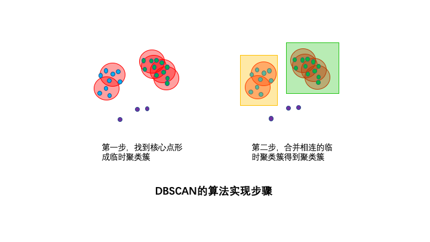
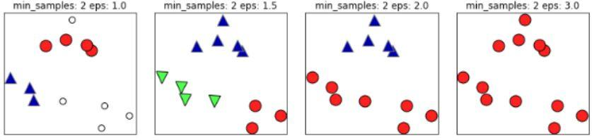

## DBSCAN

- 1 **Fundamentals**

    - DBSCAN是一个出现得比较早(1996年), 比较有代表性的基于密度的聚类算法, 虽然这个算法本身是密度聚类算法, 但同样可以用作异常检测, 其思想就是找到样本空间中处在低密度的异常样本, 本文就介绍下基本原理以及怎么进行异常检测, 后面介绍聚类的应用.

    - DBSCAN是英文Density-Based Spatial Clustering of Applications with Noise的缩写, 意思为: 一种基于密度, 同时对于有噪声(即孤立点或异常值)的数据集也有很好的鲁棒的空间聚类算法. DBSCAN将簇定义为密度相连的点的最大集合, 能够把具有足够高密度的区域划分为簇, 并可在噪声的空间数据库中发现任意形状的聚类.

    - 在聚类问题中, 如果数据集的各类呈球形分布, 可以采用kmeans聚类算法, 如果各类数据呈非球形分布(如太极图, 笑脸图等), 采用kmeans算法效果将大打折扣, 这种情况使用DBSCAN聚类算法更为合适, 如下图所示.

    

    - 各种聚类算法对不同形状的簇的聚类效果.
    

    - DBSCAN算法具有以下特点: 基于密度, 对远离密度核心的噪声点鲁棒, 单独划分为一个簇; 无需事前知道聚类簇的数量; 可以发现任意形状的聚类簇.

- 2 **Basic Concepts**
    - DBSCAN的基本概念可以用1个思想, 2个参数, 3种类别, 4种关系来总结.

    - 1个核心思想
        - 该算法最核心的思想就是基于密度, 直观效果上看, DBSCAN算法可以找到样本点的全部密集区域, 并把这些密集区域当做一个一个的聚类簇.
        

        - 可以简单的理解该算法是基于密度的一种生长, 和病毒的传染差不多, 只要密度够大, 就能传染过去, 遇到密度小的, 就停止传染.
        

        可视化的网站: https://www.naftaliharris.com/blog/visualizing-dbscan-clustering/

    - 2个算法参数
        - 邻域半径R、最少点数目MinPoints.
        - 这两个算法参数实际可以刻画什么叫密集: 当邻域半径R内的点的个数大于最少点数目R时, 就是密集.
        

        - 这两个参数恰好对应sklearn.cluster.DBSCAN算法中的两个参数为: min_samples 和 eps.
            - eps表示数据点的邻域半径, 如果某个数据点的邻域内至少有min_sample个数据点, 则将该数据点看作为核心点, 如果某个核心点的邻域内有其他核心点, 则将它们看作属于同一个簇.

        - 如果将eps设置得非常小, 则有可能没有点成为核心点, 并且可能导致所有点都被标记为噪声.
        - 如果将eps设置为非常大, 则将导致所有点都被划分到同一个簇.

        - 如果 min_samples 设置地太大, 那么意味着更少的点会成为核心点, 而更多的点将被标记为噪声. 指定半径r的点内有满足条件的个点, 则可以认为该区域密集.
        

    - 3种点的类别
        - 核心点, 边界点, 噪声点.
        - 我们可以简单理解: 邻域半径 R 内样本点的数量大于等于 minpoints 的点叫做核心点, 不属于核心点但在某个核心点的邻域内的点叫做边界点, 既不是核心点也不是边界点的是噪声点.
        
        

        - 核心点: 对某一数据集 D, 若样本 p 的 $\epsilon$ 领域内至少包含 MinPts 个样本(包括样本p), 那么样本p称核心点. 即: $ N_{\epsilon} \geq MinPts $, 称p为核心点, 其中 $ \epsilon $ 领域 $ N_{\epsilon}(P) $ 的表达式为: $ N_{\epsilon}(P) = \{ q \in D | dist(p, q) \leq \epsilon \} $.

        - 边界点: 对于非核心点的样本b, 若b在任意核心点p的 $\epsilon$ 领域内, 那么样本b称为边界点. 即:
            \[ 
            \begin{cases} 
            p, & b \text{分别为核心点与非核心点} \\ 
            b \in N_{\epsilon}(p) 
            \end{cases} 
            \]
        称b为边界点.

        - 噪声点: 对于非核心点的样本n, 若n不在任意核心点p的 $\epsilon$ 领域内, 那么样本n称为噪声点. 即: 
            \[ 
            \begin{cases} 
            p, & n \text{分别为核心点与非核心点} \\ 
            n \notin N_{\epsilon}(p) 
            \end{cases} 
            \]
        称n为噪声点.

    - 假设 MinPts=4, 如下图的核心点, 非核心点与噪声的分布:
        

- 3 **原理**
    - DBSCAN 算法分群的原理类似我们亲戚, 家族, 家庭的划分. 比如 通过基因和婚姻关系, 可以把爸爸妈妈和孩子划分为一个家庭; 如果家庭和家庭的长辈之间能通过基因或婚姻关系确定亲戚关系, 那几个家庭就可划分为一个家族或亲戚关系. DBSCAN划分的原理也类似, 只不过这里的基因或婚姻关系是r-邻域(通俗理解可以理解成半径为r的球), 只要能通过r邻域把多个对象联通起来, 就可把这堆对象划为一类.

- 4 **DBSCAN点的关系**
    - 密度直达, 密度可达, 密度相连, 非密度相连.

        - 如果P为核心点, Q在P的R邻域内, 那么称P到Q密度直达. 任何核心点到其自身密度直达, 密度直达不具有对称性, 如果P到Q密度可达, 那么Q到P不一定密度可达.

        - 如果存在核心点P2, P3, ..., Pn, 且P1到P2密度直达, P2到P3密度直达, ..., P(n-1) 到Pn密度直达, Pn到Q密度直达, 则P1到Q密度可达, 密度可达也不具有对称性.

        - 如果存在核心点S, 使得S到P和Q都密度可达, 则P和Q密度相连. 密度相连具有对称性, 如果P和Q密度相连, 那么Q和P也一定密度相连, 密度相连的两个点属于同一个聚类簇.

        - 如果两个点不属于密度相连关系, 则两个点非密度相连, 非密度相连的两个点属于不同的聚类簇, 或者其中存在噪声点.
        

    - 密度直达
        - 若点Q在核心点P的r-邻域内, 则称Q是从P出发可以直接密度可达(通俗理解, P和Q是直系亲属), 假设M=6, 则上图点P是核心点. 点Q在点P的r邻域内, 则P和Q为直接密度可达. 当然, 圈内的其他五个点与P也是直接密度可达的.
        
    
        - 样本X在核心样本Y的邻域内, 则称Y到X是密度直达的, 注意这个关系是单向的, 反向不一定成立.
        

    - 密度可达
        - 若存在 P1, P2, ...., Pm是一列核心点, Pi-1 是从 Pi 出发关于r和M直接密度可达的(即P2在 P1的圈里, P3在P2的圈里, P4在P3的圈里, 以此类推, Pm在Pm-1的圈里), 则称点 Pm 是从 P1 出发关于r和M密度可达的(通俗理解 Pm是家庭 P1 的远房亲戚).
        
    
        - 核心样本Y到核心样本 P3 是密度直达的, 核心样本P3到核心样本P2是密度直达的, 核心样本P2到样本X是密度直达的, 像这种通过P3和P2的中转, 在样本Y到样本X建立的关系叫做密度可达.
        

    - 密度相连
        - 如果样本集中存在点O, 使得点P Q是从集合o出发关于r和M密度可达的, 那么点P Q是关于r和M密度相连的(通俗理解, P是家庭O中男方的远房亲戚, Q是家庭O中女方的远房亲戚, 那么P和Q也是亲戚关系)
        

        - 核心样本O到样本Y是密度可达的, 同时核心样本O到样本X是密度可达的, 这样的关系可以认为样本X和样本Y是密度相连的.
        

        - 对于一系列密度可达的点而言, 其邻域范围内的点都是密度相连的, 下图所示是一个minPoints为5的领域, 红色点为core ponit, 绿色箭头连接起来的则是密度可达的样本集合, 在这些样本点的邻域内的点构成了一个密度相连的样本集合, 这些样本就属于同一个cluster.
        

        - DBSCAN的聚类过程就是根据核心点来推导出最大密度相连的样本集合, 首先随机寻找一个核心样本点, 按照minPoints和eps来推导其密度相连的点, 赋予一个cluser编号, 然后再选择一个没有赋予类别的核心样本点, 开始推导其密度相连的样本结合, 一直迭代到所有的核心样本点都有对应的类别为止.


- 5 **DBSCAN的算法原理**

    - a 寻找核心点形成临时聚类簇
        扫描全部样本点, 如果某个样本点R半径范围内点数目 $\geq$ MinPoints, 则将其纳入核心点列表, 并将其密度直达的点形成对应的临时聚类簇.

    - b 合并临时聚类簇得到聚类簇
        对于每一个临时聚类簇, 检查其中的点是否为核心点, 如果是则将该点对应的临时聚类簇和当前临时聚类簇合并, 得到新的临时聚类簇.

    - 重复此操作, 直到当前临时聚类簇中的每一个点要么不在核心点列表, 要么其密度直达的点都已经在该临时聚类簇, 该临时聚类簇升级成为聚类簇.

    - 继续对剩余的临时聚类簇进行相同的合并操作, 直到全部临时聚类簇被处理. 反复寻找这些核心点直接密度可达或密度可达的点, 将其加入到相应的类, 对于核心点发生密度可达状况的类, 给予合并(组建好各个家庭后, 如果家庭中长辈之间有亲戚关系, 则把家庭合并为一个大家族).
    

- 6 **DBSCAN算法步骤**

    - 1 找到每个样本的邻域内的样本个数, 若个数大于等于MinPts, 则该样本为核心点.
    - 2 找到每个核心样本密度直达和密度可达的样本, 且该样本亦为核心样本, 忽略所有的非核心样本.
    - 3 若非核心样本在核心样本的邻域内, 则非核心样本为边界样本, 反之为噪声.

- 7 **sklearn实现**
    - https://scikit-learn.org/stable/modules/generated/sklearn.cluster.DBSCAN.html

    - 1 基本用法
        ```python highlight=python
        sklearn.cluster.DBSCAN(eps=0.5, *, 
                            min_samples=5, 
                            metric='euclidean', 
                            metric_params=None, 
                            algorithm='auto', 
                            leaf_size=30, 
                            p=None, 
                            n_jobs=None
                            )
        ```
    - 2 核心参数
        ```python hightlight=python
        eps: float # $\epsilon$-邻域的距离阈值
        min_samples: int # 样本点要成为核心对象所需要的 $\epsilon$-邻域的样本数阈值
        ```

    - 3 其他参数
        ``` python highlight=python
        metric # 度量方式, 默认为欧式距离, 可以使用的距离度量参数有: 
        欧式距离 “euclidean”
        曼哈顿距离 “manhattan”
        切比雪夫距离“chebyshev”
        闵可夫斯基距离 “minkowski”
        带权重闵可夫斯基距离 “wminkowski”
        标准化欧式距离 “seuclidean”
        马氏距离“mahalanobis”
        自己定义距离函数
        algorithm: 近邻算法求解方式, 有四种: 
        “brute”蛮力实现
        “kd_tree” KD树实现
        “ball_tree”球树实现
        “auto”上面三种算法中做权衡, 选择一个拟合最好的最优算法. 
        leaf_size: 使用“ball_tree”或“kd_tree”时,停止建子树的叶子节点数量的阈值
        p: 只用于闵可夫斯基距离和带权重闵可夫斯基距离中p值的选择, p=1为曼哈顿距离,  p=2为欧式距离. 如果使用默认的欧式距离不需要管这个参数. 
        n_jobs : CPU并行数, 若值为 -1, 则用所有的CPU进行运算
        ```
    - 4 属性
        ``` python highlight=python
        core_sample_indices_ # 核心点的索引, 因为labels_不能区分核心点还是边界点, 所以需要用这个索引确定核心点
        components_ # 训练样本的核心点
        labels_ # 每个点所属集群的标签, 也就是聚类的编号, -1代表噪声点
        ```
    
    

    - 5 算法案例
        ``` python highlight=python
        from sklearn.cluster import DBSCAN
        import numpy as np
        X = np.array([[1, 2], [2, 2], [2, 3],
                    [8, 7], [8, 8], [25, 80]])
        clustering = DBSCAN(eps=3, min_samples=2).fit(X)

        clustering.labels_
        array([0, 0, 0, 1, 1, -1])
        # 0, 0, 0: 表示前三个样本被分为了一个群
        # 1, 1: 中间两个被分为一个群
        # -1: 最后一个为异常点, 不属于任何一个群

        再生成个复杂点的数据看看

        import numpy as np
        import matplotlib.pyplot as plt
        from sklearn.datasets import make_blobs
        from sklearn.cluster import DBSCAN
        from sklearn.preprocessing import StandardScaler

        # 生成随机簇类数据, 样本数为600, 类别为5
        X, y = make_blobs(random_state=170,
                        n_samples=600,
                        centers=5
                        )
        # 绘制延伸图
        plt.scatter(X[:,0],X[:,1])
        plt.xlabel("Feature 0")
        plt.ylabel("Feature 1")
        plt.show()

        # dbscan聚类算法 按照经验MinPts=2*ndims, 因此我们设置MinPts=4. 
        dbscan = DBSCAN(eps=1, 
                        min_samples=4)
        clusters = dbscan.fit_predict(X)

        # dbscan聚类结果
        plt.scatter(X[:, 0],X[:, 1],
                    c=clusters,
                    cmap="plasma")
        plt.xlabel("Feature 0")
        plt.ylabel("Feature 1")
        plt.title("eps=0.5,minPts=4")
        plt.show()

        # 性能评价指标ARI
        from sklearn.metrics.cluster import adjusted_rand_score
        # ARI指数  ARI= 0.99为了较少算法的计算量, 我们尝试减小MinPts的值. 
        print("ARI=",round(adjusted_rand_score(y,clusters),2))
        ```


- 8 **DBSCAN算法的参数估计**
    - DBSCAN主要包含两个参数: eps, MinPts.
    - eps: 邻域半径, 也就是我们要观察的最小半径是多少
    - MinPts: 形成簇类所需的最小样本个数, 比如MinPts等于5, 形成簇类的前提是至少有一个样本的eps-邻域大于等于5.
        - 如果eps值取的太小, 部分样本误认为是噪声点(白色)；eps值取的多大, 大部分的样本会合并为同一簇类.
    

        - 若MinPts值过小, 则所有样本都可能为核心样本；MinPts值过大时, 部分样本误认为是噪声点(白色), 如下图: 
    

    - 根据经验, minPts的最小值可以从数据集的维数D得到, 即 $ minPts \geq D + 1 $.
        - 若$ minPts = 1 $, 含义为所有的数据集样本都为核心样本, 即每个样本都是一个簇类.
        - 若$ minPts \leq 2 $, 结果和单连接的层次聚类相同.
        - 因此$ minPts $必须大于等于3, 因此一般认为$ minPts = 2 \times dim $, 若数据集越大, 则minPts的值选择的亦越大.

    - eps值常常用k-距离曲线(k-distance graph)得到, 计算每个样本与所有样本的距离, 选择第k个最近邻的距离并从大到小排序, 得到k-距离曲线, 曲线拐点对应的距离设置为eps, 如下图: 
    

    - 由图可知或者根据k-距离曲线的定义可知: 样本点第k个近邻距离值小于eps归为簇类, 大于eps的样本点归为噪声点. 根据经验, 一般选择eps值等于第(minPts-1)的距离, 计算样本间的距离前需要对数据进行归一化, 使所有特征值处于同一尺度范围, 有利于eps参数的设置. 

    - 如果(k+1)-距离曲线和k-距离曲线没有明显差异, 那么minPts设置为k值. 例如k=4和k>4的距离曲线没有明显差异, 而且k>4的算法计算量大于k=4的计算量, 因此设置MinPts=4. 

- 9 **example**
    - 1 数据集介绍
        - 数据来自于kaggle上的一个信用卡欺诈检测比赛, 数据质量高, 正负样本比例非常悬殊, 很典型的异常检测数据集, 在这个数据集上来测试一下各种异常检测手段的效果. 当然, 可能换个数据集结果就会有很大不同, 结果仅供参考. 
        - 我们用一个信用卡欺诈的数据来进行测试, 看看聚类算法用于异常检测的效果怎么样. 

        - 信用卡欺诈是指故意使用伪造、作废的信用卡, 冒用他人的信用卡骗取财物, 或用本人信用卡进行恶意透支的行为,信用卡欺诈形式分为3种: 失卡冒用、假冒申请、伪造信用卡. 欺诈案件中, 有60%以上是伪造信用卡诈骗, 其特点是团伙性质, 从盗取卡资料、制造假卡、贩卖假卡, 到用假卡作案, 牟取暴利. 而信用卡欺诈检测是银行减少损失的重要手段. 

        - 该数据集包含欧洲持卡人于 2013 年 9 月通过信用卡进行的交易信息. 此数据集显示的是两天内发生的交易, 在 284807 笔交易中, 存在 492 起欺诈, 数据集高度不平衡, 正类(欺诈)仅占所有交易的 0.172%. 原数据集已做脱敏处理和PCA处理, 匿名变量V1,  V2,  ...V28 是 PCA 获得的主成分, 唯一未经过 PCA 处理的变量是 Time 和 Amount. Time 是每笔交易与数据集中第一笔交易之间的间隔, 单位为秒；Amount 是交易金额. Class 是分类变量, 在发生欺诈时为1, 否则为0. 项目要求根据现有数据集建立分类模型, 对信用卡欺诈行为进行检测. 

    - 2 数据来源
        - 数据集 Credit Card Fraud Detection 由比利时布鲁塞尔自由大学(ULB) - Worldline and the Machine Learning Group 提供. 可从Kaggle上下载: https://www.kaggle.com/mlg-ulb/creditcardfraud

    - 3 算法案例
        - 我们抽取一部分的数据来进行无监督的学习, 这个算法比较慢, 30w的数据推理需要5-6min, 所以只选择10w左右来做实验.

        ``` python highlight=python
        import os 
        import pandas as pd 
        import numpy as np 

        # 工作空间设置
        os.chdir('/your_dir')
        os.getcwd()

        # 数据读取
        data = pd.read_csv('creditcard.csv')

        # 查看 0 - 1 个数
        import matplotlib.pyplot as plt
        data.Class.value_counts()

        num_nonfraud = np.sum(data['Class'] == 0)
        num_fraud = np.sum(data['Class'] == 1)
        plt.bar(['Fraud', 'non-fraud'], [num_fraud, num_nonfraud], color='red')
        plt.show()

        # 数据集划分 + 简单的特征工程
        data['Hour'] = data["Time"].apply(lambda x : divmod(x, 3600)[0])

        X = data.drop(['Time','Class'], axis=1)
        Y = data.Class

        # 数据归一化
        from sklearn.preprocessing import StandardScaler
        sd        = StandardScaler()
        column    = X.columns
        X[column] = sd.fit_transform(X[column])

        #训练集交叉验证, 开发集测试泛化性能
        from sklearn.model_selection import train_test_split
        X_train,X_test,Y_train,Y_test = train_test_split(X,Y,
                                                    test_size=0.55,
                                                    random_state=0
                                                    )

        from sklearn.cluster import DBSCAN
        import numpy as np

        clustering = DBSCAN(eps=3.8, min_samples=13).fit(X_train)

        pd.Series(clustering.labels_).value_counts()
        0     113644
        1       8372
        -1       6016
        2         32
        4         16
        8         15
        3         14
        5         14
        6         13
        10         9
        9          9
        7          9

        X_train['labels_'] = clustering.labels_
        X_train['labels'] = Y_train

        X_train[X_train['labels']==1]
        [218 rows x 32 columns]

        X_train[(X_train['labels']==1)&(X_train['labels_']==-1)]
        [186 rows x 32 columns]
        ```

        - 可以看到, 异常簇有6016个样本, 覆盖了186个样本, 所以从覆盖的角度来说, 还是可以的, 但是准确率就比较差了, 也可能我技术不好, 从这个案例来看, 在比较高维度的实际数据中, 这个算法并不是很适合用来做异常检测, 只有在维度比较低的情况下, 做异常检测效果不错. 并未我在试验的时候, 进行了很多半径和样本数量的尝试. 如果要得到比较理想的效果, 可能还需要更加深入的研究. 看了这个算法, 还是比较用来做聚类, 异常检测有点费劲了. 后面继续研究该算法在聚类里面的应用. 

- 10 **Summary**
    - 优点
        1 相比K-Means, DBSCAN 不需要预先声明聚类数量. 
        2 可以对任意形状的稠密数据集进行聚类, 相对的, K-Means之类的聚类算法一般只适用于凸数据集.
        3 可以在聚类的同时发现异常点, 对数据集中的异常点不敏感.
        4 聚类结果没有偏倚, 相对的, K-Means之类的聚类算法初始值对聚类结果有很大影响.

    - 缺点
        1 算法要对数据集中的每个样本都进行计算, 如果数据集样本量很大, 那么计算效率、对计算机算力的要求等就有了很大考验, 可以对搜索最近邻时建立的KD树或者球树进行规模限制来改进. 
        2 对于具有不同密度的簇, DBSCAN 算法的效果可能不是很好, 当空间聚类的密度不均匀、样本分布较分散、聚类间距差相差很大时, 聚类质量较差, 需要为算法指定eps和MinPts参数, 这对分析人员是一个很大的挑战.
        3 在两个聚类交界边缘的点会视乎它在数据库的次序决定加入哪个聚类, 幸运地, 这种情况并不常见, 而且对整体的聚类结果影响不大(DBSCAN*变种算法, 把交界点视为噪音, 达到完全决定性的结果.
        4 调参相对于传统的K-Means之类的聚类算法稍复杂, 主要需要对距离阈值eps, 邻域样本数阈值MinPts联合调参, 不同的参数组合对最后的聚类效果有较大影响, DBSCAN聚类算法对参数eps和MinPts的设置是非常敏感的, 如果指定不当, 该算法将造成聚类质量的下降, DBSCAN 算法的两个参数也是要根据具体的数据情况进行多次尝试.
        5 作为异常检测时, 并没有异常程度, 只有一个标签去标记是否异常.
