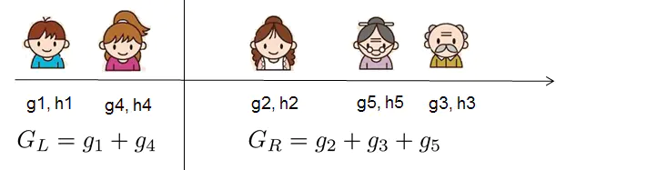

# Decision Tree

Q1 **有监督学习**
- 有监督学习
  利用包含多个特征的训练数据$x_i$, 来预测目标变量$y_i$.

- 模型与参数
  在监督学习中模型(model)表示一种数学函数, 通过给定$x_i$来对$y_i$进行预测. 以最常见的线性模型(linear model)举例来说, 模型可以表述为$\hat{y}_i = \sum_{j} \theta_j x_{ij}$, 这是一个输入特性进行线性加权的函数. 那么针对预测值的不同, 可以分为回归或者分类两种. 
  在监督学习中参数(parameters)是待定的部分, 我们需要从数据中进行学习得到. 在线性回归问题中, 参数用$\theta$来表示. 

  - 目标函数, 训练误差, 正则化
  根据对目标$y_i$的不同理解, 我们可以把问题分为, 回归、分类、排序等. 我们需要针对训练数据, 尝试找到最好的参数. 为此, 我们需要定义所谓的目标函数, 此函数用来度量参数的效果. 
  这里需要强调的是, 目标函数必须包含两个部分:训练误差和正则化. 
  $Obj(\Theta) = L(\theta) + \Omega(\Theta)$

  其中, $L$表示训练误差函数, $\Omega$表示正则项. 训练误差用来衡量模型在训练数据上的预测能力. 比较典型的有用均方差来衡量. 
  $L(\theta) = \sum_i (y_i - \hat{y}_i)^2$
  另外针对逻辑回归, 比较常见的损失函数为Logistic函数:
  $L(\theta) = \sum_i \left[ y_i \ln(1 + e^{-\tilde{y}_i}) + (1 - y_i) \ln(1 + e^{\tilde{y}_i}) \right]$

  另外一个比较重要的部分就是正则项, 这也是很多人容易忘记的部分. 正则项是用来控制模型的复杂度, 以防止过拟合(`overfitting`). 这听起来有点抽象, 那么我们用下面的例子来说明. 针对下面左上角的这幅图, 我们需要找到一个阶梯函数来拟合图中的数据点集合. 
  

Q2 **`XGBoost`的原理是什么?**
- 原理
  - 梯度提升决策树`XGBoost`(`Extreme Gradient Boosting`), 在原有的`GBDT`(`Gradient Boosting Decision Trees`)基础上进行了改进, 使得模型效果得到大大提升. 作为一种前向加法模型, 他的核心是采用集成思想(`Boosting`), 将多个弱学习器通过一定的方法整合为一个强学习器. 即用多棵树共同决策, 并且用每棵树的结果都是目标值与之前所有树的预测结果之差 并将所有的结果累加即得到最终的结果, 以此达到整个模型效果的提升. `XGBoost`是由多棵`CART`(`Classification And Regression Tree`), 即分类回归树组成, 因此他可以处理分类回归等问题. 
  - XGBoost主要解决有监督学习问题, 此类问题利用包含多个特征的训练数据$x_i$, 来预测目标变量$y_i$.
  
- 推导
  - 下图是一个预测一家人喜欢电脑游戏的回归问题. 可以看到样本落到叶子结点, 对应的权重即为样本的回归分数. 多棵树的预测结果即为最终的结果. 
  
  - 上面的模型可定义为:
  \[\hat{y}_{i}=\sum_{k=1}^{K} f_{k}\left(x_{i}\right), f_{k} \in \mathcal{F}\]

  - 其中, $K$表示树的数目, $f$表示函数空间$F$中的一个函数, $\mathcal{F}$表示`CART`的所有可能集合, 代表树这种抽象结构. 那么$y_i^{\prime}$表示的即为最终预测结果. 

  - 我们定义目标函数(优化目标)可以写为:
  \[obj(\theta)=\sum_{i}^{n} l\left(y_{i}, \hat{y}_{i}\right)+\sum_{k=1}^{K} \Omega\left(f_{k}\right)\]
    本质上, 随机森林对应的模型也是这样的一个复合树模型, 所以在模型的表述上, 随机森林和`XGBoost`是一样的, 区别只在于如何训练.
- `XGBoost`
  定义目标函数:
  \[obj=\sum_{i=1}^{n} l\left(y_{i}, \hat{y}_{i}^{(t)}\right)+\sum_{k=1}^{K} \Omega\left(f_{i}\right)\]

  - 其中, $l$为我们的损失函数, $\Omega$为惩罚项. 它在形式上如下图所示:
  

- 增量训练

  - 传统的最优化问题可以通过梯度去解决, 但是在这类问题中无法一次性训练所有的树, 利用增量(`Adaptive`)的方式, 每一步都在前一步的基础上增加一棵树, 新增的树是为了修补上一棵树的不足. 对于增量模型的定义, 我们是用每一个树的预测结果去拟合上一棵树预测结果的残差, 这样整体的树模型效果才会越来越好. 
  $\hat{y}_{i}^{(0)} = 0$
  $\hat{y}_{i}^{(1)} = f_{1}\left(x_{i}\right) = \hat{y}_{i}^{(0)} + f_{1}\left(x_{i}\right)$
  $\hat{y}_{i}^{(2)} = f_{1}\left(x_{i}\right) + f_{2}\left(x_{i}\right) = \hat{y}_{i}^{(1)} + f_{2}\left(x_{i}\right)$
  ...
  \[\hat{y}_{i}^{(t)}=\sum_{k=1}^{t} f_{k}\left(x_{i}\right)=\hat{y}_{i}^{(t-1)}+f_{t}\left(x_{i}\right)\]
  - 可以看到, 第`0`棵树模型的预测结果为`0`, 第`1`颗树模型的预测结果为第`1`颗树的表现, 在数值上等于上一课的预测结果加上当前树的表现；第`2`棵树模型的预测结果等于第`1`颗树的表现加上第`2`棵树的表现, 在数值上也等于上一课的预测结果加上当前树的表现；

  - 因此, 我们可以得到`t`棵树模型的预测结果, 在数值上等于前面`t-1`棵树的预测结果, 加上第`t`棵树的表现. 
  
  - 对于`t`棵树我们的目标函数为:
    \[
    Obj^{(t)} = \sum_{i=1}^n l\left(y_i, \hat{y}_i^{(t-1)} + f_t(x_i)\right) + \Omega(f_t) + \text{constant}
    \]

  - 用泰勒展开来近似我们的目标
  \[
  f(x + \Delta x) \approx f(x) + f'(x) \Delta x + \frac{1}{2} f''(x) \Delta x^2
  \]
  - 定义
  \[
  g_i = \partial_{\hat{y}_i^{(t-1)}} l\left(y_i, \hat{y}_i^{(t-1)}\right), \quad h_i = \partial^2_{\hat{y}_i^{(t-1)}} l\left(y_i, \hat{y}_i^{(t-1)}\right)
  \]
  \[
  Obj^{(t)} \approx \sum_{i=1}^n \left[ l\left(y_i, \hat{y}_i^{(t-1)}\right) + g_i f_t(x_i) + \frac{1}{2} h_i f_t^2(x_i) \right] + \Omega(f_t) + \text{constant}
  \]

  - 简化为
  \[
  \sum_{i=1}^n \left[ g_i f_t(x_i) + \frac{1}{2} h_i f_t^2(x_i) \right] + \Omega(f_t)
  \]

  - 当我们求到t棵树模型时, 前面`t-1`树的结果或是结构肯定是已经是确定了的, 所以我们将它视为常数便得到上图的最后一个式子. 这里的$g_i$和$h_i$是我们的损失函数关于$\widehat {y_i}^{(t-1)}$的一阶、二阶导数, 只要损失函数确定, 我们的$g_i$, $h_i$就确定了. 比如, 当我们选取`MSE`, 即均方误差作为损失:
  \[
  g_i = \partial_{\hat{y}_i^{(t-1)}} \left( \hat{y}_i^{(t-1)} - y_i \right)^2 = 2 \left( \hat{y}_i^{(t-1)} - y_i \right)
  \]

  \[
  h_i = \partial^2_{\hat{y}_i^{(t-1)}} \left( y_i - \hat{y}_i^{(t-1)} \right)^2 = 2
  \]
  - 这里的梯度值其实就是前面t-1棵树与当前树模型的差值, 我们称之为残差. 每次我们加的梯度, 就是用残差去拟合上几棵树预测的结果, 只有这样我们的模型才可能更精确, 更接近我们的真实值. 

  - 接着, 对上面的目标函数进行处理:
    样本上遍历
    \[
    Obj^{(t)} \approx \sum_{i=1}^n \left[ g_i f_t(x_i) + \frac{1}{2} h_i f_t^2(x_i) \right] + \Omega(f_t)
    \]

    \[
    = \sum_{i=1}^n \left[ g_i w_{q(x_i)} + \frac{1}{2} h_i w_{q(x_i)}^2 \right] + \gamma T + \lambda \frac{1}{2} \sum_{j=1}^T w_j^2
    \]

    \[
    = \sum_{j=1}^T \left[ \left( \sum_{i \in I_j} g_i \right) w_j + \frac{1}{2} \left( \sum_{i \in I_j} h_i + \lambda \right) w_j^2 \right] + \gamma T
    \]
    叶子结点上遍历
  - 这里我们定义上面的$f(x)$:
  \[f_{t}(x)=w_{q(x)}, w \in R^{T}, q: R^{d} \rightarrow\{1,2, \cdots, T\}\]
    - 其中$w$表示叶子结点上的分数所组成的向量, 即我们的权重向量；$q$表示一种映射关系, 即每个数据样本对应的叶子结点. 那么一棵树的结构就可以描述为叶子结点对应权重的组合. 同时, 我们定义
    \[I_{j}=\left\{i \mid q\left(x_{i}\right)=j\right\}\]
    表示某个样本映射到的结点集合. 因为多个样本会落到一个结点, 所以这里的$n > T$. 同时, 我们也将目标函数的定义范围由$n$个样本转变为了$T$个结点. 
  - 因为映射到同一叶子结点上的样本的权重都相同, 所以我们继续对上图中的式子进行处理:
  $G_j = \sum_{i\in I_j} g_i, H_j = \sum_{i\in I_j} h_i$
  \[Obj^{(t)} = \sum_{j=1}^T \left[ \left( \sum_{i\in I_j} g_i \right) w_j + \frac{1}{2} \left( \sum_{i\in I_j} h_i + \lambda \right) w_j^2 \right] + \gamma T \\
  = \sum_{j=1}^T \left[ G_j w_j + \frac{1}{2} (H_j + \lambda) w_j^2 \right] + \gamma T
  \]
  - 因为$G_j$, $H_j$都是前`t-1`棵树已经确定了的, 因此对于一棵确定的树, 即T已知的情况下, 此时我们的目标函数就只和$w_j$相关了, 易知:对$w_j$求偏导, 偏导数为`0`时的$w$值, 代入目标函数将取得最小值. (隐含条件是$H_j$必须为正值)如下图所示:
  \[
  \frac{\partial J(f_i)}{\partial w_j} = G_j + (H_j + \lambda)w_j = 0
  \]
  \[
  w_j = -\frac{G_j}{H_j + \lambda}
  \]
  \[
  Obj = -\frac{1}{2}\sum_{j=1}^T\frac{G_j^2}{H_j + \lambda} + \gamma T
  \]
  - 再回到上面, 对于一个确定的树结构q(x), 我们便能求得目标函数, 有了目标函数, 我们树模型的评判标准便也就确定了. 
  
  - 如何确定树的结构呢？这就涉及到分裂点选择的问题了. 最原始的猜想就是枚举出所有可能的树结构, 即特征值和分裂阈值, 然后再根据目标函数计算比较出最优的选择. 比如, 当我们的结点按如下方式进行划分:(这里做了一个简单的年龄排序)
  
  那么使用我们的目标函数对这次划分做出评判, 即切分前的obj减去切分后的obj:
  \[
  \begin{align*}
  Gain = \frac{1}{2}\left[\frac{G_L^2}{H_L +\lambda} + \frac{G_R^2}{H_R +\lambda} - \frac{(G_L+G_R)^2}{H_L + H_R +\lambda}\right]-\gamma
  \end{align*}
  \]
  如果增益Gain为正值, 说明切分后的obj更小, 模型更好. 

  - 类似的, 其他结点也递归的重复这个过程, 直到达到树的最大深度, 或是当样本权重和小于设定阈值时停止生长以防止过拟合. 这样一颗树的训练过程就完成了. 下一棵树的训练过程同样是计算梯度, 然后确定树结构. 

  - 至此, 我们的XGBoost算法的树模型训练过程就结束了, 这里引用一张图, 梳理一下推导过程. 
  

  Q3 **CART是什么**