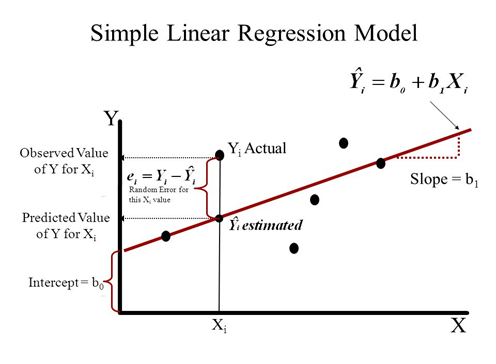
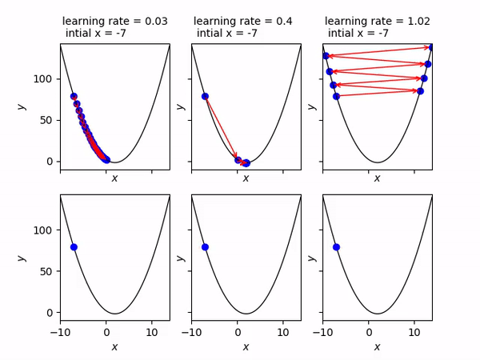
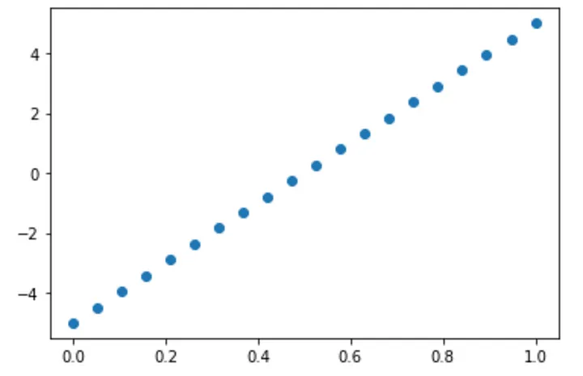
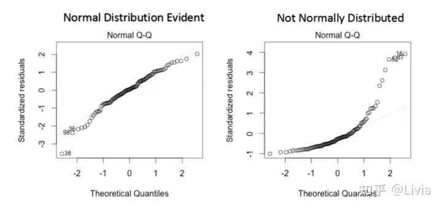

# Linear Regression

Q1 **解释什么是线性回归?**

- 线性回归是一种监督式机器学习算法, 其中预测输出是连续的, 并且具有恒定的斜率.它用于预测连续范围内的值(例如销售额, 价格).

Q2 **有哪些指标, 可以检查回归模型是否良好地拟合了数据?**

  - `R-squared`系数: 数据点与拟合回归线的接近程度的统计度量, 是残差平方和与总平方和的比值. 其值始终介于0和1之间, 越接近1, 回归模型对观测值的拟合越好.
  - `F-test`: 评估数据由仅截距模型描述的原假设, 该模型是所有系数都等于零的回归, 而备择假设至少有一个系数不等于零. 如果`F-test`的`P`值小于显著性水平, 我们可以否定原假设, 并得出结论, 该模型提供的拟合优于仅截距模型.
  - 均方根误差(`RMSE`): 测量估计值与观测值的平均偏差.

Q3 **平均绝对误差(`MAE`)与均方误差(`MSE`)有什么区别?**

- MSE均方误差被定义为误差的平方, 并在我们想要惩罚数据集中的异常值时使用.它被定义为: 

$$
MSE = \frac{1}{N}\sum_{i=1}^{N}(y_i-y)^2
$$

- MAE平均绝对误差被定义为误差的平均值.当我们不希望异常值发挥重要作用时使用: 

$$
MAE = \frac{1}{N}\sum_{i=1}^{N}|y_i-y|
$$

Q4 **怎样检测到线性回归模型中的过拟合?**

- 如下图, 在训练集和测试集的loss曲线图上可以检测到过拟合的现象, 过拟合表现为: 训练数据集上的模型性能继续提高(损失或错误继续下降), 而测试或验证集的性能提高到一个点, 然后开始变得更糟.

Q5 **协方差和相关性有什么区别?**

- 协方差衡量一个变量的变化是否会导致另一个变量的变化, 并仅处理数据集中两个变量的线性关系.其值的范围可以从负无穷到正无穷 .简单地说, 协方差表示变量之间线性关系的方向.

- 相关性衡量两个或多个变量之间的相关性.其值介于-1到1之间.相关性测量两个变量之间线性关系的强度和方向, 是协方差的函数: 相关性等于协方差除以X的标准差和Y的标准差.

$$
\rho =\frac{Cov(X,Y)}{\sigma_x\sigma_y}
$$

Q6 **提供学习率的直观解释**

- Learning Rate是一个超参数, 可以确定每次迭代时向梯度下降中的最小点移动的速度或步长.这个值不应该太小或太高, 因为如果它太小则收敛时间太长, 如果它太大则步长会增加并且移动很快, 即使在重复迭代多轮之后也不会达到全局最小值点.

Q7 **非线性回归与线性回归有何不同?**

- 非线性函数的变量的幂大于1, 线性函数的变量的幂为1
- 非线性回归试图模拟自变量和因变量之间的非线性关系, 线性回归分析试图模拟自变量和因变量之间的线性关系.

Q8 **R-squared系数有什么缺点?如何解决?**

- 使用 R Squared 有一个主要缺点.R Squared 的值永远不会减少.添加新的自变量将导致 R 平方的值增加, 这导致 R Squared 会持续建议添加新变量, 无论它们是否真的重要, 都会增加价值.因此, 模型可能会添加一个不太重要的变量, 例如, 用于预测薪水的人的姓名, R 平方的值也会增加, 表明模型更好.

Q9 **普通最小二乘法和ridge回归有什么区别?**

- **ridge**回归是带二阶范数惩罚的最小二乘回归, los在最小二乘基础上添加了系数向量的平方范数, 

Q10 **普通最小二乘法和lasso回归有什么区别?**

- Lasso回归是线性回归的一种改进, 在线性回归基础上加入了一阶范数惩罚.效果是: 权重的绝对值将减少, 并且许多将趋于为零.

Q11 **为什么使用均方根误差 (RMSE)而不是平均绝对误差 (MAE)作为线性回归的衡量指标?**

- RMSE是MSE的平方根, MAE是误差的绝对值加和, 相对来说, RMSE 对较大的误差给予相对较高的权重, 有助于惩罚数据中的离群点

Q12 **如何确定变量对多元回归模型的重要性?**

- 一般规则是将**具有最大标准化回归系数的预测变量视为最重要的变量**, 具有下一个最大标准化回归系数的预测变量作为下一个重要变量, 依此类推.
- 假定回归方程的形式如下, 其中, $Y$是估计值, 参数$b_j$ 通过最小二乘法求得.则标准化回归系数等于$b_j$的标准差*($X_j$的标准差/$Y$的标准差).
  $Y = b_0 + b_1X_1 + ... + b_jX_j + b_JX_J$

- 引用: [http://www.dmstat1.com/res/PredictiveContributionCoefficient.html](http://www.dmstat1.com/res/PredictiveContributionCoefficient.html)

Q13 **应用最小二乘法之间的假设是什么?**

- 回归模型的误差项和系数具有线性关系
- 误差项的总体均值为零
- 自变量与误差项之间没有相关性
- 误差项的每一次观察都是独立的
- 误差项的方差是常数
- 误差项服从正态分布模式
- 不存在是其他变量的完美线性函数的自变量

- 引用: [https://www.indeed.com/career-advice/career-development/ols-regression-assumptions](https://www.indeed.com/career-advice/career-development/ols-regression-assumptions)

Q14 **线性回归和逻辑回归有什么区别?**

- 线性回归是在数据中拟合一条直线, 而Logistic回归就是在数据中拟合曲线. 线性回归是回归算法, 而Logistic回归是分类算法. 线性回归假设因变量呈高斯(或正态)分布. Logistic回归假设因变量为二项分布.

Q15 **为什么要对线性回归使用归一化与标准化?**

- 归一化和标准化操作使得数据更趋近于高斯分布
- 归一化后加快了梯度下降求最优解的速度

Q16 **比较线性回归和决策树模型**

- 决策树支持非线性解, 而线性回归只支持线性解.当具有较少数据集(低噪声)的大量特征时, 线性回归可能优于决策树/随机森林.在一般情况下, 决策树的平均准确度会更高.

Q17 **数据的同方差性和异方差性有什么区别?**

- 同方差性是经典线性回归模型对数据的一个假设, 即$\epsilon \sim N(0, \sigma^2)$ 简单的说就是残差必须是随机的, 这个分布是我们用来描述随机分布的一种方法 -- 均值为0, 方差为sigma平方.
- 异方差则说明残差不满足这个正态分布.

Q18 **如何处理回归中的缺失数据?**

- 直接删除, 统计值充填(均值, 中位数等), 回归方程预测充填等.

Q19 **什么是多重共线性?如何检测共线性?**

- 进行线性回归分析时, 容易出现自变量(解释变量)之间彼此相关的现象, 这种现象为多重共线性.
- 用方差膨胀系数 (variance inflation factor) 来衡量多元线性回归模型中多重共线性(multicollinearity) 的严重程度. VIF表示回归系数估计量的方差与假设自变量间不线性相关时方差相比的比值.

Q20 **如何处理线性回归中的过拟合问题?**

- 使用Lasso回归或者ridge回归

Q21 **线性回归对数据做了哪些假设?**

- **1.线性关系**:  自变量x和因变量y之间存在线性关系.

- **2.独立性**: 自变量之间相互独立.

- **3.同方差性**:  残差在 x 的每个水平上都有恒定的方差.

- **4.正态性: ** 模型的残差呈正态分布.

Q22 **如何检查数据是否遵循所有回归假设?**

- 检查线性关系: 通过散点图, 可以直观地得出变量间是否存在某种线性关系

- 独立性: 
    - 直接计算自变量两两之间的皮尔森系数, 若皮尔森系数大于0.8, 则可认为这两个自变量高度相关
    - 方差膨胀因子(variance inflation factor, VIF)[9].方差膨胀系数VIF越大, 说明自变量之间存在共线性的可能性越大.一般来讲, 如果方差膨胀因子超过10, 则回归模型存在严重的多重共线性.
- 同方差性: 可视化并观察预测值与残差的关系
- 正态: KS非参数检验, 或者绘制Quantile-Quantile Plot, 纵坐标为残差的分位数, 横坐标为标准正态分布的分位数.如果两个分布相似, 则该Q-Q图趋近于落在y=x线上, 如果两分布线性相关, 则点在Q-Q图上趋近于落在一条直线上.

- 引用: [https://medium.com/@andrewhnberry/checking-your-linear-regression-assumptions-and-how-to-check-them-338f770acb57](https://medium.com/@andrewhnberry/checking-your-linear-regression-assumptions-and-how-to-check-them-338f770acb57)

Q23 **使用梯度下降法或者最小二乘法求解线性回归问题, 分别有哪些优势?**

- 最小二乘法OLS是一种非迭代方法, 直接找到最优解, 如果任务很简单并且可以使用 OLS 直接解决, 那么使用 OLS 会更好, 最小二乘法也有缺点: 
    - 最小二乘法需要计算$X^TX$的逆矩阵, 可能$X^TX$没有逆矩阵, 并且, 当特征数非常大的时候, $X^TX$的计算量非常大
    - 并且, 最小二乘法只有拟合函数为线性的时候才可以使用
- 梯度下降更通用, 因为它可以通过迭代过程应用于任何优化问题(包括非线性回归), 但梯度下降法容易陷于局部最优

- 引用: [https://www.cnblogs.com/nickchen121/p/11686757.html#tid-WXpwFW](https://www.cnblogs.com/nickchen121/p/11686757.html#tid-WXpwFW)

Q24 **比较机器学习里分类和回归的相同点与不同点**

在机器学习中, **回归**和**分类**是两种不同的监督学习任务, 它们的主要区别在于**预测目标的类型**和**应用场景**.

- **定义**
  - **回归(Regression)**: 预测的是**连续值**, 输出可以是任何实数, 例如房价, 温度, 销售额等.
  - **分类(Classification)**: 预测的是**离散类别标签**, 输出是一个有限集合中的某个类别, 例如邮件是“垃圾邮件”还是“正常邮件”.

- **输出类型**
  - **回归**: 输出是一个**连续变量**, 例如`y = 2.5`或`y = -1.34`, 预测值通常是实数范围内的.
  - **分类**: 输出是一个或多个**类别标签**, 例如`y`$\in$ `{0, 1}`(二分类)或`y`$\in$`{A, B, C}`(多分类).在概率分布中, 分类模型也可以输出属于每个类别的概率.

- **示例**
  
| 任务类型 | 输入 | 输出(目标变量) | 场景举例 |
| --- | --- | --- | --- |
| 回归 | 房屋特征(面积, 卧室数) | 房价(连续值) | 房价预测, 股票价格预测 |
| 分类 | 图像像素数据 | 类别(猫, 狗) | 图像分类, 垃圾邮件检测, 疾病诊断 |

- **常用算法**
  - **回归算法**: 线性回归(`Linear Regression`), 支持向量回归(`SVR`, `Support Vector Regression`), 决策树回归(`Decision Tree Regressor`), 随机森林回归(`Random Forest Regressor`), 神经网络(用于回归任务).

  - **分类算法**: 逻辑回归(`Logistic Regression`), 支持向量机(`SVM`, `Support Vector Machine`), 决策树分类(`Decision Tree Classifier`), 随机森林分类(`Random Forest Classifier`), k近邻算法(`K-Nearest Neighbors`, `KNN`), 神经网络(用于分类任务).

- **损失函数**
  - **回归**: 均方误差(`MSE`, `Mean Squared Error`), 平均绝对误差(`MAE`, `Mean Absolute Error`), `Huber`损失函数

  - **分类**: 交叉熵损失(`Cross-Entropy Loss`), 对于二分类: 对数损失(`Log Loss`), 对于多分类: `Softmax`损失

- **评价指标**
  - **回归**: 均方误差(`MSE`), 均方根误差(`RMSE`), 决定系数$R^2$

  - **分类**: 准确率(`Accuracy`), 精确率(`Precision`), 召回率(`Recall`), `F1-score`, `ROC-AUC`(用于二分类)

- **应用场景**
  - **回归**: 预测未来某一时刻的股票价格, 根据病人特征预测其血糖水平, 预测某商品的市场需求量.

  - **分类**: 判断一封邮件是否为垃圾邮件(二分类), 对图像进行分类, 如识别狗, 猫或鸟(多分类), 疾病诊断: 预测患者是否患有某种疾病(二分类或多分类).

- **什么时候选择回归或分类?**
  - 如果输出目标是**连续值**, 选择回归模型.  
  - 如果输出目标是**类别标签**, 选择分类模型.

- **总结**

| **属性** | **回归** | **分类** |
| --- | --- | --- |
| 输出类型 | 连续值 | 离散类别 |
| 目标 | 拟合连续变量的映射关系 | 区分不同类别 |
| 常用损失函数 | 均方误差(`MSE`)| 交叉熵(`Cross-Entropy`)|
| 示例 | 房价预测, 温度预测 | 垃圾邮件检测, 图像分类 |

